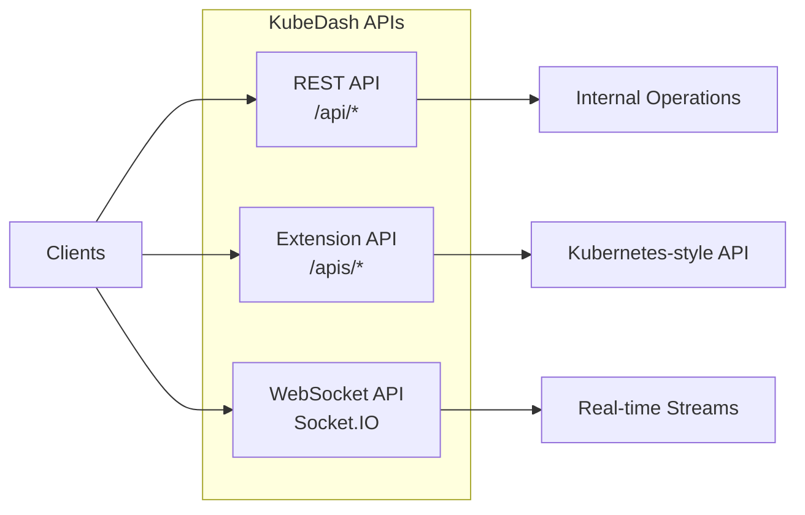
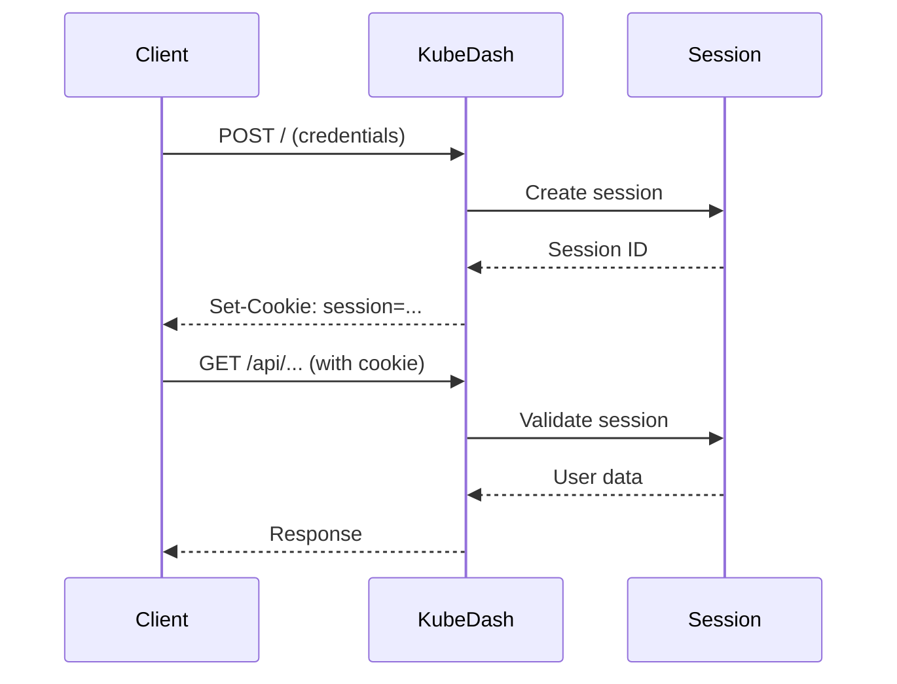

# KubeDash API Reference

This document provides comprehensive API documentation for KubeDash, covering both the internal Flask REST API and the Kubernetes Extension API.

## Table of Contents

- [Overview](#overview)
- [Authentication](#authentication)
- [REST API Endpoints](#rest-api-endpoints)
- [Extension API](#extension-api)
- [WebSocket API](#websocket-api)
- [Error Responses](#error-responses)
- [Rate Limiting](#rate-limiting)
- [SDK Examples](#sdk-examples)

---

## Overview

KubeDash exposes three types of APIs:



### Base URLs

| Environment | Base URL |
|-------------|----------|
| Development | `http://localhost:8000` |
| Production | `https://kubedash.example.com` |

### API Versioning

| API | Version | Path |
|-----|---------|------|
| REST API | v1 | `/api/` |
| Extension API | v1 | `/apis/kubedash.devopstales.github.io/v1/` |

---

## Authentication

### Session-Based Authentication (Web UI)



### Bearer Token Authentication (Extension API)

```bash
# Get ServiceAccount token
TOKEN=$(kubectl create token default -n default)

# Use token in requests
curl -X GET "https://kubedash.example.com/apis/kubedash.devopstales.github.io/v1/projects" \
  -H "Authorization: Bearer $TOKEN" \
  -H "Content-Type: application/json"
```

### Login Endpoint

```http
POST /
Content-Type: application/x-www-form-urlencoded

username=admin&password=admin
```

**Response**: Redirect to dashboard with session cookie set

---

## REST API Endpoints

### Health Endpoints

#### Liveness Probe

Check if the application is running.

```http
GET /api/health/live
```

**Response** `200 OK`
```json
{
  "message": "OK"
}
```

#### Readiness Probe

Check if the application is ready to serve requests.

```http
GET /api/health/ready
```

**Response** `200 OK`
```json
{
  "database": true,
  "oidc": true,
  "kubernetes": true
}
```

**Response** `503 Service Unavailable`
```json
{
  "database": false,
  "oidc": true,
  "kubernetes": false
}
```

### Utility Endpoints

#### Ping

Simple health check endpoint.

```http
GET /api/ping
```

**Response** `200 OK`
```json
{
  "message": "pong"
}
```

#### Debug Trace

Get current OpenTelemetry trace information (requires Jaeger enabled).

```http
GET /api/debug-trace
```

**Response** `200 OK`
```json
{
  "flask_correlation_id": "550e8400-e29b-41d4-a716-446655440000",
  "jaeger_trace_id": "00000000000000001234567890abcdef",
  "span_id": "1234567890abcdef",
  "trace_flags": "0x01",
  "is_remote": false,
  "span_attributes": {
    "http.route": "/api/debug-trace",
    "http.method": "GET"
  }
}
```

### Metrics Endpoint

Prometheus-compatible metrics endpoint.

```http
GET /metrics
```

**Response** `200 OK` (text/plain)
```
# HELP flask_http_request_total Total HTTP requests
# TYPE flask_http_request_total counter
flask_http_request_total{method="GET",status="200"} 1234
...
```

---

## Extension API

The Extension API implements the Kubernetes API Aggregation Layer, allowing kubectl and other Kubernetes clients to interact with KubeDash resources.

### API Discovery

#### List API Groups

```http
GET /apis/
```

**Response** `200 OK`
```json
{
  "kind": "APIGroupList",
  "apiVersion": "v1",
  "groups": [
    {
      "name": "kubedash.devopstales.github.io",
      "versions": [
        {
          "groupVersion": "kubedash.devopstales.github.io/v1",
          "version": "v1"
        }
      ],
      "preferredVersion": {
        "groupVersion": "kubedash.devopstales.github.io/v1",
        "version": "v1"
      }
    }
  ]
}
```

#### Get API Group

```http
GET /apis/kubedash.devopstales.github.io
```

**Response** `200 OK`
```json
{
  "kind": "APIGroup",
  "apiVersion": "v1",
  "name": "kubedash.devopstales.github.io",
  "versions": [
    {
      "groupVersion": "kubedash.devopstales.github.io/v1",
      "version": "v1"
    }
  ],
  "preferredVersion": {
    "groupVersion": "kubedash.devopstales.github.io/v1",
    "version": "v1"
  }
}
```

#### List API Resources

```http
GET /apis/kubedash.devopstales.github.io/v1
```

**Response** `200 OK`
```json
{
  "kind": "APIResourceList",
  "apiVersion": "v1",
  "groupVersion": "kubedash.devopstales.github.io/v1",
  "resources": [
    {
      "name": "projects",
      "singularName": "project",
      "namespaced": false,
      "kind": "Project",
      "verbs": ["get", "list", "create", "update", "patch", "delete"],
      "shortNames": ["proj"],
      "categories": ["all"],
      "storageVersionHash": ""
    }
  ]
}
```

### Projects Resource

#### List Projects

```http
GET /apis/kubedash.devopstales.github.io/v1/projects
Authorization: Bearer <token>
```

**Query Parameters**

| Parameter | Type | Description |
|-----------|------|-------------|
| `labelSelector` | string | Filter by labels |
| `fieldSelector` | string | Filter by fields |
| `limit` | integer | Maximum results |
| `continue` | string | Pagination token |

**Response** `200 OK`
```json
{
  "kind": "ProjectList",
  "apiVersion": "kubedash.devopstales.github.io/v1",
  "metadata": {
    "resourceVersion": "12345"
  },
  "items": [
    {
      "kind": "Project",
      "apiVersion": "kubedash.devopstales.github.io/v1",
      "metadata": {
        "name": "my-project",
        "uid": "550e8400-e29b-41d4-a716-446655440000",
        "creationTimestamp": "2025-01-01T00:00:00Z",
        "labels": {},
        "annotations": {}
      },
      "spec": {
        "protected": false,
        "owner": "admin",
        "repository": "https://github.com/example/repo",
        "pipeline": "https://ci.example.com/pipeline"
      },
      "status": {
        "phase": "Active",
        "namespace": "my-project"
      }
    }
  ]
}
```

#### Get Project

```http
GET /apis/kubedash.devopstales.github.io/v1/projects/{name}
Authorization: Bearer <token>
```

**Response** `200 OK`
```json
{
  "kind": "Project",
  "apiVersion": "kubedash.devopstales.github.io/v1",
  "metadata": {
    "name": "my-project",
    "uid": "550e8400-e29b-41d4-a716-446655440000",
    "creationTimestamp": "2025-01-01T00:00:00Z"
  },
  "spec": {
    "protected": false,
    "owner": "admin"
  },
  "status": {
    "phase": "Active",
    "namespace": "my-project"
  }
}
```

#### Create Project

```http
POST /apis/kubedash.devopstales.github.io/v1/projects
Authorization: Bearer <token>
Content-Type: application/json

{
  "apiVersion": "kubedash.devopstales.github.io/v1",
  "kind": "Project",
  "metadata": {
    "name": "new-project",
    "labels": {
      "team": "backend"
    }
  },
  "spec": {
    "protected": true,
    "owner": "john.doe",
    "repository": "https://github.com/company/new-project",
    "pipeline": "https://ci.example.com/new-project"
  }
}
```

**Response** `201 Created`
```json
{
  "kind": "Project",
  "apiVersion": "kubedash.devopstales.github.io/v1",
  "metadata": {
    "name": "new-project",
    "uid": "550e8400-e29b-41d4-a716-446655440001",
    "creationTimestamp": "2025-12-09T10:00:00Z",
    "labels": {
      "team": "backend"
    }
  },
  "spec": {
    "protected": true,
    "owner": "john.doe",
    "repository": "https://github.com/company/new-project",
    "pipeline": "https://ci.example.com/new-project"
  },
  "status": {
    "phase": "Active",
    "namespace": "new-project"
  }
}
```

#### Update Project

```http
PUT /apis/kubedash.devopstales.github.io/v1/projects/{name}
Authorization: Bearer <token>
Content-Type: application/json

{
  "apiVersion": "kubedash.devopstales.github.io/v1",
  "kind": "Project",
  "metadata": {
    "name": "my-project"
  },
  "spec": {
    "protected": false,
    "owner": "new-owner"
  }
}
```

**Response** `200 OK`

#### Patch Project

```http
PATCH /apis/kubedash.devopstales.github.io/v1/projects/{name}
Authorization: Bearer <token>
Content-Type: application/json

{
  "spec": {
    "protected": true
  }
}
```

**Response** `200 OK`

#### Delete Project

```http
DELETE /apis/kubedash.devopstales.github.io/v1/projects/{name}
Authorization: Bearer <token>
```

**Response** `200 OK`
```json
{
  "kind": "Status",
  "apiVersion": "v1",
  "status": "Success",
  "details": {
    "name": "my-project",
    "group": "kubedash.devopstales.github.io",
    "kind": "projects"
  }
}
```

**Response** `403 Forbidden` (Protected project)
```json
{
  "kind": "Status",
  "apiVersion": "v1",
  "status": "Failure",
  "message": "Project my-project is protected and cannot be deleted",
  "reason": "Forbidden",
  "code": 403
}
```

### Project Schema

```yaml
# Project Custom Resource Definition
apiVersion: kubedash.devopstales.github.io/v1
kind: Project
metadata:
  name: string           # Required: Project name
  uid: string            # Auto-generated: Unique identifier
  creationTimestamp: string  # Auto-generated: ISO 8601 timestamp
  labels: object         # Optional: Key-value labels
  annotations: object    # Optional: Key-value annotations
spec:
  protected: boolean     # Required: Deletion protection
  owner: string          # Optional: Project owner (defaults to creator)
  repository: string     # Optional: Git repository URL
  pipeline: string       # Optional: CI/CD pipeline URL
status:
  phase: string          # Active | Terminating
  namespace: string      # Associated Kubernetes namespace
```

---

## WebSocket API

KubeDash uses Socket.IO for real-time communication.

### Log Streaming

**Namespace**: `/log`

#### Events

| Event | Direction | Description |
|-------|-----------|-------------|
| `connect` | Client → Server | Establish connection |
| `message` | Client → Server | Request log stream |
| `response` | Server → Client | Log data |

#### Example Usage

```javascript
// Connect to log namespace
const socket = io('/log');

socket.on('connect', () => {
  console.log('Connected to log stream');
  
  // Request logs for specific pod/container
  socket.emit('message', 'my-pod', 'my-container');
});

socket.on('response', (data) => {
  console.log('Log:', data.data);
});

socket.on('disconnect', () => {
  console.log('Disconnected from log stream');
});
```

### Pod Exec

**Namespace**: `/exec`

#### Events

| Event | Direction | Description |
|-------|-----------|-------------|
| `connect` | Client → Server | Establish connection |
| `message` | Client → Server | Start exec session |
| `exec-input` | Client → Server | Send terminal input |
| `response` | Server → Client | Terminal output |

#### Example Usage

```javascript
// Connect to exec namespace
const socket = io('/exec');

socket.on('connect', () => {
  // Start exec session
  socket.emit('message', 'my-pod', 'my-container');
});

socket.on('response', (data) => {
  // Display terminal output
  terminal.write(data.output);
});

// Send user input
function sendInput(input) {
  socket.emit('exec-input', { input: input });
}
```

---

## Error Responses

### Standard Error Format

All error responses follow the Kubernetes Status format:

```json
{
  "kind": "Status",
  "apiVersion": "v1",
  "metadata": {},
  "status": "Failure",
  "message": "Human-readable error message",
  "reason": "ErrorReason",
  "details": {
    "name": "resource-name",
    "group": "api-group",
    "kind": "resource-kind"
  },
  "code": 400
}
```

### HTTP Status Codes

| Code | Reason | Description |
|------|--------|-------------|
| 400 | BadRequest | Invalid request format |
| 401 | Unauthorized | Authentication required |
| 403 | Forbidden | Permission denied |
| 404 | NotFound | Resource not found |
| 409 | AlreadyExists | Resource already exists |
| 500 | InternalError | Server error |
| 502 | BadGateway | Upstream service error |
| 503 | ServiceUnavailable | Service temporarily unavailable |
| 504 | GatewayTimeout | Upstream timeout |

### Error Examples

#### 401 Unauthorized
```json
{
  "kind": "Status",
  "apiVersion": "v1",
  "status": "Failure",
  "message": "Unauthorized: No valid authentication credentials",
  "reason": "Unauthorized",
  "code": 401
}
```

#### 404 Not Found
```json
{
  "kind": "Status",
  "apiVersion": "v1",
  "status": "Failure",
  "message": "projects \"nonexistent\" not found",
  "reason": "NotFound",
  "details": {
    "name": "nonexistent",
    "group": "kubedash.devopstales.github.io",
    "kind": "projects"
  },
  "code": 404
}
```

---

## Rate Limiting

Currently, KubeDash does not implement rate limiting at the application level. For production deployments, consider implementing rate limiting at the ingress level:

```yaml
# Nginx Ingress rate limiting
apiVersion: networking.k8s.io/v1
kind: Ingress
metadata:
  name: kubedash-ingress
  annotations:
    nginx.ingress.kubernetes.io/limit-rps: "10"
    nginx.ingress.kubernetes.io/limit-connections: "5"
spec:
  # ...
```

---

## SDK Examples

### Python

```python
import requests

class KubeDashClient:
    def __init__(self, base_url, token):
        self.base_url = base_url.rstrip('/')
        self.headers = {
            'Authorization': f'Bearer {token}',
            'Content-Type': 'application/json'
        }
    
    def list_projects(self, label_selector=None):
        """List all projects"""
        params = {}
        if label_selector:
            params['labelSelector'] = label_selector
        
        response = requests.get(
            f'{self.base_url}/apis/kubedash.devopstales.github.io/v1/projects',
            headers=self.headers,
            params=params
        )
        response.raise_for_status()
        return response.json()
    
    def get_project(self, name):
        """Get a specific project"""
        response = requests.get(
            f'{self.base_url}/apis/kubedash.devopstales.github.io/v1/projects/{name}',
            headers=self.headers
        )
        response.raise_for_status()
        return response.json()
    
    def create_project(self, name, protected=False, owner=None):
        """Create a new project"""
        body = {
            'apiVersion': 'kubedash.devopstales.github.io/v1',
            'kind': 'Project',
            'metadata': {'name': name},
            'spec': {'protected': protected}
        }
        if owner:
            body['spec']['owner'] = owner
        
        response = requests.post(
            f'{self.base_url}/apis/kubedash.devopstales.github.io/v1/projects',
            headers=self.headers,
            json=body
        )
        response.raise_for_status()
        return response.json()
    
    def delete_project(self, name):
        """Delete a project"""
        response = requests.delete(
            f'{self.base_url}/apis/kubedash.devopstales.github.io/v1/projects/{name}',
            headers=self.headers
        )
        response.raise_for_status()
        return response.json()


# Usage
client = KubeDashClient('https://kubedash.example.com', token)
projects = client.list_projects()
new_project = client.create_project('my-project', protected=True)
```

### kubectl

```bash
# Using kubectl with KubeDash Extension API
# (Requires APIService registration)

# List projects
kubectl get projects

# Get specific project
kubectl get project my-project -o yaml

# Create project from file
kubectl apply -f project.yaml

# Delete project
kubectl delete project my-project

# Example project.yaml
cat <<EOF | kubectl apply -f -
apiVersion: kubedash.devopstales.github.io/v1
kind: Project
metadata:
  name: my-project
spec:
  protected: false
  owner: team-lead
EOF
```

### curl

```bash
# Set token
TOKEN=$(kubectl create token default -n default)

# List projects
curl -s -X GET "https://kubedash.example.com/apis/kubedash.devopstales.github.io/v1/projects" \
  -H "Authorization: Bearer $TOKEN" \
  -H "Content-Type: application/json" | jq .

# Create project
curl -X POST "https://kubedash.example.com/apis/kubedash.devopstales.github.io/v1/projects" \
  -H "Authorization: Bearer $TOKEN" \
  -H "Content-Type: application/json" \
  -d '{
    "apiVersion": "kubedash.devopstales.github.io/v1",
    "kind": "Project",
    "metadata": {"name": "test-project"},
    "spec": {"protected": false}
  }'

# Delete project
curl -X DELETE "https://kubedash.example.com/apis/kubedash.devopstales.github.io/v1/projects/test-project" \
  -H "Authorization: Bearer $TOKEN"
```

---

## OpenAPI Specification

The Extension API provides an OpenAPI v2 specification at:

```http
GET /apis/openapi/v2
```

This can be used to generate client SDKs or import into API development tools like Postman.

---

*Last Updated: December 2025*
*Version: 4.1.0*
