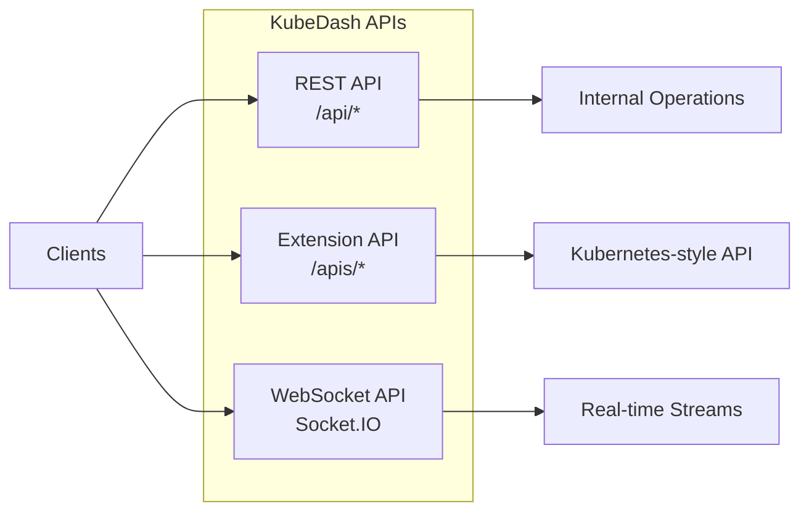
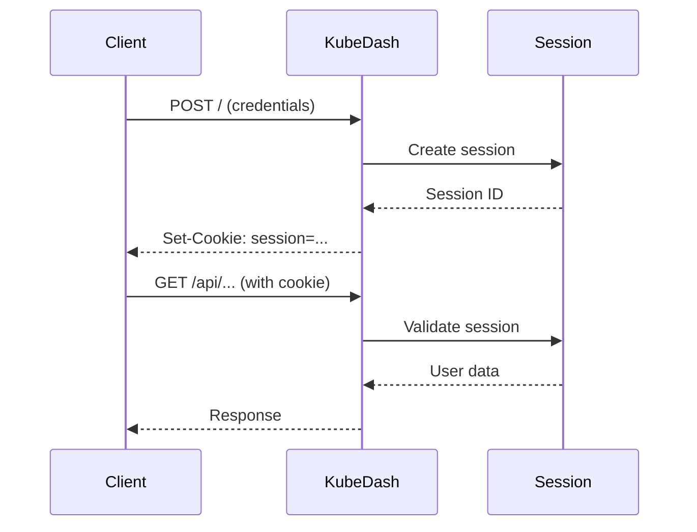

# KubeDash API Reference

This document provides comprehensive API documentation for KubeDash, covering both the internal Flask REST API and the Kubernetes Extension API.

## Table of Contents

- [Overview](#overview)
- [Authentication](#authentication)
- [REST API Endpoints](#rest-api-endpoints)
- [Extension API](#extension-api)
- [WebSocket API](#websocket-api)
- [Error Responses](#error-responses)
- [Rate Limiting](#rate-limiting)
- [SDK Examples](#sdk-examples)

---

## Overview

KubeDash exposes three types of APIs:


```mermaid
graph LR
    subgraph "KubeDash APIs"
        REST[REST API<br/>/api/*]
        EXT[Extension API<br/>/apis/*]
        WS[WebSocket API<br/>Socket.IO]
    end
    
    CLIENT[Clients] --> REST
    CLIENT --> EXT
    CLIENT --> WS
    
    REST --> INTERNAL[Internal Operations]
    EXT --> K8S[Kubernetes-style API]
    WS --> REALTIME[Real-time Streams]
```

### Base URLs

| Environment | Base URL |
|-------------|----------|
| Development | `http://localhost:8000` |
| Production | `https://kubedash.example.com` |

### API Versioning

| API | Version | Path |
|-----|---------|------|
| REST API | v1 | `/api/` |
| Extension API | v1 | `/apis/kubedash.devopstales.github.io/v1/` |

---

## Authentication

### Session-Based Authentication (Web UI)


```mermaid
sequenceDiagram
    participant Client
    participant KubeDash
    participant Session
    
    Client->>KubeDash: POST / (credentials)
    KubeDash->>Session: Create session
    Session-->>KubeDash: Session ID
    KubeDash-->>Client: Set-Cookie: session=...
    
    Client->>KubeDash: GET /api/... (with cookie)
    KubeDash->>Session: Validate session
    Session-->>KubeDash: User data
    KubeDash-->>Client: Response
```

### Bearer Token Authentication (Extension API)

```bash
# Get ServiceAccount token
TOKEN=$(kubectl create token default -n default)

# Use token in requests
curl -X GET "https://kubedash.example.com/apis/kubedash.devopstales.github.io/v1/projects" \
  -H "Authorization: Bearer $TOKEN" \
  -H "Content-Type: application/json"
```

### Login Endpoint

```http
POST /
Content-Type: application/x-www-form-urlencoded

username=admin&password=admin
```

**Response**: Redirect to dashboard with session cookie set

---

## REST API Endpoints

The KubeDash REST API is organized into logical groups under `/api/v1/`. All endpoints require authentication via session cookies (web UI) or can be accessed programmatically.

### API Structure

```
/api/
├── /api/                    # Base API (health, ping, debug)
│   ├── /ping               # Health check
│   ├── /health/live        # Liveness probe
│   ├── /health/ready       # Readiness probe
│   └── /debug-trace        # Debug trace info
│
└── /api/v1/                # Main REST API v1
    ├── /workloads/         # Pods, Deployments, StatefulSets, etc.
    ├── /cluster/           # Cluster metrics, events, status
    ├── /network/           # Services, Ingress, IngressClasses
    ├── /storage/           # PVCs, PVs, StorageClasses, ConfigMaps
    ├── /security/          # Secrets, NetworkPolicies, PriorityClasses
    ├── /nodes/             # Cluster nodes
    ├── /namespaces/        # Namespace management
    ├── /rbac/              # Roles, ClusterRoles, Bindings, ServiceAccounts
    ├── /other-resources/   # HPA, VPA, LimitRanges, Quotas, PDBs, CRDs
    ├── /users/             # User management, privileges, SSO groups
    ├── /settings/          # SSO config, K8s configs, export
    └── /plugins/           # Plugin APIs (dynamically registered)
        ├── /application-catalog/
        ├── /cert-manager/
        ├── /external-loadbalancer/
        ├── /flux/
        ├── /gateway-api/
        ├── /helm/
        ├── /registry/
        └── /trivy-operator/
```

### Response Format

All API endpoints return JSON responses in a consistent format:

**Success Response:**
```json
{
  "data": { ... },
  "metadata": {
    "count": 10,
    "namespace": "default"
  }
}
```

**Error Response:**
```json
{
  "error": "ErrorType",
  "message": "Human-readable error message"
}
```

### Common Query Parameters

Most endpoints support these query parameters:

| Parameter | Type | Description | Default |
|-----------|------|-------------|---------|
| `namespace` | string | Kubernetes namespace | Session namespace |
| `all_namespaces` | boolean | List from all namespaces | `false` |

### Health Endpoints

#### Liveness Probe

Check if the application is running.

```http
GET /api/health/live
```

**Response** `200 OK`
```json
{
  "message": "OK"
}
```

#### Readiness Probe

Check if the application is ready to serve requests.

```http
GET /api/health/ready
```

**Response** `200 OK`
```json
{
  "database": true,
  "oidc": true,
  "kubernetes": true
}
```

**Response** `503 Service Unavailable`
```json
{
  "database": false,
  "oidc": true,
  "kubernetes": false
}
```

### Utility Endpoints

#### Ping

Simple health check endpoint.

```http
GET /api/ping
```

**Response** `200 OK`
```json
{
  "message": "pong"
}
```

#### Debug Trace

Get current OpenTelemetry trace information (requires Jaeger enabled).

```http
GET /api/debug-trace
```

**Response** `200 OK`
```json
{
  "flask_correlation_id": "550e8400-e29b-41d4-a716-446655440000",
  "jaeger_trace_id": "00000000000000001234567890abcdef",
  "span_id": "1234567890abcdef",
  "trace_flags": "0x01",
  "is_remote": false,
  "span_attributes": {
    "http.route": "/api/debug-trace",
    "http.method": "GET"
  }
}
```

### Metrics Endpoint

Prometheus-compatible metrics endpoint.

```http
GET /metrics
```

**Response** `200 OK` (text/plain)
```
# HELP flask_http_request_total Total HTTP requests
# TYPE flask_http_request_total counter
flask_http_request_total{method="GET",status="200"} 1234
...
```

---

## REST API v1

The REST API v1 provides comprehensive endpoints for managing Kubernetes resources and KubeDash application features. All endpoints are under `/api/v1/` and require authentication.

### Workloads API

#### List Pods

```http
GET /api/v1/workloads/pods?namespace=default&all_namespaces=false
```

**Query Parameters:**
- `namespace` (string): Kubernetes namespace (default: session namespace)
- `all_namespaces` (boolean): List pods from all namespaces (default: false)

**Response** `200 OK`
```json
{
  "data": [
    {
      "name": "my-pod",
      "namespace": "default",
      "status": "Running",
      "node": "node-1",
      "age": "2d"
    }
  ],
  "metadata": {
    "namespace": "default",
    "count": 1
  }
}
```

#### Get Pod

```http
GET /api/v1/workloads/pods/{name}?namespace=default
```

#### Delete Pod

```http
DELETE /api/v1/workloads/pods/{name}?namespace=default
```

#### Get Pod Containers

```http
GET /api/v1/workloads/pods/{name}/containers?namespace=default
```

**Response** `200 OK`
```json
{
  "data": {
    "containers": ["container1", "container2"],
    "init_containers": ["init-container"]
  },
  "metadata": {
    "name": "my-pod",
    "namespace": "default"
  }
}
```

#### List Deployments

```http
GET /api/v1/workloads/deployments?namespace=default
```

#### Get Deployment

```http
GET /api/v1/workloads/deployments/{name}?namespace=default
```

#### Scale Deployment

```http
PATCH /api/v1/workloads/deployments/{name}?namespace=default
Content-Type: application/json

{
  "replicas": 3
}
```

#### List StatefulSets

```http
GET /api/v1/workloads/statefulsets?namespace=default
```

#### Scale StatefulSet

```http
PATCH /api/v1/workloads/statefulsets/{name}?namespace=default
Content-Type: application/json

{
  "replicas": 5
}
```

#### List DaemonSets

```http
GET /api/v1/workloads/daemonsets?namespace=default
```

#### Enable/Disable DaemonSet

```http
PATCH /api/v1/workloads/daemonsets/{name}?namespace=default
Content-Type: application/json

{
  "enabled": false
}
```

#### List ReplicaSets

```http
GET /api/v1/workloads/replicasets?namespace=default
```

### Cluster API

#### Get Cluster Metrics

```http
GET /api/v1/cluster/metrics
```

**Response** `200 OK`
```json
{
  "data": {
    "cpu": {
      "capacity": "8",
      "allocatable": "7.5",
      "requests": "2.5",
      "limits": "4",
      "usage": "1.2"
    },
    "memory": {
      "capacity": "32Gi",
      "allocatable": "30Gi",
      "requests": "10Gi",
      "limits": "20Gi",
      "usage": "8Gi"
    },
    "pods": {
      "allocatable": 110,
      "current": 45
    }
  },
  "metadata": {
    "source": "kubernetes"
  }
}
```

#### Get Cluster Events

```http
GET /api/v1/cluster/events?limit=100&namespace=default&kind=Pod
```

**Query Parameters:**
- `limit` (integer): Maximum number of events (default: 100)
- `namespace` (string): Filter by namespace (optional)
- `kind` (string): Filter by object kind (optional)

#### Get Cluster Status

```http
GET /api/v1/cluster/status
```

**Response** `200 OK`
```json
{
  "data": {
    "connected": true,
    "message": "Cluster is accessible",
    "timestamp": "2025-12-09T10:00:00Z"
  }
}
```

#### Get Workload Map

```http
GET /api/v1/cluster/workload-map?namespace=default
```

**Response** `200 OK`
```json
{
  "data": {
    "nodes": [
      {"id": "pod-1", "label": "my-pod", "type": "pod"},
      {"id": "svc-1", "label": "my-service", "type": "service"}
    ],
    "edges": [
      {"from": "pod-1", "to": "svc-1"}
    ]
  },
  "metadata": {
    "namespace": "default",
    "nodes_count": 2,
    "edges_count": 1
  }
}
```

#### List Runtime Classes

```http
GET /api/v1/cluster/runtime-classes
```

### Network API

#### List Services

```http
GET /api/v1/network/services?namespace=default
```

#### Get Service

```http
GET /api/v1/network/services/{name}?namespace=default
```

**Response** `200 OK`
```json
{
  "data": {
    "service": {
      "name": "my-service",
      "namespace": "default",
      "type": "ClusterIP",
      "cluster_ip": "10.96.0.1",
      "ports": [{"port": 80, "target_port": 8080}],
      "selector": {"app": "my-app"}
    },
    "pods": [
      {"name": "pod-1", "status": "Running"}
    ]
  },
  "metadata": {
    "name": "my-service",
    "namespace": "default"
  }
}
```

#### List Ingress

```http
GET /api/v1/network/ingress?namespace=default
```

#### Get Ingress

```http
GET /api/v1/network/ingress/{name}?namespace=default
```

#### List Ingress Classes

```http
GET /api/v1/network/ingress-classes
```

#### Get Ingress Class

```http
GET /api/v1/network/ingress-classes/{name}
```

### Storage API

#### List PVCs

```http
GET /api/v1/storage/pvcs?namespace=default
```

#### Get PVC

```http
GET /api/v1/storage/pvcs/{name}?namespace=default
```

#### Get PVC Metrics

```http
GET /api/v1/storage/pvcs/metrics?namespace=default
```

#### List PVs

```http
GET /api/v1/storage/pvs?namespace=default
```

#### Get PV

```http
GET /api/v1/storage/pvs/{name}
```

#### Get PV Metrics

```http
GET /api/v1/storage/pvs/metrics?namespace=default
```

#### List Storage Classes

```http
GET /api/v1/storage/storage-classes
```

#### Get Storage Class

```http
GET /api/v1/storage/storage-classes/{name}
```

#### List Snapshot Classes

```http
GET /api/v1/storage/snapshot-classes
```

#### List Volume Snapshots

```http
GET /api/v1/storage/volume-snapshots?namespace=default
```

#### List ConfigMaps

```http
GET /api/v1/storage/configmaps?namespace=default
```

#### Get ConfigMap

```http
GET /api/v1/storage/configmaps/{name}?namespace=default
```

### Security API

#### List Secrets

```http
GET /api/v1/security/secrets?namespace=default
```

#### Get Secret

```http
GET /api/v1/security/secrets/{name}?namespace=default
```

**Note:** Secret values are not returned for security reasons, only metadata.

#### List Network Policies

```http
GET /api/v1/security/network-policies?namespace=default
```

#### Get Network Policy

```http
GET /api/v1/security/network-policies/{name}?namespace=default
```

#### List Priority Classes

```http
GET /api/v1/security/priority-classes
```

### Nodes API

#### List Nodes

```http
GET /api/v1/nodes
```

#### Get Node

```http
GET /api/v1/nodes/{name}
```

**Response** `200 OK`
```json
{
  "data": {
    "name": "node-1",
    "status": "Ready",
    "roles": ["worker"],
    "cpu": {"capacity": "4", "allocatable": "3.9"},
    "memory": {"capacity": "16Gi", "allocatable": "15Gi"},
    "pods": {"allocatable": 110, "current": 45},
    "conditions": [...],
    "taints": [...]
  },
  "metadata": {
    "name": "node-1"
  }
}
```

#### Get Node Metrics

```http
GET /api/v1/nodes/{name}/metrics
```

### Namespaces API

#### List Namespaces

```http
GET /api/v1/namespaces
```

#### Get Namespace

```http
GET /api/v1/namespaces/{name}
```

#### Create Namespace

```http
POST /api/v1/namespaces
Content-Type: application/json

{
  "name": "my-namespace",
  "labels": {"team": "backend"}
}
```

#### Delete Namespace

```http
DELETE /api/v1/namespaces/{name}
```

#### List Namespaces with Permissions

```http
GET /api/v1/namespaces/list
```

Returns namespaces with user permission information.

### RBAC API

#### List Roles

```http
GET /api/v1/rbac/roles?namespace=default
```

#### Get Role

```http
GET /api/v1/rbac/roles/{name}?namespace=default
```

**Response** `200 OK`
```json
{
  "data": {
    "name": "my-role",
    "namespace": "default",
    "rules": [
      {
        "apiGroups": [""],
        "resources": ["pods"],
        "verbs": ["get", "list"]
      }
    ]
  },
  "metadata": {
    "name": "my-role",
    "namespace": "default"
  }
}
```

#### List Cluster Roles

```http
GET /api/v1/rbac/cluster-roles
```

#### Get Cluster Role

```http
GET /api/v1/rbac/cluster-roles/{name}
```

#### List Role Bindings

```http
GET /api/v1/rbac/role-bindings?namespace=default
```

#### List Cluster Role Bindings

```http
GET /api/v1/rbac/cluster-role-bindings
```

#### List Service Accounts

```http
GET /api/v1/rbac/service-accounts?namespace=default
```

### Other Resources API

#### List HPAs

```http
GET /api/v1/other-resources/hpa?namespace=default
```

#### Get HPA

```http
GET /api/v1/other-resources/hpa/{name}?namespace=default
```

#### List VPAs

```http
GET /api/v1/other-resources/vpa?namespace=default
```

#### List Limit Ranges

```http
GET /api/v1/other-resources/limit-ranges?namespace=default
```

#### List Resource Quotas

```http
GET /api/v1/other-resources/quota?namespace=default
```

#### List Pod Disruption Budgets

```http
GET /api/v1/other-resources/pdb?namespace=default
```

#### List CRDs

```http
GET /api/v1/other-resources/crds
```

#### Get CRD

```http
GET /api/v1/other-resources/crds/{group}/{version}/{kind}?name={crd_name}
```

#### Get CRD Instances

```http
GET /api/v1/other-resources/crds/{group}/{version}/{kind}/instances?namespace=default&name={crd_name}
```

### Users API

#### List Users

```http
GET /api/v1/users
```

**Response** `200 OK`
```json
{
  "data": [
    {
      "id": 1,
      "username": "admin",
      "email": "admin@example.com",
      "user_type": "Local",
      "role": "Admin",
      "kubectl_configs": ["k8s-main"]
    }
  ],
  "metadata": {
    "count": 1,
    "available_roles": ["Admin", "User"],
    "k8s_contexts": ["k8s-main"]
  }
}
```

#### Get User

```http
GET /api/v1/users/{username}
```

#### Create User

```http
POST /api/v1/users
Content-Type: application/json

{
  "username": "newuser",
  "password": "securepassword",
  "email": "user@example.com",
  "type": "Local",
  "role": "User"
}
```

#### Update User

```http
PUT /api/v1/users/{username}
Content-Type: application/json

{
  "role": "Admin",
  "type": "Kubernetes",
  "email": "newemail@example.com"
}
```

#### Delete User

```http
DELETE /api/v1/users/{username}
```

#### Update User Password

```http
PUT /api/v1/users/{username}/password
Content-Type: application/json

{
  "old_password": "oldpass",
  "new_password": "newpass"
}
```

#### Get User Info

```http
GET /api/v1/users/info
```

Returns information about the currently authenticated user.

#### Get User Privileges

```http
GET /api/v1/users/{username}/privileges
```

**Response** `200 OK`
```json
{
  "data": {
    "user_cluster_roles": ["cluster-admin"],
    "user_roles": [
      {
        "name": "admin",
        "namespace": "default"
      }
    ]
  },
  "metadata": {
    "username": "admin"
  }
}
```

#### Update User Privileges

```http
POST /api/v1/users/{username}/privileges
Content-Type: application/json

{
  "user_cluster_role": "cluster-admin",
  "user_namespaced_role_1": "admin",
  "user_all_namespaces_1": true,
  "user_namespaces_1": ["default", "kube-system"]
}
```

#### Get Privilege Templates

```http
GET /api/v1/users/privileges/templates
```

Returns available role templates for assigning privileges.

#### List SSO Groups

```http
GET /api/v1/users/sso/groups?include_members=false
```

#### Get Group Privileges

```http
GET /api/v1/users/groups/{group_name}/privileges
```

#### Update Group Privileges

```http
POST /api/v1/users/groups/{group_name}/privileges
Content-Type: application/json

{
  "user_cluster_role": "view",
  "user_namespaced_role_1": "edit",
  "user_namespaces_1": ["default"]
}
```

### Settings API

#### Get SSO Configuration

```http
GET /api/v1/settings/sso
```

#### Create/Update SSO Configuration

```http
POST /api/v1/settings/sso
Content-Type: application/json

{
  "oauth_server_uri": "https://auth.example.com",
  "oauth_server_ca": "base64-encoded-ca",
  "client_id": "kubedash",
  "client_secret": "secret",
  "base_uri": "https://kubedash.example.com",
  "scope": ["openid", "email", "profile"],
  "request_type": "create"
}
```

#### List K8s Contexts

```http
GET /api/v1/settings/k8s/contexts
```

#### List K8s Configs

```http
GET /api/v1/settings/k8s/configs
```

#### Create K8s Config

```http
POST /api/v1/settings/k8s/configs
Content-Type: application/json

{
  "k8s_context": "my-cluster",
  "k8s_server_url": "https://k8s.example.com:6443",
  "k8s_server_ca": "base64-encoded-ca"
}
```

#### Update K8s Config

```http
PUT /api/v1/settings/k8s/configs/{context}
Content-Type: application/json

{
  "k8s_context": "updated-cluster",
  "k8s_server_url": "https://k8s.example.com:6443",
  "k8s_server_ca": "base64-encoded-ca"
}
```

#### Delete K8s Config

```http
DELETE /api/v1/settings/k8s/configs/{context}
```

#### Export Kubectl Config

```http
GET /api/v1/settings/export
```

Returns kubectl configuration data for the current user (OIDC or certificate-based).

### Plugin APIs

Plugin APIs are dynamically registered under `/api/v1/plugins/`. Each plugin can expose its own API endpoints.

#### Application Catalog API

See [Application Catalog Documentation](../integrations/application-catalog.md#api-reference) for details.

**Base Path:** `/api/v1/plugins/application-catalog`

- `GET /api/v1/plugins/application-catalog` - List applications
- `POST /api/v1/plugins/application-catalog` - Create application
- `GET /api/v1/plugins/application-catalog/{name}` - Get application
- `PUT /api/v1/plugins/application-catalog/{name}` - Update application
- `DELETE /api/v1/plugins/application-catalog/{name}` - Delete application

#### Other Plugin APIs

Other plugins (Cert Manager, External LoadBalancer, Flux, Gateway API, Helm, Registry, Trivy Operator) may expose their own API endpoints under `/api/v1/plugins/{plugin-name}/`.

---

## Extension API

The Extension API implements the Kubernetes API Aggregation Layer, allowing kubectl and other Kubernetes clients to interact with KubeDash resources.

KubeDash can be registered as a Kubernetes API Extension Server using an `APIService` resource, making it appear as a native Kubernetes API endpoint. This enables seamless integration with `kubectl` and other Kubernetes tooling.

For detailed instructions on registering KubeDash as an API extension server, see the [Extension API documentation](../integrations/extension-api.md#registering-kubedash-as-an-api-extension-server).

### API Discovery

#### List API Groups

```http
GET /apis/
```

**Response** `200 OK`
```json
{
  "kind": "APIGroupList",
  "apiVersion": "v1",
  "groups": [
    {
      "name": "kubedash.devopstales.github.io",
      "versions": [
        {
          "groupVersion": "kubedash.devopstales.github.io/v1",
          "version": "v1"
        }
      ],
      "preferredVersion": {
        "groupVersion": "kubedash.devopstales.github.io/v1",
        "version": "v1"
      }
    }
  ]
}
```

#### Get API Group

```http
GET /apis/kubedash.devopstales.github.io
```

**Response** `200 OK`
```json
{
  "kind": "APIGroup",
  "apiVersion": "v1",
  "name": "kubedash.devopstales.github.io",
  "versions": [
    {
      "groupVersion": "kubedash.devopstales.github.io/v1",
      "version": "v1"
    }
  ],
  "preferredVersion": {
    "groupVersion": "kubedash.devopstales.github.io/v1",
    "version": "v1"
  }
}
```

#### List API Resources

```http
GET /apis/kubedash.devopstales.github.io/v1
```

**Response** `200 OK`
```json
{
  "kind": "APIResourceList",
  "apiVersion": "v1",
  "groupVersion": "kubedash.devopstales.github.io/v1",
  "resources": [
    {
      "name": "projects",
      "singularName": "project",
      "namespaced": false,
      "kind": "Project",
      "verbs": ["get", "list", "create", "update", "patch", "delete"],
      "shortNames": ["proj"],
      "categories": ["all"],
      "storageVersionHash": ""
    }
  ]
}
```

### Projects Resource

#### List Projects

```http
GET /apis/kubedash.devopstales.github.io/v1/projects
Authorization: Bearer <token>
```

**Query Parameters**

| Parameter | Type | Description |
|-----------|------|-------------|
| `labelSelector` | string | Filter by labels |
| `fieldSelector` | string | Filter by fields |
| `limit` | integer | Maximum results |
| `continue` | string | Pagination token |

**Response** `200 OK`
```json
{
  "kind": "ProjectList",
  "apiVersion": "kubedash.devopstales.github.io/v1",
  "metadata": {
    "resourceVersion": "12345"
  },
  "items": [
    {
      "kind": "Project",
      "apiVersion": "kubedash.devopstales.github.io/v1",
      "metadata": {
        "name": "my-project",
        "uid": "550e8400-e29b-41d4-a716-446655440000",
        "creationTimestamp": "2025-01-01T00:00:00Z",
        "labels": {},
        "annotations": {}
      },
      "spec": {
        "protected": false,
        "owner": "admin",
        "repository": "https://github.com/example/repo",
        "pipeline": "https://ci.example.com/pipeline"
      },
      "status": {
        "phase": "Active",
        "namespace": "my-project"
      }
    }
  ]
}
```

#### Get Project

```http
GET /apis/kubedash.devopstales.github.io/v1/projects/{name}
Authorization: Bearer <token>
```

**Response** `200 OK`
```json
{
  "kind": "Project",
  "apiVersion": "kubedash.devopstales.github.io/v1",
  "metadata": {
    "name": "my-project",
    "uid": "550e8400-e29b-41d4-a716-446655440000",
    "creationTimestamp": "2025-01-01T00:00:00Z"
  },
  "spec": {
    "protected": false,
    "owner": "admin"
  },
  "status": {
    "phase": "Active",
    "namespace": "my-project"
  }
}
```

#### Create Project

```http
POST /apis/kubedash.devopstales.github.io/v1/projects
Authorization: Bearer <token>
Content-Type: application/json

{
  "apiVersion": "kubedash.devopstales.github.io/v1",
  "kind": "Project",
  "metadata": {
    "name": "new-project",
    "labels": {
      "team": "backend"
    }
  },
  "spec": {
    "protected": true,
    "owner": "john.doe",
    "repository": "https://github.com/company/new-project",
    "pipeline": "https://ci.example.com/new-project"
  }
}
```

**Response** `201 Created`
```json
{
  "kind": "Project",
  "apiVersion": "kubedash.devopstales.github.io/v1",
  "metadata": {
    "name": "new-project",
    "uid": "550e8400-e29b-41d4-a716-446655440001",
    "creationTimestamp": "2025-12-09T10:00:00Z",
    "labels": {
      "team": "backend"
    }
  },
  "spec": {
    "protected": true,
    "owner": "john.doe",
    "repository": "https://github.com/company/new-project",
    "pipeline": "https://ci.example.com/new-project"
  },
  "status": {
    "phase": "Active",
    "namespace": "new-project"
  }
}
```

#### Update Project

```http
PUT /apis/kubedash.devopstales.github.io/v1/projects/{name}
Authorization: Bearer <token>
Content-Type: application/json

{
  "apiVersion": "kubedash.devopstales.github.io/v1",
  "kind": "Project",
  "metadata": {
    "name": "my-project"
  },
  "spec": {
    "protected": false,
    "owner": "new-owner"
  }
}
```

**Response** `200 OK`

#### Patch Project

```http
PATCH /apis/kubedash.devopstales.github.io/v1/projects/{name}
Authorization: Bearer <token>
Content-Type: application/json

{
  "spec": {
    "protected": true
  }
}
```

**Response** `200 OK`

#### Delete Project

```http
DELETE /apis/kubedash.devopstales.github.io/v1/projects/{name}
Authorization: Bearer <token>
```

**Response** `200 OK`
```json
{
  "kind": "Status",
  "apiVersion": "v1",
  "status": "Success",
  "details": {
    "name": "my-project",
    "group": "kubedash.devopstales.github.io",
    "kind": "projects"
  }
}
```

**Response** `403 Forbidden` (Protected project)
```json
{
  "kind": "Status",
  "apiVersion": "v1",
  "status": "Failure",
  "message": "Project my-project is protected and cannot be deleted",
  "reason": "Forbidden",
  "code": 403
}
```

### Project Schema

```yaml
# Project Custom Resource Definition
apiVersion: kubedash.devopstales.github.io/v1
kind: Project
metadata:
  name: string           # Required: Project name
  uid: string            # Auto-generated: Unique identifier
  creationTimestamp: string  # Auto-generated: ISO 8601 timestamp
  labels: object         # Optional: Key-value labels
  annotations: object    # Optional: Key-value annotations
spec:
  protected: boolean     # Required: Deletion protection
  owner: string          # Optional: Project owner (defaults to creator)
  repository: string     # Optional: Git repository URL
  pipeline: string       # Optional: CI/CD pipeline URL
status:
  phase: string          # Active | Terminating
  namespace: string      # Associated Kubernetes namespace
```

---

## WebSocket API

KubeDash uses Socket.IO for real-time communication.

### Log Streaming

**Namespace**: `/log`

#### Events

| Event | Direction | Description |
|-------|-----------|-------------|
| `connect` | Client → Server | Establish connection |
| `message` | Client → Server | Request log stream |
| `response` | Server → Client | Log data |

#### Example Usage

```javascript
// Connect to log namespace
const socket = io('/log');

socket.on('connect', () => {
  console.log('Connected to log stream');
  
  // Request logs for specific pod/container
  socket.emit('message', 'my-pod', 'my-container');
});

socket.on('response', (data) => {
  console.log('Log:', data.data);
});

socket.on('disconnect', () => {
  console.log('Disconnected from log stream');
});
```

### Pod Exec

**Namespace**: `/exec`

#### Events

| Event | Direction | Description |
|-------|-----------|-------------|
| `connect` | Client → Server | Establish connection |
| `message` | Client → Server | Start exec session |
| `exec-input` | Client → Server | Send terminal input |
| `response` | Server → Client | Terminal output |

#### Example Usage

```javascript
// Connect to exec namespace
const socket = io('/exec');

socket.on('connect', () => {
  // Start exec session
  socket.emit('message', 'my-pod', 'my-container');
});

socket.on('response', (data) => {
  // Display terminal output
  terminal.write(data.output);
});

// Send user input
function sendInput(input) {
  socket.emit('exec-input', { input: input });
}
```

---

## Error Responses

### Standard Error Format

All error responses follow the Kubernetes Status format:

```json
{
  "kind": "Status",
  "apiVersion": "v1",
  "metadata": {},
  "status": "Failure",
  "message": "Human-readable error message",
  "reason": "ErrorReason",
  "details": {
    "name": "resource-name",
    "group": "api-group",
    "kind": "resource-kind"
  },
  "code": 400
}
```

### HTTP Status Codes

| Code | Reason | Description |
|------|--------|-------------|
| 400 | BadRequest | Invalid request format |
| 401 | Unauthorized | Authentication required |
| 403 | Forbidden | Permission denied |
| 404 | NotFound | Resource not found |
| 409 | AlreadyExists | Resource already exists |
| 500 | InternalError | Server error |
| 502 | BadGateway | Upstream service error |
| 503 | ServiceUnavailable | Service temporarily unavailable |
| 504 | GatewayTimeout | Upstream timeout |

### Error Examples

#### 401 Unauthorized
```json
{
  "kind": "Status",
  "apiVersion": "v1",
  "status": "Failure",
  "message": "Unauthorized: No valid authentication credentials",
  "reason": "Unauthorized",
  "code": 401
}
```

#### 404 Not Found
```json
{
  "kind": "Status",
  "apiVersion": "v1",
  "status": "Failure",
  "message": "projects \"nonexistent\" not found",
  "reason": "NotFound",
  "details": {
    "name": "nonexistent",
    "group": "kubedash.devopstales.github.io",
    "kind": "projects"
  },
  "code": 404
}
```

---

## Rate Limiting

Currently, KubeDash does not implement rate limiting at the application level. For production deployments, consider implementing rate limiting at the ingress level:

```yaml
# Nginx Ingress rate limiting
apiVersion: networking.k8s.io/v1
kind: Ingress
metadata:
  name: kubedash-ingress
  annotations:
    nginx.ingress.kubernetes.io/limit-rps: "10"
    nginx.ingress.kubernetes.io/limit-connections: "5"
spec:
  # ...
```

---

## SDK Examples

### Python

```python
import requests

class KubeDashClient:
    def __init__(self, base_url, token):
        self.base_url = base_url.rstrip('/')
        self.headers = {
            'Authorization': f'Bearer {token}',
            'Content-Type': 'application/json'
        }
    
    def list_projects(self, label_selector=None):
        """List all projects"""
        params = {}
        if label_selector:
            params['labelSelector'] = label_selector
        
        response = requests.get(
            f'{self.base_url}/apis/kubedash.devopstales.github.io/v1/projects',
            headers=self.headers,
            params=params
        )
        response.raise_for_status()
        return response.json()
    
    def get_project(self, name):
        """Get a specific project"""
        response = requests.get(
            f'{self.base_url}/apis/kubedash.devopstales.github.io/v1/projects/{name}',
            headers=self.headers
        )
        response.raise_for_status()
        return response.json()
    
    def create_project(self, name, protected=False, owner=None):
        """Create a new project"""
        body = {
            'apiVersion': 'kubedash.devopstales.github.io/v1',
            'kind': 'Project',
            'metadata': {'name': name},
            'spec': {'protected': protected}
        }
        if owner:
            body['spec']['owner'] = owner
        
        response = requests.post(
            f'{self.base_url}/apis/kubedash.devopstales.github.io/v1/projects',
            headers=self.headers,
            json=body
        )
        response.raise_for_status()
        return response.json()
    
    def delete_project(self, name):
        """Delete a project"""
        response = requests.delete(
            f'{self.base_url}/apis/kubedash.devopstales.github.io/v1/projects/{name}',
            headers=self.headers
        )
        response.raise_for_status()
        return response.json()


# Usage
client = KubeDashClient('https://kubedash.example.com', token)
projects = client.list_projects()
new_project = client.create_project('my-project', protected=True)
```

### kubectl

```bash
# Using kubectl with KubeDash Extension API
# (Requires APIService registration)

# List projects
kubectl get projects

# Get specific project
kubectl get project my-project -o yaml

# Create project from file
kubectl apply -f project.yaml

# Delete project
kubectl delete project my-project

# Example project.yaml
cat <<EOF | kubectl apply -f -
apiVersion: kubedash.devopstales.github.io/v1
kind: Project
metadata:
  name: my-project
spec:
  protected: false
  owner: team-lead
EOF
```

### curl

```bash
# Set token
TOKEN=$(kubectl create token default -n default)

# List projects
curl -s -X GET "https://kubedash.example.com/apis/kubedash.devopstales.github.io/v1/projects" \
  -H "Authorization: Bearer $TOKEN" \
  -H "Content-Type: application/json" | jq .

# Create project
curl -X POST "https://kubedash.example.com/apis/kubedash.devopstales.github.io/v1/projects" \
  -H "Authorization: Bearer $TOKEN" \
  -H "Content-Type: application/json" \
  -d '{
    "apiVersion": "kubedash.devopstales.github.io/v1",
    "kind": "Project",
    "metadata": {"name": "test-project"},
    "spec": {"protected": false}
  }'

# Delete project
curl -X DELETE "https://kubedash.example.com/apis/kubedash.devopstales.github.io/v1/projects/test-project" \
  -H "Authorization: Bearer $TOKEN"
```

---

## API Documentation & Interactive UI

### Swagger UI

KubeDash provides an interactive Swagger UI for exploring and testing all REST API endpoints:

```http
GET /api/swagger-ui
```

The Swagger UI provides:
- Interactive API documentation
- Try-it-out functionality for all endpoints
- Request/response examples
- Authentication support (session-based)

!!! note
    Swagger UI requires authentication. You must be logged in to access it.

### OpenAPI Specification

The REST API provides OpenAPI specifications:

**REST API OpenAPI Spec:**
```http
GET /api/openapi.json
```

**Extension API OpenAPI v2:**
```http
GET /apis/openapi/v2
```

These specifications can be used to:
- Generate client SDKs
- Import into API development tools (Postman, Insomnia, etc.)
- Generate API documentation
- Validate API requests/responses

### API Discovery

All API endpoints are automatically documented and discoverable through:
- Swagger UI at `/api/swagger-ui`
- OpenAPI JSON at `/api/openapi.json`
- Extension API discovery at `/apis/`

---

*Last Updated: December 2025*
*Version: 4.1.0*
