# KubeDash Architecture

This document provides a comprehensive overview of the KubeDash architecture from a software architect's perspective. It covers the system design, component interactions, data flows, and key architectural decisions.

## Table of Contents

- [System Overview](#system-overview)
- [High-Level Architecture](#high-level-architecture)
- [Component Architecture](#component-architecture)
- [Data Flow Architecture](#data-flow-architecture)
- [Database Schema](#database-schema)
- [Plugin System Architecture](#plugin-system-architecture)
- [Security Architecture](#security-architecture)
- [Deployment Architecture](#deployment-architecture)
- [Technology Stack](#technology-stack)

---

## System Overview

KubeDash is a Python-based web application built on Flask that provides a comprehensive dashboard for Kubernetes cluster management. It follows a modular architecture with blueprints for different functional areas and a plugin system for extensibility.

### Key Architectural Principles

1. **Modularity**: Blueprint-based separation of concerns
2. **Extensibility**: Dynamic plugin loading system
3. **Security-First**: Multi-layer authentication and authorization
4. **Observability**: Integrated OpenTelemetry tracing
5. **Scalability**: Redis-based caching and session management

---

## High-Level Architecture

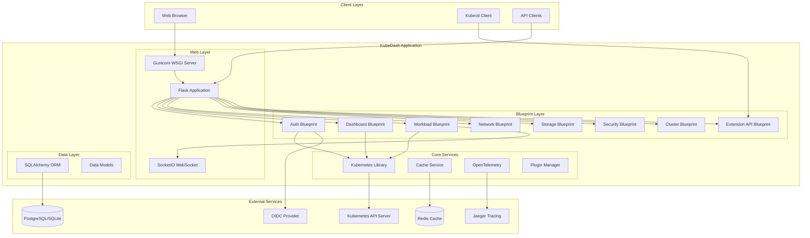

---

## Component Architecture

### Application Initialization Flow

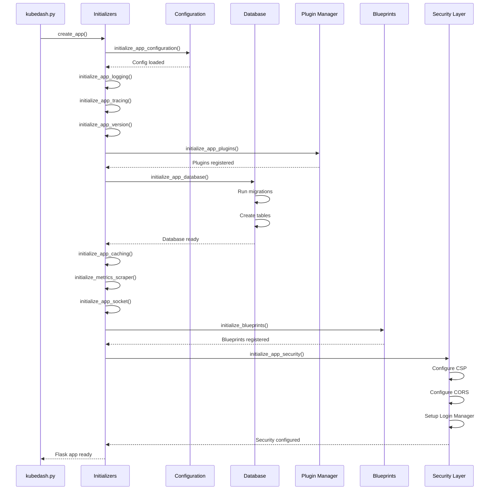

### Blueprint Component Structure

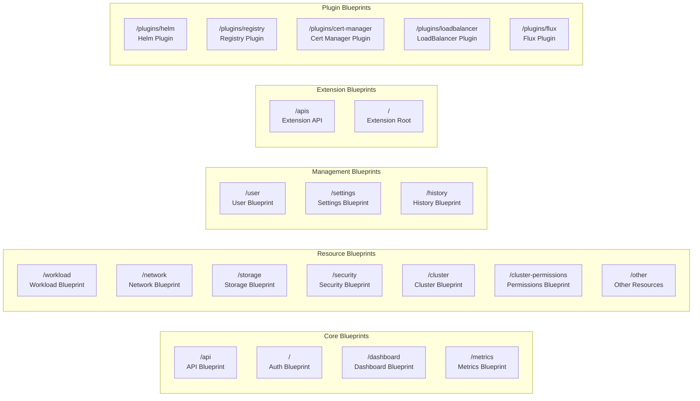

---

## Data Flow Architecture

### Authentication Flow

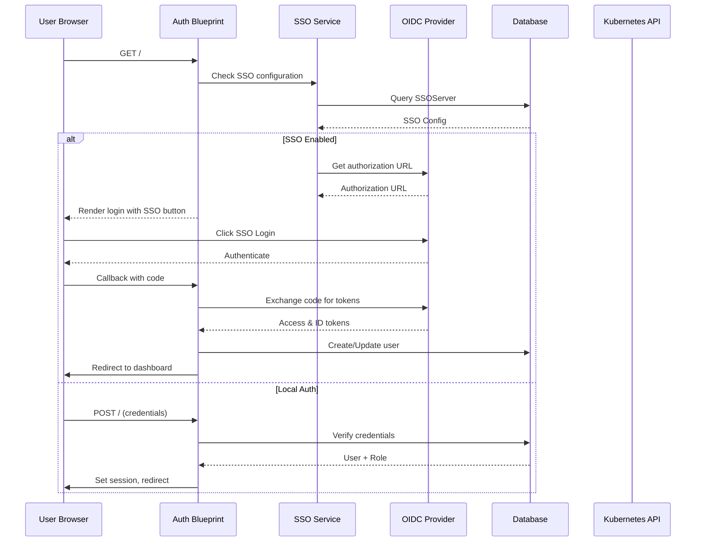

### Kubernetes API Interaction Flow

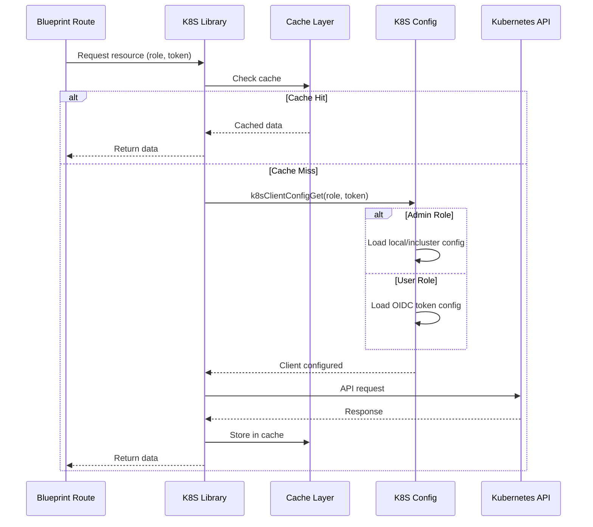

### Real-time Log Streaming Flow

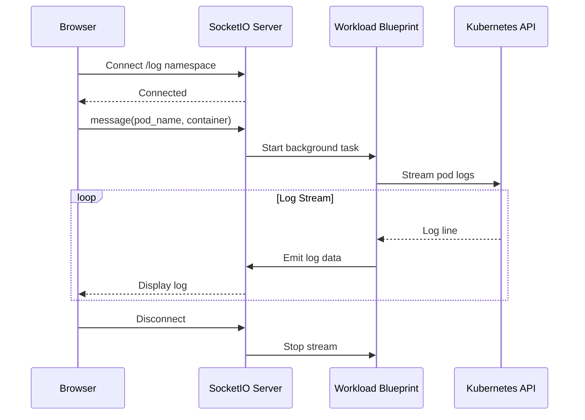

---

## Database Schema

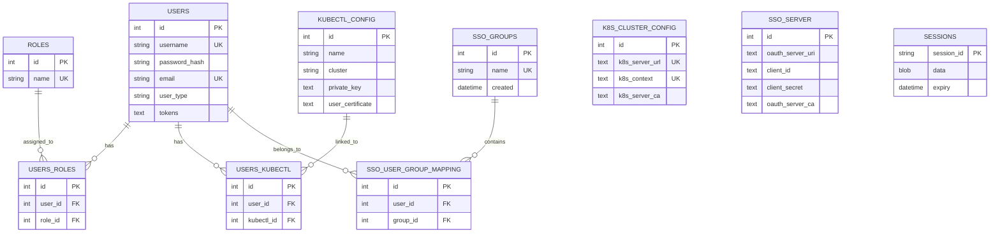

---

## Plugin System Architecture

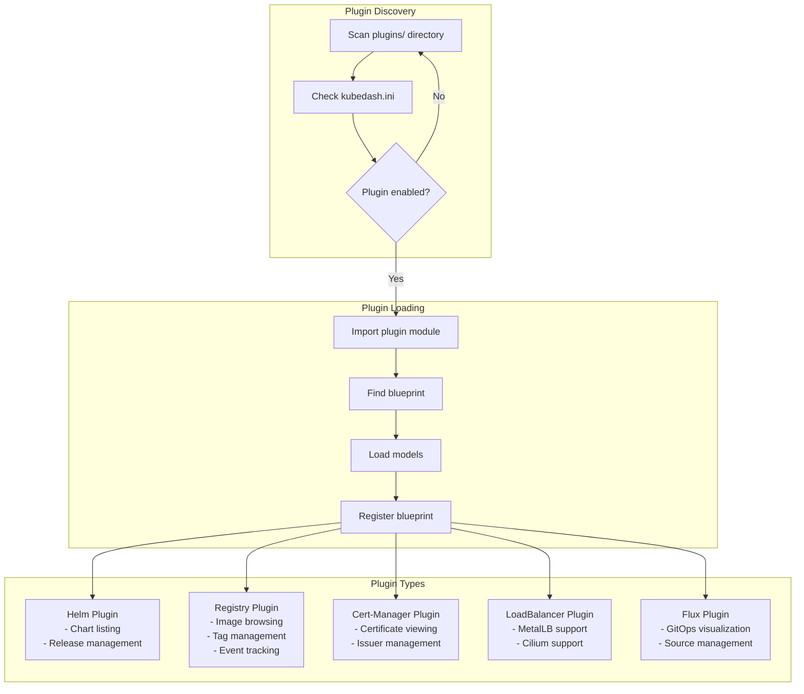

### Plugin Interface

Each plugin must follow this structure:

```
plugins/
└── plugin_name/
    ├── __init__.py      # Blueprint definition (plugin_name_bp)
    ├── functions.py     # Business logic
    ├── model.py         # Database models (optional)
    └── templates/       # Jinja2 templates
        └── *.html.j2
```

---

## Security Architecture

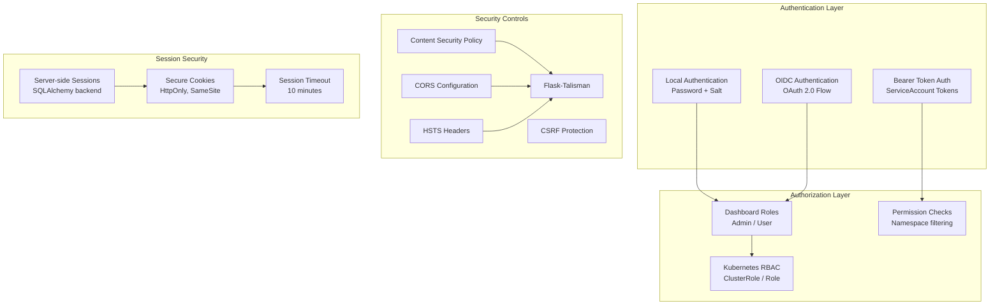

### Security Headers Configuration

| Header | Value | Purpose |
|--------|-------|---------|
| Content-Security-Policy | Strict CSP | Prevent XSS attacks |
| X-Content-Type-Options | nosniff | Prevent MIME sniffing |
| X-Frame-Options | DENY | Prevent clickjacking |
| Strict-Transport-Security | max-age=31536000 | Force HTTPS |
| Cross-Origin-Embedder-Policy | require-corp | Isolation |
| Cross-Origin-Opener-Policy | same-origin | Isolation |

---

## Deployment Architecture

### Kubernetes Deployment

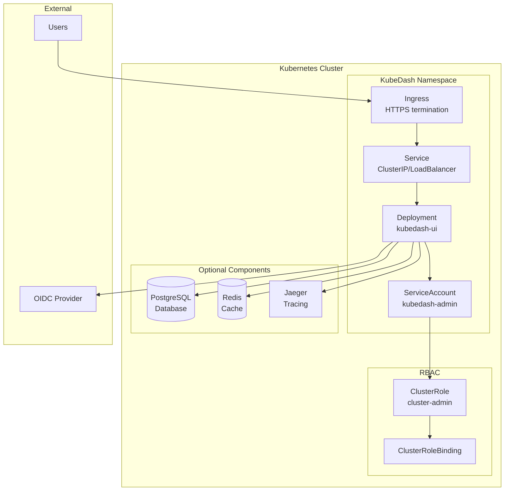

### Container Architecture

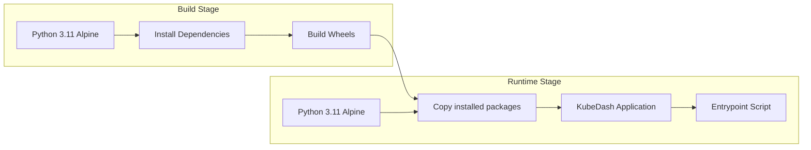

---

## Technology Stack

### Backend Stack

| Component | Technology | Version | Purpose |
|-----------|------------|---------|---------|
| Web Framework | Flask | 3.0.2 | Application core |
| WSGI Server | Gunicorn | 23.0.0 | Production server |
| ORM | SQLAlchemy | 2.0.17 | Database abstraction |
| Migration | Alembic/Flask-Migrate | 4.0.5 | Schema migrations |
| Authentication | Flask-Login | 0.6.3 | Session management |
| WebSocket | Flask-SocketIO | 5.5.1 | Real-time communication |
| Caching | Flask-Caching | 2.3.1 | Performance optimization |
| API Documentation | Flask-Smorest | 0.46.1 | OpenAPI/Swagger |
| Kubernetes Client | kubernetes-python | 26.1.0 | K8s API access |

### Observability Stack

| Component | Technology | Purpose |
|-----------|------------|---------|
| Tracing | OpenTelemetry | Distributed tracing |
| Metrics | Prometheus | Application metrics |
| Logging | Colorlog | Structured logging |
| Export | OTLP HTTP | Trace export to Jaeger |

### Frontend Stack

| Component | Technology | Purpose |
|-----------|------------|---------|
| UI Framework | CoreUI + Bootstrap 5 | Responsive design |
| Charts | Chart.js + Plotly | Data visualization |
| Tables | DataTables | Interactive tables |
| Icons | Font Awesome 6 | Icon library |
| Terminal | xterm.js | Terminal emulation |
| Network Graph | PyVis/Cytoscape | Resource mapping |

### Security Stack

| Component | Technology | Purpose |
|-----------|------------|---------|
| Security Headers | Flask-Talisman | CSP, HSTS, etc. |
| CSRF Protection | Flask-WTF | Form protection |
| Password Hashing | Werkzeug (scrypt) | Secure password storage |
| OAuth 2.0 | Authlib | OIDC integration |

---

## Architectural Decision Records

### ADR-001: Blueprint-Based Modularization

**Context**: Need to organize code for maintainability and scalability.

**Decision**: Use Flask Blueprints to separate concerns by functional domain.

**Consequences**: 
- Improved code organization
- Easier testing of individual components
- Clear separation between UI routes and API endpoints

### ADR-002: SQLAlchemy with Multiple Database Support

**Context**: Need to support both development (SQLite) and production (PostgreSQL) scenarios.

**Decision**: Use SQLAlchemy ORM with configurable database backends.

**Consequences**:
- Seamless development experience
- Production-ready database support
- Migration support through Alembic

### ADR-003: Plugin Architecture

**Context**: Need to extend functionality without modifying core code.

**Decision**: Implement dynamic plugin loading from `plugins/` directory.

**Consequences**:
- Easy addition of new features
- Optional component loading
- Clear plugin interface requirements

### ADR-004: Dual Authentication Modes

**Context**: Support both standalone and enterprise deployments.

**Decision**: Implement local authentication and OIDC SSO.

**Consequences**:
- Flexible deployment options
- Enterprise integration capability
- Kubernetes RBAC integration for OIDC users

### ADR-005: Kubernetes API Abstraction

**Context**: Need consistent interface for Kubernetes operations across authentication modes.

**Decision**: Create `lib/k8s/` abstraction layer with role-based client configuration.

**Consequences**:
- Unified API access pattern
- Transparent admin vs user token handling
- Centralized error handling and caching

---

## Performance Considerations

### Caching Strategy

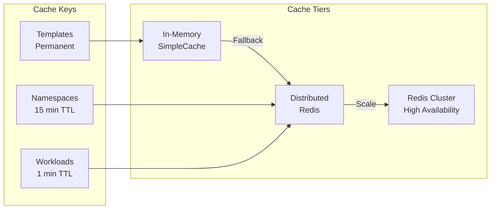

### Caching Configuration

| Cache Type | TTL | Use Case |
|------------|-----|----------|
| Short Cache | 60s | Dynamic resources (pods, events) |
| Long Cache | 900s | Semi-static resources (namespaces, CRDs) |
| Template Cache | ∞ | Base templates |

---

## Future Architecture Considerations

1. **Horizontal Scaling**: Multi-instance deployment with shared session store
2. **Event-Driven Architecture**: Kubernetes watch streams for real-time updates
3. **GraphQL API**: Alternative to REST for flexible queries
4. **Multi-Cluster Support**: Managing multiple Kubernetes clusters
5. **Audit Logging**: Comprehensive action logging for compliance

---

*Last Updated: December 2025*
*Version: 4.1.0*
