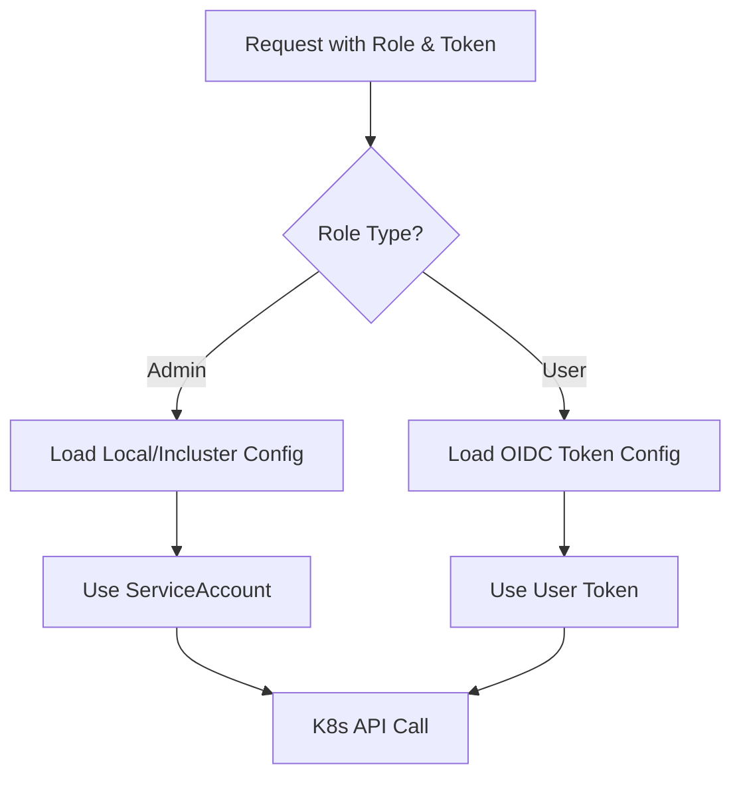

# KubeDash Developer Guide

This comprehensive guide is designed for developers who want to understand, contribute to, or extend KubeDash. It covers the development environment setup, code organization, coding standards, and common development tasks.

## Table of Contents

- [Getting Started](#getting-started)
- [Project Structure](#project-structure)
- [Development Environment](#development-environment)
- [Code Organization](#code-organization)
- [Adding New Features](#adding-new-features)
- [Creating Plugins](#creating-plugins)
- [Database Operations](#database-operations)
- [Kubernetes API Integration](#kubernetes-api-integration)
- [Testing](#testing)
- [Debugging](#debugging)
- [Code Style Guide](#code-style-guide)

---

## Getting Started

### Prerequisites

- Python 3.11 or higher
- Poetry (dependency management)
- Access to a Kubernetes cluster (minikube, kind, or remote)
- Docker (optional, for containerized development)
- VS Code (recommended IDE)

### Quick Start

```bash
# Clone the repository
git clone https://github.com/devopstales/KubeDash.git
cd KubeDash/src/kubedash

# Create virtual environment
python3 -m venv .venv
source .venv/bin/activate

# Install dependencies
pip install poetry
poetry install

# Or using requirements.txt
pip install -r requirements.txt

# Run development server
flask run --debug
```

---

## Project Structure

```
kubedash_4/
├── docker/                    # Docker build files
│   └── kubedash/
│       ├── Dockerfile         # Production image
│       ├── Dockerfile.dev     # Development image
│       └── requirements.txt   # Container dependencies
├── deploy/                    # Deployment configurations
│   ├── charts/               # Helm charts
│   ├── kubernetes/           # Raw K8s manifests
│   └── docker-compose/       # Docker Compose files
├── docs/                      # Documentation (MkDocs)
│   ├── development/          # Developer docs
│   ├── functions/            # Feature docs
│   └── integrations/         # Plugin docs
└── src/kubedash/             # Main application
    ├── kubedash.py           # Application entry point
    ├── blueprint/            # Flask blueprints
    ├── lib/                  # Core libraries
    │   ├── k8s/             # Kubernetes client library
    │   └── extension_api/   # Extension API helpers
    ├── plugins/              # Plugin modules
    ├── templates/            # Jinja2 templates
    ├── static/               # Static assets
    ├── migrations/           # Database migrations
    └── tests/                # Test suites
```

---

## Development Environment

### VS Code Setup

Recommended extensions (from `.vscode/extensions.json`):

```json
{
  "recommendations": [
    "ms-python.python",
    "ms-python.pylance",
    "ms-python.debugpy",
    "samuelcolvin.jinjahtml",
    "ms-azuretools.vscode-docker",
    "ms-kubernetes-tools.vscode-kubernetes-tools"
  ]
}
```

### Debug Configuration

Create `.vscode/launch.json`:

```json
{
  "version": "0.2.0",
  "configurations": [
    {
      "name": "Flask Debug",
      "type": "debugpy",
      "request": "launch",
      "module": "flask",
      "args": ["run", "--debug"],
      "env": {
        "FLASK_ENV": "development",
        "FLASK_APP": "kubedash"
      },
      "jinja": true
    }
  ]
}
```

### Configuration File

Create `kubedash.ini` for local development:

```ini
[DEFAULT]
app_mode = development

[security]
admin_password = admin

[database]
type = sqlite3
host = 127.0.0.1:5432
name = kubedash

[remote_cache]
redis_enabled = false
redis_host = 127.0.0.1
redis_port = 6379
redis_db = 0
redis_password =
short_cache_time = 60
long_cache_time = 900

[monitoring]
jaeger_enabled = false
jaeger_http_endpoint = http://127.0.0.1:4318

[plugin_settings]
registry = false
helm = true
gateway_api = false
cert_manager = false
external_loadbalancer = false
flux = false
```

---

## Code Organization

### Application Entry Point

```python
# kubedash.py - Main application factory
def create_app(external_config_name=None):
    """Initialize Flask app object
    
    This function initializes all application components in the correct order:
    1. Configuration loading
    2. Logging setup
    3. Tracing initialization (if enabled)
    4. Plugin discovery and loading
    5. Database setup and migrations
    6. Cache initialization
    7. Blueprint registration
    8. Security configuration
    """
    app = Flask(__name__, static_url_path='', static_folder='static')
    
    # Initialize in order
    initialize_app_configuration(app, external_config_name)
    initialize_app_logging(app)
    initialize_app_tracing(app)
    initialize_app_plugins(app)
    initialize_app_database(app, __file__)
    initialize_app_caching(app)
    initialize_blueprints(app)
    initialize_app_security(app)
    
    return app
```

### Blueprint Structure

Each blueprint follows this pattern:

```python
# blueprint/example.py
from flask import Blueprint, render_template, request, session
from flask_login import login_required

from lib.helper_functions import get_logger
from lib.k8s.example import k8sExampleGet
from lib.sso import get_user_token

# Blueprint definition
example_bp = Blueprint("example", __name__, url_prefix="/example")
logger = get_logger()

# Routes
@example_bp.route("/list", methods=['GET', 'POST'])
@login_required
def list_items():
    user_token = get_user_token(session)
    
    if request.method == 'POST':
        if 'ns_select' in request.form:
            session['ns_select'] = request.form.get('ns_select')
    
    items = k8sExampleGet(session['user_role'], user_token, session['ns_select'])
    
    return render_template(
        'example/list.html.j2',
        items=items
    )
```

### Kubernetes Library Pattern

```python
# lib/k8s/example.py
from kubernetes import client as k8s_client
from kubernetes.client.rest import ApiException
from lib.components import cache, long_cache_time
from lib.helper_functions import ErrorHandler
from . import logger, tracer
from .server import k8sClientConfigGet

@cache.memoize(timeout=long_cache_time)
def k8sExampleGet(username_role, user_token, namespace):
    """Get example resources from Kubernetes
    
    Args:
        username_role (str): Role of the current user (Admin/User)
        user_token (str): Auth token for the current user
        namespace (str): Target namespace
        
    Returns:
        list: List of resource dictionaries
    """
    with tracer.start_as_current_span("get-example") as span:
        if tracer and span.is_recording():
            span.set_attribute("user.role", username_role)
            span.set_attribute("namespace", namespace)
        
        # Configure client based on role
        k8sClientConfigGet(username_role, user_token)
        
        try:
            api = k8s_client.CoreV1Api()
            items = api.list_namespaced_resource(namespace, _request_timeout=1)
            
            result = []
            for item in items.items:
                result.append({
                    "name": item.metadata.name,
                    "namespace": item.metadata.namespace,
                    "created": item.metadata.creation_timestamp,
                    # ... additional fields
                })
            return result
            
        except ApiException as error:
            ErrorHandler(logger, error, f"get example - {error.status}")
            return []
```

---

## Adding New Features

### Step 1: Create Blueprint

```python
# blueprint/new_feature.py
from flask import Blueprint, render_template, request, session
from flask_login import login_required
from lib.helper_functions import get_logger

new_feature_bp = Blueprint("new_feature", __name__, url_prefix="/new-feature")
logger = get_logger()

@new_feature_bp.route("/", methods=['GET'])
@login_required
def index():
    return render_template('new_feature/index.html.j2')
```

### Step 2: Register Blueprint

```python
# lib/initializers.py - Add to initialize_blueprints()
def initialize_blueprints(app: Flask):
    from blueprint.new_feature import new_feature_bp
    app.register_blueprint(new_feature_bp)
```

### Step 3: Create Templates

```html
<!-- templates/new_feature/index.html.j2 -->



<div class="container-fluid">
    <div class="row">
        <div class="col-12">
            <div class="card">
                <div class="card-header">
                    <strong>New Feature</strong>
                </div>
                <div class="card-body">
                    <!-- Feature content -->
                </div>
            </div>
        </div>
    </div>
</div>

```

### Step 4: Add Kubernetes Integration (if needed)

```python
# lib/k8s/new_feature.py
from kubernetes import client as k8s_client
from . import logger, tracer
from .server import k8sClientConfigGet

def k8sNewFeatureGet(username_role, user_token, namespace):
    """Fetch data for new feature"""
    k8sClientConfigGet(username_role, user_token)
    
    try:
        api = k8s_client.CoreV1Api()
        # API calls here
        return data
    except Exception as e:
        logger.error(f"Error: {e}")
        return None
```

---

## Creating Plugins

Plugins are self-contained modules that extend KubeDash functionality.

### Plugin Structure

```
plugins/
└── my_plugin/
    ├── __init__.py        # Blueprint and routes
    ├── functions.py       # Business logic
    ├── model.py          # Database models (optional)
    └── templates/
        └── my-plugin.html.j2
```

### Plugin Implementation

```python
# plugins/my_plugin/__init__.py
from flask import Blueprint, render_template, request, session
from flask_login import login_required
from lib.helper_functions import get_logger
from .functions import get_plugin_data

my_plugin_bp = Blueprint(
    "my_plugin", 
    __name__, 
    url_prefix="/plugins",
    template_folder="templates"
)
logger = get_logger()

@my_plugin_bp.route('/my-plugin', methods=['GET', 'POST'])
@login_required
def index():
    data = get_plugin_data()
    return render_template('my-plugin.html.j2', data=data)
```

```python
# plugins/my_plugin/functions.py
from lib.helper_functions import get_logger

logger = get_logger()

def get_plugin_data():
    """Plugin business logic"""
    return {"message": "Hello from plugin!"}
```

### Plugin Configuration

Add to `kubedash.ini`:

```ini
[plugin_settings]
my_plugin = true
```

### Plugin with Database Model

```python
# plugins/my_plugin/model.py
from lib.components import db

class MyPluginData(db.Model):
    __tablename__ = 'my_plugin_data'
    id = db.Column(db.Integer, primary_key=True)
    name = db.Column(db.String(100), nullable=False)
    value = db.Column(db.Text, nullable=True)
```

---

## Database Operations

### Creating Migrations

```bash
# Generate migration
flask db migrate -m "Add new table"

# Apply migration
flask db upgrade

# Rollback migration
flask db downgrade
```

### Migration File Example

```python
# migrations/versions/xxxx_add_new_table.py
"""Add new table

Revision ID: xxxx
Revises: yyyy
Create Date: 2025-01-01
"""
from alembic import op
import sqlalchemy as sa

revision = 'xxxx'
down_revision = 'yyyy'
branch_labels = None
depends_on = None

def upgrade():
    op.create_table(
        'new_table',
        sa.Column('id', sa.Integer(), nullable=False),
        sa.Column('name', sa.String(100), nullable=False),
        sa.Column('created', sa.DateTime(), nullable=False),
        sa.PrimaryKeyConstraint('id')
    )

def downgrade():
    op.drop_table('new_table')
```

### Database Model Pattern

```python
# lib/models.py
from flask_login import UserMixin
from lib.components import db

class MyModel(UserMixin, db.Model):
    __tablename__ = 'my_table'
    
    id = db.Column(db.Integer, primary_key=True)
    name = db.Column(db.String(100), unique=True, nullable=False)
    data = db.Column(db.Text, nullable=True)
    
    def __repr__(self):
        return f'<MyModel {self.name}>'

# CRUD operations
def create_item(name, data):
    item = MyModel(name=name, data=data)
    db.session.add(item)
    db.session.commit()
    return item

def get_item(name):
    return MyModel.query.filter_by(name=name).first()

def update_item(name, data):
    item = get_item(name)
    if item:
        item.data = data
        db.session.commit()
    return item

def delete_item(name):
    item = get_item(name)
    if item:
        db.session.delete(item)
        db.session.commit()
```

---

## Kubernetes API Integration

### Role-Based Client Configuration



### Client Configuration Code

```python
# lib/k8s/server.py
def k8sClientConfigGet(username_role, user_token):
    """Configure Kubernetes client based on user role
    
    Admin: Uses local kubeconfig or in-cluster service account
    User: Uses OIDC token for authentication
    """
    if username_role == "Admin":
        try:
            k8s_config.load_kube_config()  # Try local first
        except:
            k8s_config.load_incluster_config()  # Fall back to in-cluster
    
    elif username_role == "User":
        k8sConfig = k8sServerConfigGet()
        configuration = k8s_client.Configuration()
        configuration.host = k8sConfig.k8s_server_url
        configuration.ssl_ca_cert = 'CA.crt'
        configuration.api_key_prefix['authorization'] = 'Bearer'
        configuration.api_key["authorization"] = user_token.get('access_token')
        k8s_client.Configuration.set_default(configuration)
```

### API Call Patterns

```python
# List resources in namespace
api = k8s_client.CoreV1Api()
pods = api.list_namespaced_pod(namespace, _request_timeout=1)

# Get specific resource
pod = api.read_namespaced_pod(name, namespace, _request_timeout=1)

# Create resource
body = k8s_client.V1Namespace(
    metadata=k8s_client.V1ObjectMeta(name="my-namespace")
)
api.create_namespace(body, _request_timeout=1)

# Patch resource
body = {"spec": {"replicas": 3}}
apps_api = k8s_client.AppsV1Api()
apps_api.patch_namespaced_deployment_scale(name, namespace, body)

# Delete resource
api.delete_namespaced_pod(name, namespace, _request_timeout=1)
```

### WebSocket Streaming

```python
# lib/k8s/workload.py
from lib.components import socketio

def k8sPodLogsStream(username_role, user_token, namespace, pod_name, container):
    """Stream pod logs via WebSocket"""
    k8sClientConfigGet(username_role, user_token)
    api = k8s_client.CoreV1Api()
    
    stream = api.read_namespaced_pod_log(
        name=pod_name,
        namespace=namespace,
        container=container,
        follow=True,
        _preload_content=False
    )
    
    for line in stream:
        socketio.emit('response', {'data': line.decode()}, namespace="/log")
```

---

## Testing

### Test Structure

```
tests/
├── conftest.py           # Pytest fixtures
├── functional/
│   ├── health_test.py    # Health endpoint tests
│   ├── page_test.py      # Page rendering tests
│   └── playwright_test.py # E2E tests
└── unit/
    └── user_test.py      # Unit tests
```

### Running Tests

```bash
# Run all tests
pytest

# Run with coverage
pytest --cov=. --cov-report=html

# Run specific test file
pytest tests/functional/page_test.py

# Run with verbose output
pytest -v
```

### Test Fixtures

```python
# tests/conftest.py
import pytest
from flask.testing import FlaskClient
from kubedash import create_app

@pytest.fixture(scope='module')
def app():
    """Create test application"""
    app = create_app("testing")
    with app.app_context():
        flask_migrate.upgrade()
    yield app

@pytest.fixture(scope='module')
def client(app):
    """Create test client"""
    ctx = app.test_request_context()
    ctx.push()
    app.test_client_class = FlaskClient
    return app.test_client()
```

### Writing Tests

```python
# tests/functional/page_test.py
def test_home_page(client):
    """Test home page renders login"""
    response = client.get("/")
    assert response.status_code == 200
    assert b"<title>KubeDash - Login</title>" in response.data

def test_authenticated_dashboard(client):
    """Test dashboard requires authentication"""
    # Login first
    client.post("/", data={
        "username": "admin",
        "password": "admin"
    }, follow_redirects=True)
    
    # Access dashboard
    response = client.get('/dashboard/cluster-metric')
    assert response.status_code == 200
```

---

## Debugging

### Logging

```python
from lib.helper_functions import get_logger

logger = get_logger()

# Log levels
logger.debug("Debug message")
logger.info("Info message")
logger.warning("Warning message")
logger.error("Error message")
```

### OpenTelemetry Tracing

```python
from lib.opentelemetry import get_tracer
from opentelemetry import trace

tracer = get_tracer()

# Create span
with tracer.start_as_current_span("operation-name") as span:
    span.set_attribute("key", "value")
    span.add_event("event", {"detail": "info"})
    
    # Your code here
    
    if error:
        span.set_status(Status(StatusCode.ERROR, str(error)))
```

### Debug Endpoints

```python
# Access debug trace info
GET /api/debug-trace

# Response:
{
    "flask_correlation_id": "uuid",
    "jaeger_trace_id": "hex",
    "span_id": "hex",
    "span_attributes": {}
}
```

### Flask Debug Mode

```bash
# Enable debug mode
export FLASK_ENV=development
flask run --debug

# Or in code
app.config['DEBUG'] = True
```

---

## Code Style Guide

### Python Style

KubeDash follows PEP 8 with Black formatter:

```bash
# Format code
black .

# Check style
flake8 .

# Sort imports
isort .
```

### Configuration

```toml
# pyproject.toml
[tool.black]
line-length = 120
include = '\.pyi?$'
exclude='(\.eggs|\.git|\.idea|\.pytest_cache|venv|build|dist|logs)'

[tool.isort]
profile = "black"
line_length = 120
```

### Naming Conventions

| Type | Convention | Example |
|------|------------|---------|
| Functions | snake_case | `get_user_token()` |
| Classes | PascalCase | `UserConfig` |
| Constants | UPPER_SNAKE | `MAX_TIMEOUT` |
| Variables | snake_case | `user_role` |
| Files | snake_case | `helper_functions.py` |
| Templates | kebab-case.j2 | `pod-data.html.j2` |
| Blueprints | snake_case_bp | `workload_bp` |
| K8s functions | k8sCamelCase | `k8sPodListGet` |

### Documentation Style

```python
def function_name(param1: str, param2: int) -> list:
    """Short description of function.
    
    Longer description if needed with details about
    the function's behavior.
    
    Args:
        param1 (str): Description of param1
        param2 (int): Description of param2
        
    Returns:
        list: Description of return value
        
    Raises:
        ValueError: When param1 is empty
    """
    pass
```

### Template Style

```html
{# Use Jinja2 comments for template logic #}



{# Indent consistently with 2 or 4 spaces #}
<div class="container">
    
    <div class="item">
        {{ item.name | escape }}
    </div>
    
</div>

```

---

## CLI Commands

### Built-in Commands

```bash
# Database migrations
flask db init
flask db migrate -m "message"
flask db upgrade
flask db downgrade

# Custom CLI commands
flask cli reset-password    # Reset admin password
flask cli create-user       # Create new user
```

### Adding CLI Commands

```python
# lib/commands.py
import click
from flask import Blueprint

cli = Blueprint('cli', __name__)

@cli.cli.command("my-command")
@click.argument("name")
def my_command(name):
    """Description of my command"""
    click.echo(f"Hello, {name}!")
```

---

## Environment Variables

| Variable | Description | Default |
|----------|-------------|---------|
| `FLASK_ENV` | Environment mode | development |
| `FLASK_APP` | Application module | kubedash |
| `KUBEDASH_VERSION` | Application version | Unknown |
| `FLASK_CONFIG` | Config class | development |

---

## Common Development Tasks

### Adding a New Kubernetes Resource View

1. Create K8s library function in `lib/k8s/`
2. Create blueprint route in `blueprint/`
3. Create Jinja2 template in `templates/`
4. Add navigation link to base template
5. Write tests

### Adding Plugin Configuration Option

1. Add option to `kubedash.ini.example`
2. Read option in plugin `__init__.py`
3. Document in plugin README

### Adding Database Table

1. Create model class
2. Generate migration: `flask db migrate`
3. Apply migration: `flask db upgrade`
4. Create CRUD functions
5. Write tests

---

*Last Updated: December 2025*
*Version: 4.1.0*
