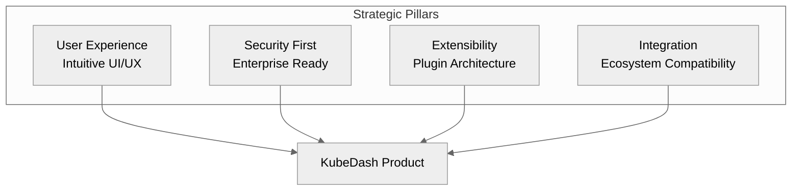
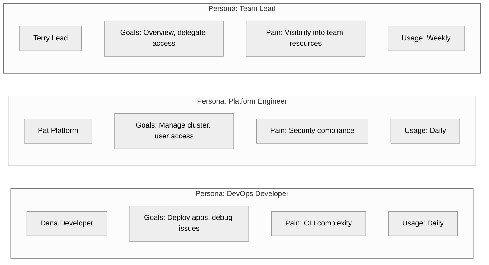
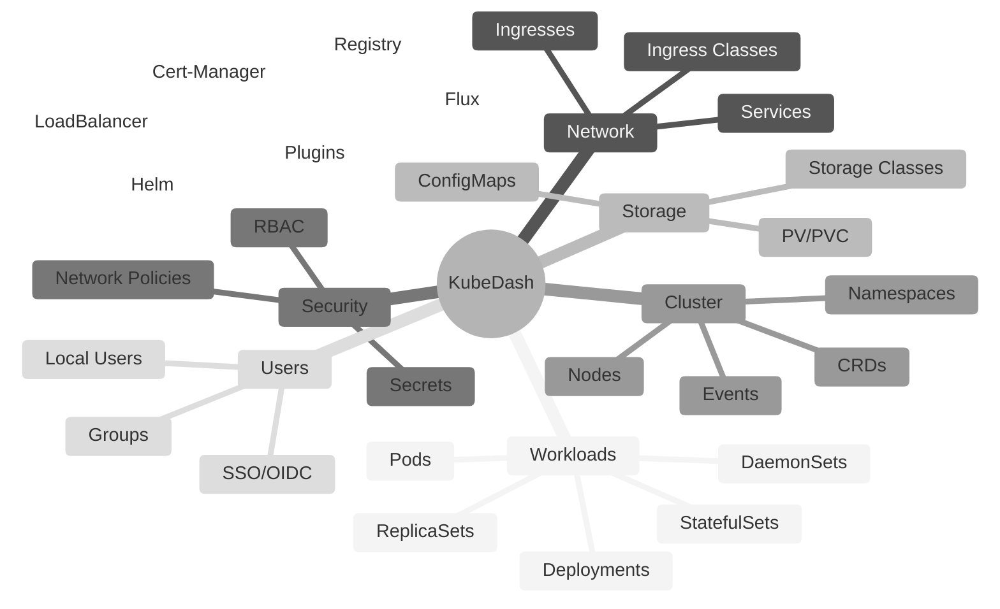
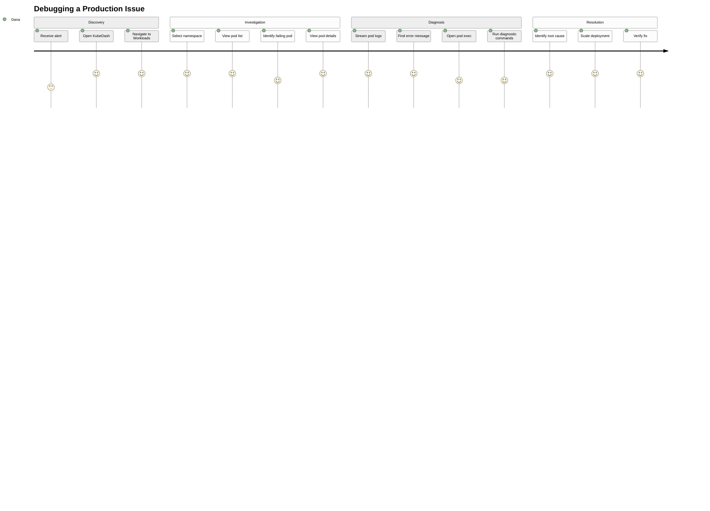
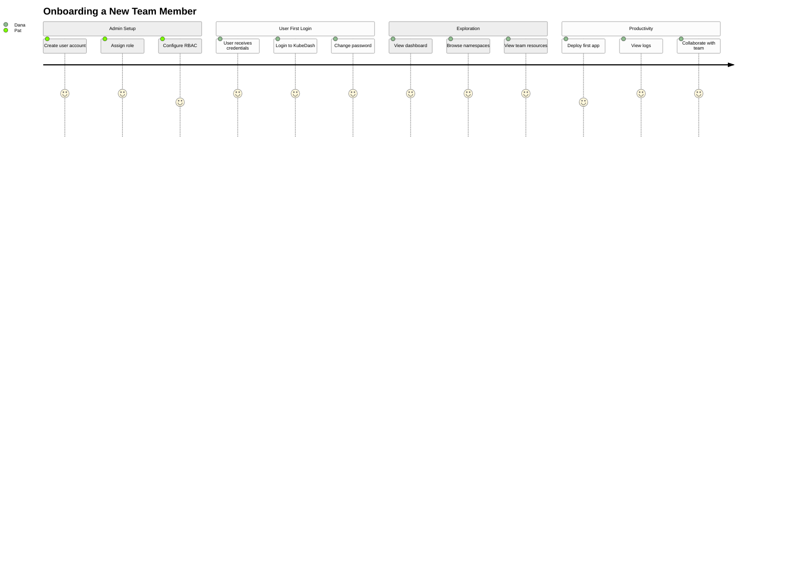
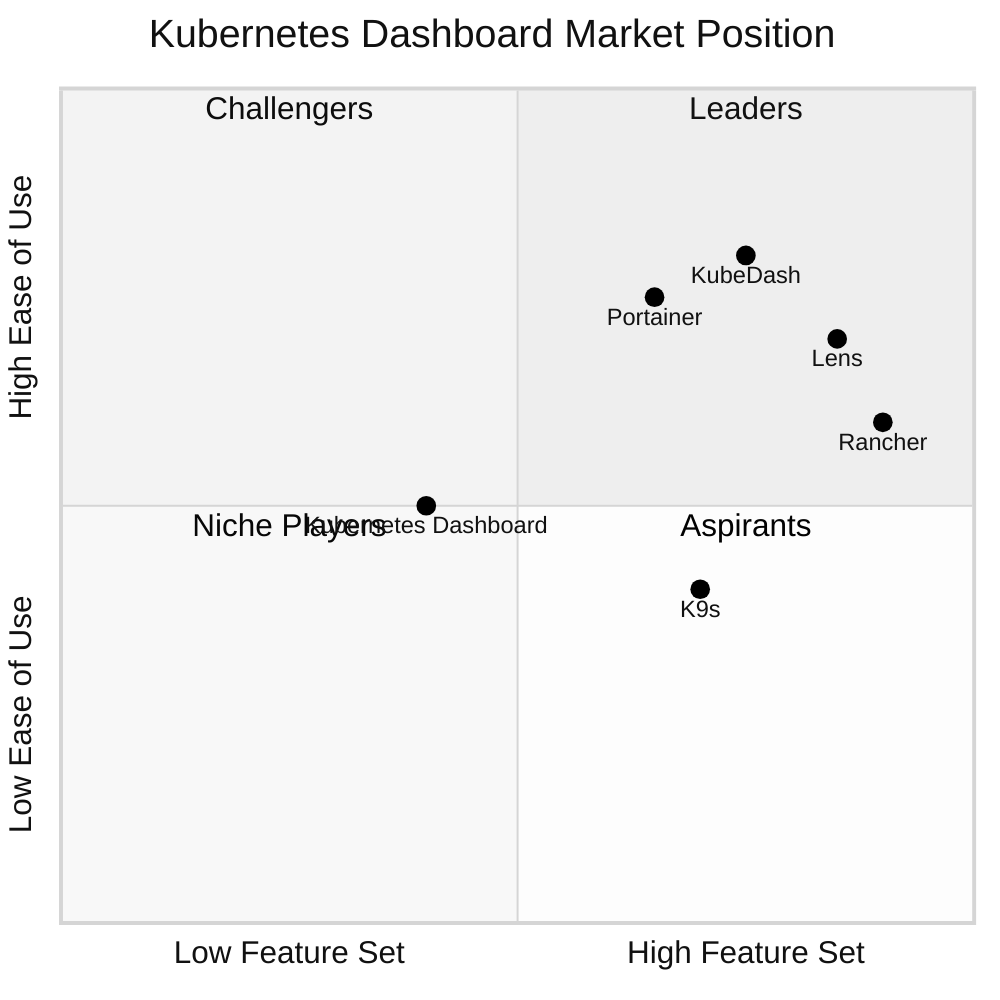
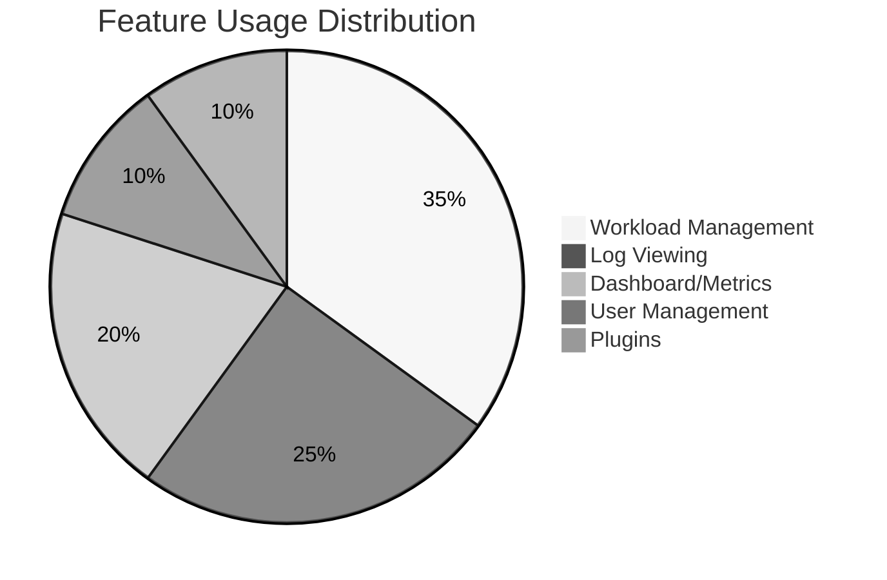
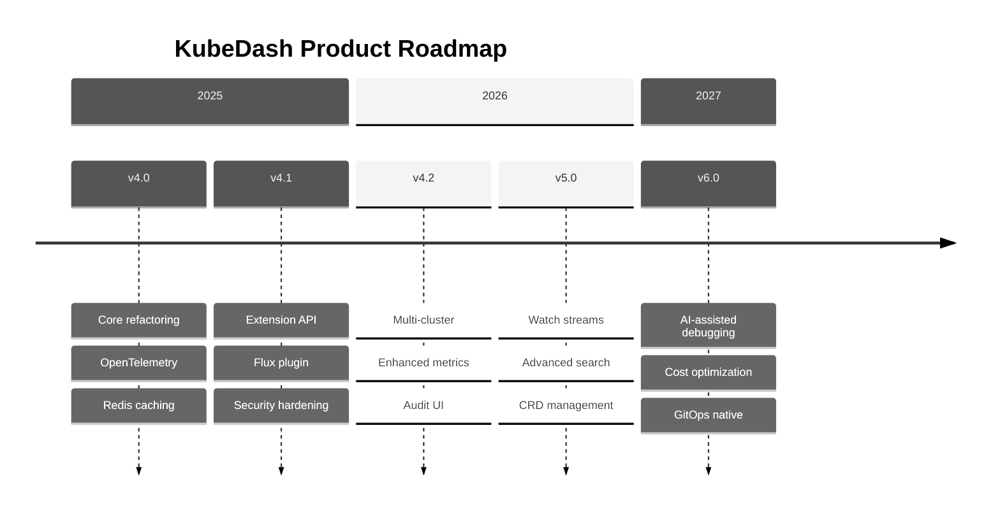
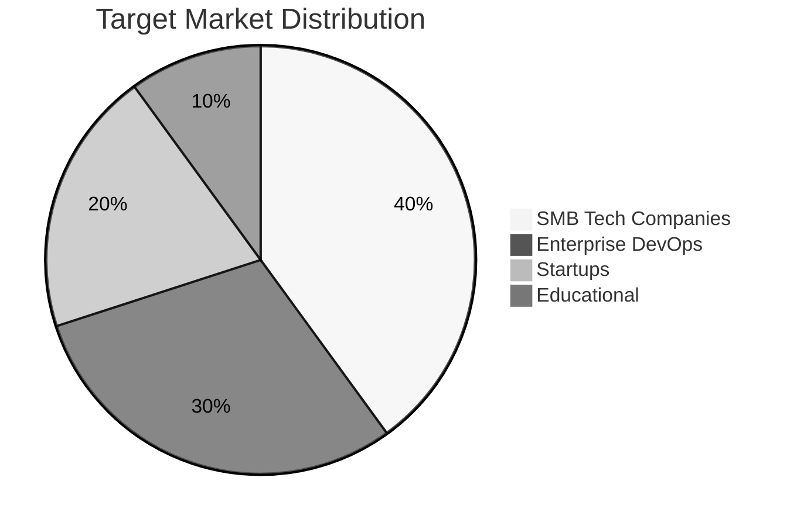

# KubeDash Product Overview

This document provides a comprehensive product overview of KubeDash from a product management perspective. It covers the product vision, feature set, user personas, competitive analysis, and product roadmap.

## Table of Contents

- [Product Vision](#product-vision)
- [Value Proposition](#value-proposition)
- [User Personas](#user-personas)
- [Feature Overview](#feature-overview)
- [Feature Matrix](#feature-matrix)
- [User Journey Maps](#user-journey-maps)
- [Competitive Analysis](#competitive-analysis)
- [Product Metrics](#product-metrics)
- [Roadmap](#roadmap)
- [Release History](#release-history)

---

## Product Vision

### Mission Statement

> **KubeDash empowers teams to observe, manage, and troubleshoot Kubernetes applications with an intuitive, secure, and extensible web interface.**

### Vision

To be the most comprehensive, user-friendly, and security-focused Kubernetes dashboard that bridges the gap between complex Kubernetes operations and day-to-day developer workflows.

### Strategic Pillars



---

## Value Proposition

### For Developers

| Pain Point | KubeDash Solution |
|------------|-------------------|
| Complex kubectl commands | Visual interface for all operations |
| Log aggregation challenges | Real-time log streaming |
| Pod debugging difficulty | Integrated terminal (exec) |
| Configuration management | ConfigMap/Secret visualization |

### For Platform Engineers

| Pain Point | KubeDash Solution |
|------------|-------------------|
| User access management | Centralized authentication (OIDC/Local) |
| Multi-tenant access control | Kubernetes RBAC integration |
| Cluster visibility | Comprehensive resource views |
| Certificate management | Cert-Manager plugin |

### For Operations Teams

| Pain Point | KubeDash Solution |
|------------|-------------------|
| Cluster health monitoring | Metrics dashboard |
| Incident investigation | Event timeline, resource maps |
| Scaling operations | One-click replica management |
| Network troubleshooting | Service/Ingress visualization |

---

## User Personas

### Primary Personas



### Persona Details

#### Dana Developer (DevOps Developer)
- **Role**: Full-stack developer deploying to Kubernetes
- **Experience**: 2-3 years with Kubernetes
- **Goals**: 
  - Deploy applications quickly
  - Debug production issues
  - View logs without kubectl
- **Frustrations**:
  - Complex kubectl commands
  - Context switching between tools
  - Difficulty understanding pod relationships
- **Success Metrics**: Time to debug, deployment frequency

#### Pat Platform (Platform Engineer)
- **Role**: Platform team member managing cluster infrastructure
- **Experience**: 5+ years Kubernetes experience
- **Goals**:
  - Secure cluster access
  - Manage user permissions
  - Monitor cluster health
- **Frustrations**:
  - Manual RBAC management
  - Scattered monitoring tools
  - SSO integration complexity
- **Success Metrics**: Security compliance, MTTR

#### Terry Lead (Team Lead)
- **Role**: Engineering manager overseeing team deployments
- **Experience**: Limited Kubernetes experience
- **Goals**:
  - Overview of team resources
  - Delegate appropriate access
  - Quick status checks
- **Frustrations**:
  - Technical complexity of kubectl
  - No visibility into resource usage
  - Complex permission management
- **Success Metrics**: Team velocity, resource costs

---

## Feature Overview

### Core Features by Category



### Feature Highlights

| Feature | Description | User Value |
|---------|-------------|------------|
| **Real-time Logs** | WebSocket-based live log streaming | Instant debugging capability |
| **Pod Exec** | Interactive terminal in pod containers | Remote troubleshooting |
| **Resource Map** | Visual graph of K8s resources | Understanding relationships |
| **Helm Dashboard** | View installed Helm releases | Release management |
| **Extension API** | Kubernetes-native API for Projects | GitOps/Automation integration |
| **Dark Mode** | Eye-friendly interface | Developer preference |

---

## Feature Matrix

### Feature Comparison by Version

| Feature | v2.0 | v3.0 | v4.0 | v4.1 (Planned) |
|---------|:----:|:----:|:----:|:----:|
| Basic Resource Viewing | ✅ | ✅ | ✅ | ✅ |
| Pod Logs & Exec | ✅ | ✅ | ✅ | ✅ |
| Local Authentication | ✅ | ✅ | ✅ | ✅ |
| OIDC/SSO | ✅ | ✅ | ✅ | ✅ |
| Helm Plugin | ⭕ | ✅ | ✅ | ✅ |
| Registry Plugin | ✅ | ✅ | ✅ | ✅ |
| Cert-Manager Plugin | ⭕ | ✅ | ✅ | ✅ |
| External LoadBalancer | ⭕ | ✅ | ✅ | ✅ |
| Extension API | ⭕ | ⭕ | ⭕ | 🔄 |
| Kubernetes RBAC Integration | ✅ | ✅ | ✅ | ✅ |
| OpenTelemetry Tracing | ⭕ | ⭕ | ✅ | ✅ |
| Redis Caching | ⭕ | ⭕ | ✅ | ✅ |
| Flux Plugin | ⭕ | ⭕ | ⭕ | 🔄 |

Legend: ✅ Available | ⭕ Not Available | 🔄 Planned

### Feature by User Role

| Feature | Admin | User |
|---------|:-----:|:----:|
| View all namespaces | ✅ | Via RBAC |
| Create namespaces | ✅ | Via RBAC |
| User management | ✅ | ❌ |
| Settings configuration | ✅ | Read-only |
| Pod exec | ✅ | Via RBAC |
| Pod logs | ✅ | Via RBAC |
| Scale workloads | ✅ | Via RBAC |
| Extension API access | ✅ | ✅ |

---

## User Journey Maps

### Journey: Debugging Production Issue



### Journey: Onboarding New User



---

## Competitive Analysis

### Market Landscape



### Competitor Comparison

| Feature | KubeDash | K8s Dashboard | Lens | Rancher | K9s |
|---------|:--------:|:-------------:|:----:|:-------:|:---:|
| Web-based | ✅ | ✅ | ❌ | ✅ | ❌ |
| SSO/OIDC | ✅ | ❌ | ✅ | ✅ | ❌ |
| Plugin System | ✅ | ❌ | ✅ | ✅ | ❌ |
| Multi-cluster | ⭕ | ❌ | ✅ | ✅ | ✅ |
| Pod Exec | ✅ | ✅ | ✅ | ✅ | ✅ |
| Helm Support | ✅ | ❌ | ✅ | ✅ | ❌ |
| Open Source | ✅ | ✅ | Partial | ✅ | ✅ |
| Self-hosted | ✅ | ✅ | ❌ | ✅ | ✅ |
| Extension API | ✅ | ❌ | ❌ | ❌ | ❌ |

### Competitive Advantages

1. **Kubernetes-native Extension API**: Unique feature for automation integration
2. **Plugin Architecture**: Easily extendable without core modifications
3. **Security Focus**: Enterprise-grade authentication and authorization
4. **Open Source**: Full transparency and community involvement
5. **Python-based**: Accessible for customization by DevOps teams

---

## Product Metrics

### Key Performance Indicators (KPIs)

| Metric | Target | Description |
|--------|--------|-------------|
| Daily Active Users | Growth 10%/month | User engagement |
| Session Duration | 15+ minutes | Feature utilization |
| Feature Adoption | 80% core features | Value delivery |
| Time to First Value | < 5 minutes | Onboarding efficiency |
| NPS Score | > 50 | User satisfaction |

### Usage Analytics (Suggested)



### Success Metrics by Persona

| Persona | Metric | Target |
|---------|--------|--------|
| Developer | Time to debug | -50% vs kubectl |
| Platform Engineer | RBAC setup time | < 10 minutes |
| Team Lead | Visibility score | 100% resource coverage |

---

## Roadmap

### Current Version: 4.0.x

**Focus**: Stability, Performance, OpenTelemetry

### Version 4.1 (Q1 2026)

| Feature | Priority | Status |
|---------|----------|--------|
| Extension API | High | In Development |
| Flux GitOps plugin | High | In Development |
| Security hardening | High | In Development |
| Enhanced caching (Redis Cluster) | Medium | In Development |

### Version 4.2 (Q2 2026)

| Feature | Priority | Status |
|---------|----------|--------|
| Multi-cluster support | High | Planned |
| Enhanced metrics dashboard | High | Planned |
| Audit logging UI | Medium | Planned |
| Custom dashboard widgets | Medium | Planned |

### Version 5.0 (Q4 2026)

| Feature | Priority | Status |
|---------|----------|--------|
| Real-time resource updates (Watch) | High | Planned |
| Advanced search/filtering | High | Planned |
| Custom resource management | High | Planned |
| Backup/restore UI | Medium | Planned |

### Long-term Vision



### Feature Request Prioritization Framework

| Factor | Weight | Description |
|--------|--------|-------------|
| User Impact | 40% | Number of users affected |
| Strategic Alignment | 25% | Fits product vision |
| Technical Feasibility | 20% | Implementation effort |
| Revenue Potential | 15% | Enterprise interest |

---

## Release History

### Version 4.1.0 (Upcoming)

**Expected**: Q1 2026

**Planned Highlights**:
- Kubernetes Extension API for Projects
- Flux GitOps plugin
- Enhanced security headers
- Improved caching with Redis Cluster support
- OpenTelemetry tracing improvements

### Version 4.0.0 (Current)

**Released**: October 2025

**Highlights**:
- Complete architecture refactoring
- OpenTelemetry integration
- Redis caching support
- Python 3.11+ requirement
- Performance optimizations

### Version 3.0.0

**Released**: June 2025

**Highlights**:
- Cert-Manager plugin
- External LoadBalancer plugin
- Kubectl config generation
- SSO group support
- Enhanced RBAC integration

### Version 2.0.0

**Released**: January 2025

**Highlights**:
- Local user management
- Registry plugin
- Improved UI/UX
- Dark mode support
- Namespace management

---

## Market Positioning

### Target Market Segments



### Go-to-Market Strategy

1. **Open Source Community**: GitHub presence, community contributions
2. **Documentation**: Comprehensive guides and tutorials
3. **Content Marketing**: Blog posts, use cases, comparisons
4. **Integration Partners**: Helm chart, OIDC providers
5. **Enterprise Features**: Security, compliance, support

### Key Differentiators

| Differentiator | Description |
|----------------|-------------|
| **Extension API** | First dashboard with K8s-native API aggregation |
| **Plugin System** | Modular architecture for custom extensions |
| **Security First** | Enterprise-grade auth from the start |
| **Developer Experience** | Built by DevOps for DevOps |
| **Open Source** | Transparent, auditable, community-driven |

---

## Appendix

### Glossary

| Term | Definition |
|------|------------|
| **Blueprint** | Flask module for organizing routes |
| **Extension API** | Kubernetes API aggregation layer endpoint |
| **OIDC** | OpenID Connect authentication protocol |
| **RBAC** | Role-Based Access Control |
| **Plugin** | Modular feature extension |

### Success Stories Template

```markdown
## Customer: [Company Name]

**Industry**: [Industry]
**Size**: [Employee count]
**Cluster Size**: [Node count]

### Challenge
[Description of problem they faced]

### Solution
[How KubeDash helped]

### Results
- [Metric 1]: [Improvement]
- [Metric 2]: [Improvement]
- [Metric 3]: [Improvement]

### Quote
> "[Customer quote about KubeDash]"
> — [Name], [Title]
```

---

*Last Updated: December 2025*
*Version: 4.0.x (4.1.0 in development)*
