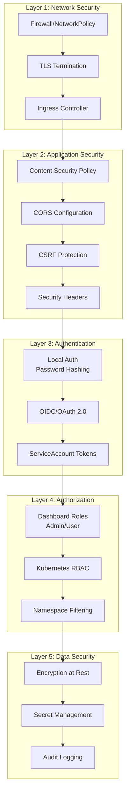
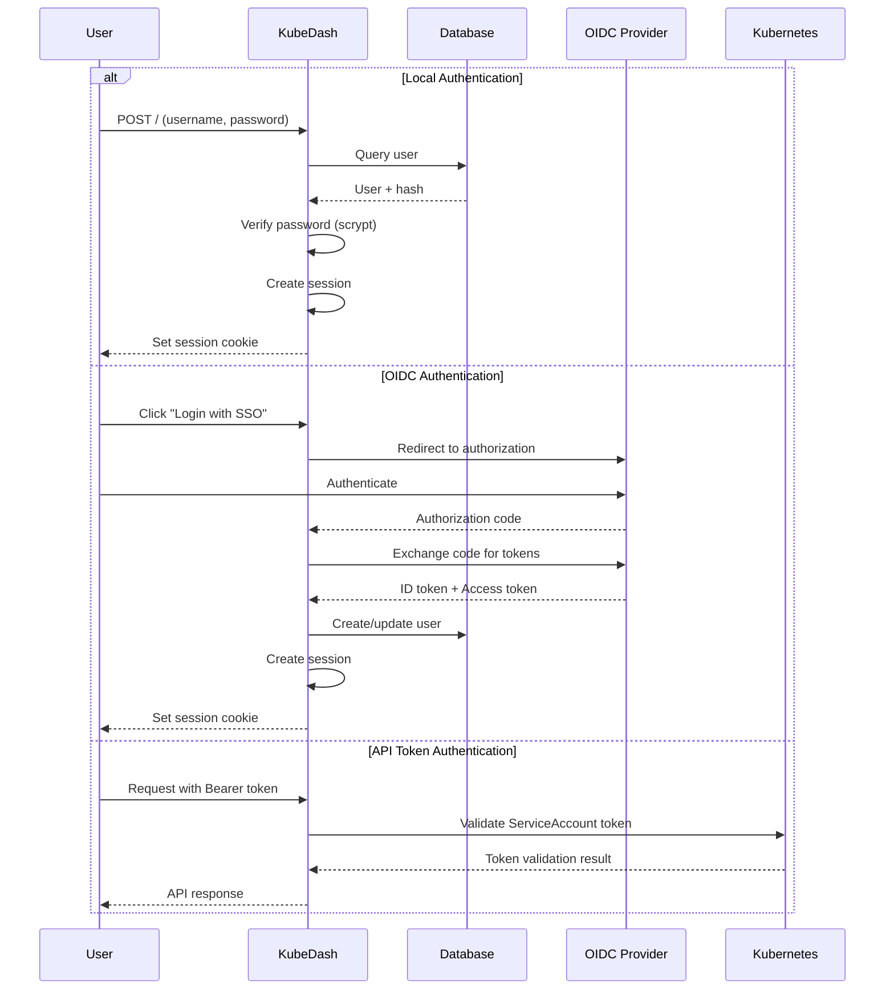
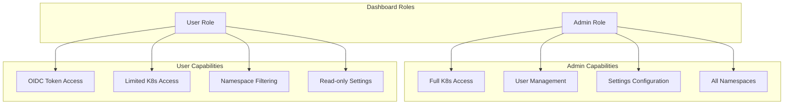
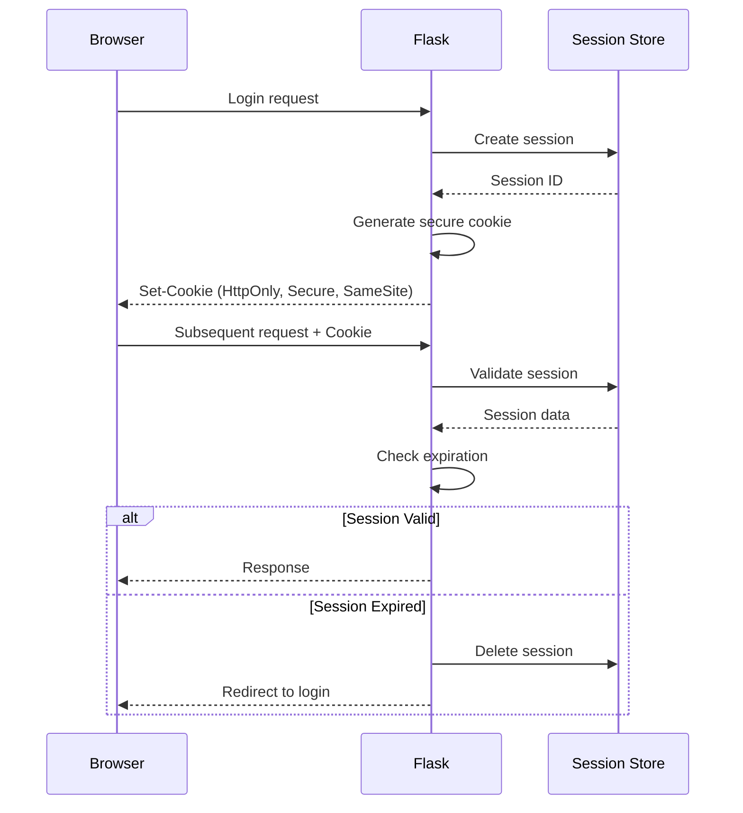
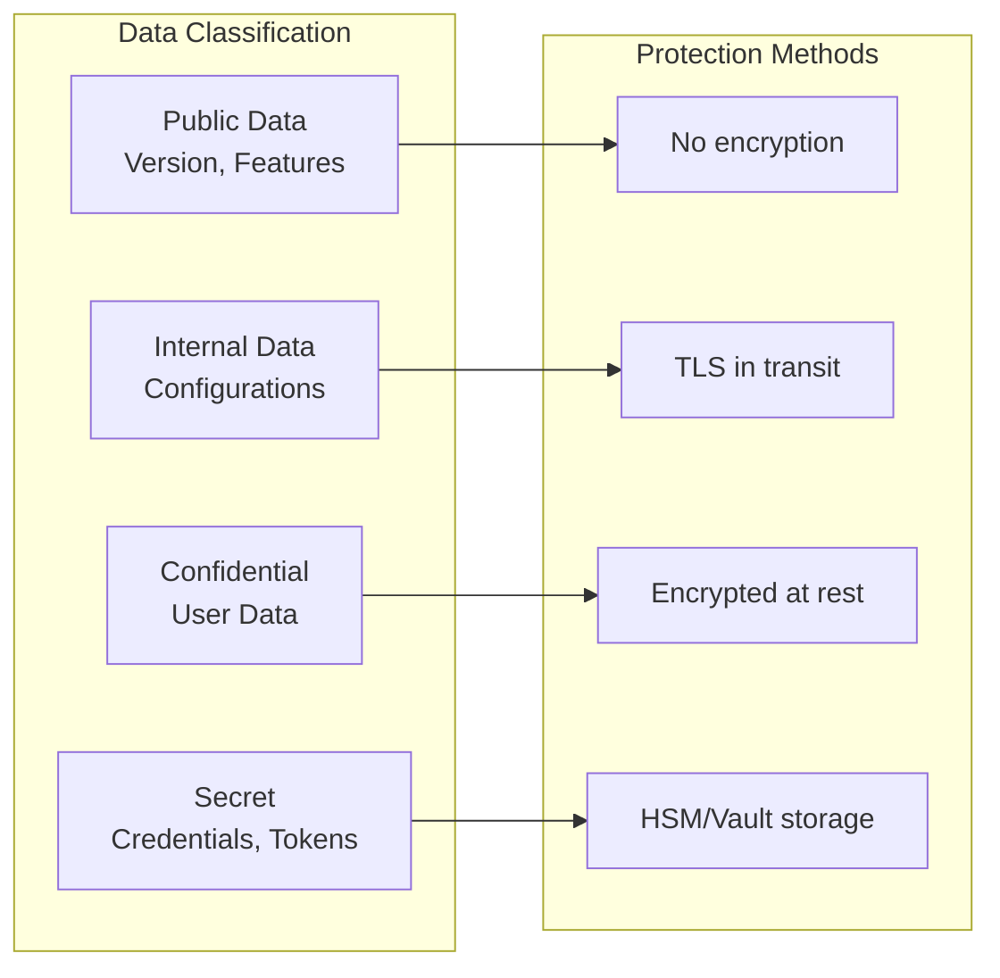
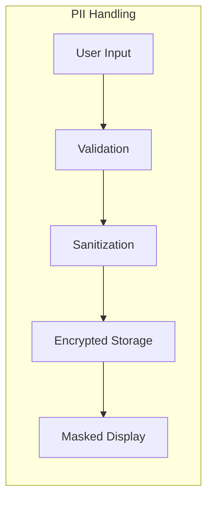

# KubeDash Security Guide

This comprehensive security guide is designed for DevSecOps engineers and security professionals. It covers the security architecture, authentication mechanisms, authorization models, secure deployment practices, and security hardening recommendations for KubeDash.

## Table of Contents

- [Security Architecture Overview](#security-architecture-overview)
- [Authentication](#authentication)
- [Authorization](#authorization)
- [Session Management](#session-management)
- [Data Security](#data-security)
- [Network Security](#network-security)
- [Container Security](#container-security)
- [Kubernetes RBAC Integration](#kubernetes-rbac-integration)
- [Security Headers](#security-headers)
- [Vulnerability Management](#vulnerability-management)
- [Security Monitoring](#security-monitoring)
- [Compliance](#compliance)
- [Security Hardening Checklist](#security-hardening-checklist)

---

## Security Architecture Overview

### Defense in Depth Model



### Security Components Matrix

| Component | Technology | Security Function |
|-----------|------------|-------------------|
| Flask-Talisman | Security Headers | CSP, HSTS, X-Frame-Options |
| Flask-WTF | CSRF Protection | Form token validation |
| Flask-Login | Session Management | User session handling |
| Werkzeug | Password Hashing | Scrypt-based hashing |
| Authlib | OAuth/OIDC | Identity federation |
| SQLAlchemy | ORM | SQL injection prevention |

---

## Authentication

### Authentication Flow



### Password Security

#### Hashing Configuration

```python
# Password hashing with scrypt
from werkzeug.security import generate_password_hash, check_password_hash

# Generate hash
password_hash = generate_password_hash(password, method='scrypt')

# Verify password
is_valid = check_password_hash(user.password_hash, password)
```

#### Password Policy Recommendations

| Policy | Recommended Value |
|--------|-------------------|
| Minimum Length | 12 characters |
| Complexity | Upper, lower, number, special |
| History | Last 5 passwords |
| Expiration | 90 days (optional) |
| Lockout | 5 failed attempts |

### OIDC Integration Security

```python
# Secure OIDC configuration
class SSOServer(db.Model):
    __tablename__ = 'sso_server'
    id = db.Column(db.Integer, primary_key=True)
    oauth_server_uri = db.Column(db.Text, nullable=False)
    client_id = db.Column(db.Text, nullable=False)
    client_secret = db.Column(db.Text, nullable=False)  # Encrypted
    oauth_server_ca = db.Column(db.Text, nullable=True)  # Custom CA
```

#### OIDC Security Best Practices

1. **Use HTTPS** for all OIDC communications
2. **Validate ID tokens** server-side
3. **Store refresh tokens** securely
4. **Implement token rotation**
5. **Configure proper redirect URIs**

### API Token Authentication

```python
# Extension API Bearer Token Authentication
def get_user_from_session_or_token(request, session):
    """Authenticate user from session or Bearer token"""
    
    # Check session first
    if 'user_name' in session:
        user = User.query.filter_by(username=session['user_name']).first()
        if user:
            return user
    
    # Check Bearer token
    auth_header = request.headers.get('Authorization')
    if auth_header and auth_header.startswith('Bearer '):
        token = auth_header.split(' ')[1]
        # Validate token against Kubernetes TokenReview
        if validate_serviceaccount_token(token):
            return create_api_user(token)
    
    return None
```

---

## Authorization

### Role-Based Access Control



### Permission Model

| Role | K8s API Access | User Management | Settings | Namespaces |
|------|----------------|-----------------|----------|------------|
| Admin | ServiceAccount (cluster-admin) | Full | Full | All |
| User | OIDC Token (RBAC filtered) | Self only | Read | Filtered |

### Kubernetes RBAC Integration

```yaml
# ClusterRole for KubeDash Admin
apiVersion: rbac.authorization.k8s.io/v1
kind: ClusterRole
metadata:
  name: kubedash-admin
rules:
- apiGroups: ["*"]
  resources: ["*"]
  verbs: ["*"]

---
# ClusterRoleBinding
apiVersion: rbac.authorization.k8s.io/v1
kind: ClusterRoleBinding
metadata:
  name: kubedash-admin-binding
subjects:
- kind: ServiceAccount
  name: kubedash-admin
  namespace: kubedash
roleRef:
  kind: ClusterRole
  name: kubedash-admin
  apiGroup: rbac.authorization.k8s.io
```

### Namespace-Level Access Control

```python
# Namespace filtering based on user permissions
def k8sNamespaceListGet(username_role, user_token):
    """Get namespaces filtered by user access"""
    k8sClientConfigGet(username_role, user_token)
    
    try:
        # User role uses OIDC token - K8s RBAC filters automatically
        namespaces = k8s_client.CoreV1Api().list_namespace()
        return [ns.metadata.name for ns in namespaces.items], None
    except ApiException as e:
        if e.status == 403:
            # User doesn't have cluster-wide namespace list permission
            # Fall back to namespace enumeration
            return get_accessible_namespaces(user_token), None
        raise
```

---

## Session Management

### Session Configuration

```python
# Secure session configuration
class Config:
    # Session backend
    SESSION_TYPE = "sqlalchemy"
    SESSION_SQLALCHEMY = db
    
    # Session timeout (10 minutes)
    PERMANENT_SESSION_LIFETIME = 600
    
    # Cookie security
    SESSION_COOKIE_SECURE = True      # HTTPS only
    SESSION_COOKIE_HTTPONLY = True    # No JavaScript access
    SESSION_COOKIE_SAMESITE = "Lax"   # CSRF protection
    
    # Remember me cookie
    REMEMBER_COOKIE_SECURE = True
    REMEMBER_COOKIE_HTTPONLY = True
```

### Session Security Flow



### Session Database Schema

```python
# Server-side session storage
class Sessions(db.Model):
    __tablename__ = 'sessions'
    id = db.Column(db.Integer, primary_key=True)
    session_id = db.Column(db.String(255), unique=True)
    data = db.Column(db.LargeBinary)
    expiry = db.Column(db.DateTime)
```

---

## Data Security

### Sensitive Data Handling



### Database Encryption

```python
# Sensitive fields should use encryption
# Example: Storing OIDC client secret
import base64
from cryptography.fernet import Fernet

def encrypt_secret(plaintext, key):
    """Encrypt sensitive data before storage"""
    f = Fernet(key)
    return f.encrypt(plaintext.encode()).decode()

def decrypt_secret(ciphertext, key):
    """Decrypt sensitive data for use"""
    f = Fernet(key)
    return f.decrypt(ciphertext.encode()).decode()
```

### Secret Management Best Practices

1. **Never store secrets in code**
2. **Use environment variables** for configuration
3. **Encrypt secrets at rest** in database
4. **Rotate secrets regularly**
5. **Use Kubernetes Secrets** for deployment

```yaml
# Kubernetes Secret for sensitive configuration
apiVersion: v1
kind: Secret
metadata:
  name: kubedash-secrets
  namespace: kubedash
type: Opaque
stringData:
  admin-password: "secure-password-here"
  oidc-client-secret: "oidc-secret-here"
  database-password: "db-password-here"
```

---

## Network Security

### TLS Configuration

```yaml
# Ingress with TLS
apiVersion: networking.k8s.io/v1
kind: Ingress
metadata:
  name: kubedash-ingress
  annotations:
    nginx.ingress.kubernetes.io/ssl-redirect: "true"
    nginx.ingress.kubernetes.io/force-ssl-redirect: "true"
spec:
  tls:
  - hosts:
    - kubedash.example.com
    secretName: kubedash-tls
  rules:
  - host: kubedash.example.com
    http:
      paths:
      - path: /
        pathType: Prefix
        backend:
          service:
            name: kubedash
            port:
              number: 8000
```

### Network Policy

```yaml
# Restrict network access
apiVersion: networking.k8s.io/v1
kind: NetworkPolicy
metadata:
  name: kubedash-network-policy
  namespace: kubedash
spec:
  podSelector:
    matchLabels:
      app: kubedash
  policyTypes:
  - Ingress
  - Egress
  ingress:
  - from:
    - namespaceSelector:
        matchLabels:
          kubernetes.io/metadata.name: ingress-nginx
    ports:
    - port: 8000
  egress:
  - to:
    - namespaceSelector: {}  # Allow to any namespace (K8s API)
    ports:
    - port: 443
    - port: 6443
  - to:
    - podSelector:
        matchLabels:
          app: postgresql
    ports:
    - port: 5432
  - to:
    - podSelector:
        matchLabels:
          app: redis
    ports:
    - port: 6379
```

---

## Container Security

### Dockerfile Security

```dockerfile
# Security-hardened Dockerfile
FROM python:3.11-alpine3.20

# Create non-root user
RUN addgroup -S -g 10001 kubedash && \
    adduser -S -u 10001 kubedash -G kubedash

# Set working directory
WORKDIR /code/kubedash

# Install dependencies
COPY requirements.txt .
RUN pip install --no-cache-dir -r requirements.txt

# Copy application
COPY --chown=kubedash:kubedash ./kubedash /code/kubedash

# Switch to non-root user
USER 10001:10001

# Expose port
EXPOSE 8000

# Run application
ENTRYPOINT ["/entrypoint.sh"]
```

### Pod Security

```yaml
# Secure Pod specification
apiVersion: apps/v1
kind: Deployment
metadata:
  name: kubedash
spec:
  template:
    spec:
      serviceAccountName: kubedash-admin
      securityContext:
        runAsNonRoot: true
        runAsUser: 10001
        runAsGroup: 10001
        fsGroup: 10001
      containers:
      - name: kubedash
        image: devopstales/kubedash:4.1.0
        securityContext:
          allowPrivilegeEscalation: false
          readOnlyRootFilesystem: true
          capabilities:
            drop:
              - ALL
        resources:
          limits:
            cpu: "1"
            memory: "512Mi"
          requests:
            cpu: "100m"
            memory: "256Mi"
        volumeMounts:
        - name: tmp
          mountPath: /tmp
        - name: cache
          mountPath: /code/kubedash/database
      volumes:
      - name: tmp
        emptyDir: {}
      - name: cache
        emptyDir: {}
```

### Image Scanning

```bash
# Scan container image with Trivy
trivy image devopstales/kubedash:4.1.0

# Generate SBOM
trivy image --format spdx-json devopstales/kubedash:4.1.0 > sbom.json

# Check for vulnerabilities
trivy image --severity HIGH,CRITICAL devopstales/kubedash:4.1.0
```

---

## Security Headers

### Flask-Talisman Configuration

```python
# Initialize security headers
from flask_talisman import Talisman

csp = {
    'default-src': "'self'",
    'font-src': [
        "'self'",
        'fonts.gstatic.com',
        'cdnjs.cloudflare.com',
    ],
    'style-src': [
        "'self'",
        "'unsafe-inline'",
        'fonts.googleapis.com',
        'cdnjs.cloudflare.com',
    ],
    'script-src': [
        "'self'",
        "'unsafe-inline'",
        "'unsafe-eval'",
        'cdnjs.cloudflare.com',
    ],
    'connect-src': [
        "'self'",
        'wss:',
        'ws:',
    ],
    'img-src': [
        "'self'",
        'data:',
    ]
}

hsts = {
    'max-age': 31536000,
    'includeSubDomains': True
}

talisman = Talisman(
    app,
    force_https=True,
    strict_transport_security=hsts,
    content_security_policy=csp,
    x_xss_protection=True,
    session_cookie_secure=True,
    session_cookie_samesite='Lax'
)
```

### Security Headers Reference

| Header | Value | Purpose |
|--------|-------|---------|
| Content-Security-Policy | Strict policy | Prevent XSS, injection |
| Strict-Transport-Security | max-age=31536000 | Force HTTPS |
| X-Content-Type-Options | nosniff | Prevent MIME sniffing |
| X-Frame-Options | DENY | Prevent clickjacking |
| X-XSS-Protection | 1; mode=block | Legacy XSS protection |
| Referrer-Policy | strict-origin-when-cross-origin | Control referrer info |
| Cross-Origin-Opener-Policy | same-origin | Process isolation |
| Cross-Origin-Resource-Policy | same-origin | Resource isolation |

---

## Vulnerability Management

### Dependency Scanning

```bash
# Audit Python dependencies
pip-audit

# Check for known vulnerabilities
safety check -r requirements.txt

# Update vulnerable packages
pip-audit --fix
```

### Security Monitoring Tools

```yaml
# GitHub Dependabot configuration
# .github/dependabot.yml
version: 2
updates:
  - package-ecosystem: "pip"
    directory: "/src/kubedash"
    schedule:
      interval: "weekly"
    open-pull-requests-limit: 10
    
  - package-ecosystem: "docker"
    directory: "/docker/kubedash"
    schedule:
      interval: "weekly"
```

### SAST Integration

```yaml
# GitHub Actions security scanning
name: Security Scan

on:
  push:
    branches: [main]
  pull_request:
    branches: [main]

jobs:
  security:
    runs-on: ubuntu-latest
    steps:
      - uses: actions/checkout@v4
      
      - name: Run Bandit SAST
        run: |
          pip install bandit
          bandit -r src/kubedash -f json -o bandit-report.json
      
      - name: Run Safety Check
        run: |
          pip install safety
          safety check -r src/kubedash/requirements.txt
      
      - name: Run pip-audit
        run: |
          pip install pip-audit
          pip-audit -r src/kubedash/requirements.txt
```

---

## Security Monitoring

### OpenTelemetry Security Events

```python
# Log security events with tracing
from lib.opentelemetry import get_tracer

tracer = get_tracer()

def log_security_event(event_type, details):
    """Log security-relevant events"""
    with tracer.start_as_current_span(f"security.{event_type}") as span:
        span.set_attributes({
            "security.event_type": event_type,
            "security.timestamp": datetime.now().isoformat(),
            **details
        })

# Usage examples
log_security_event("login_failure", {
    "user": username,
    "ip": request.remote_addr,
    "reason": "invalid_password"
})

log_security_event("privilege_escalation", {
    "user": username,
    "action": "admin_access_attempt",
    "result": "denied"
})
```

### Audit Logging

```python
# Security audit logging
@app.after_request
def audit_log(response):
    """Log all requests for audit trail"""
    if request.method in ['POST', 'PUT', 'DELETE', 'PATCH']:
        logger.info(
            f"AUDIT: {request.method} {request.path} "
            f"user={session.get('user_name', 'anonymous')} "
            f"status={response.status_code} "
            f"ip={request.remote_addr}"
        )
    return response
```

### Security Metrics

```python
# Prometheus security metrics
from prometheus_client import Counter, Histogram

# Authentication metrics
auth_attempts = Counter(
    'kubedash_auth_attempts_total',
    'Total authentication attempts',
    ['method', 'result']
)

# Authorization metrics  
authz_decisions = Counter(
    'kubedash_authz_decisions_total',
    'Authorization decisions',
    ['resource', 'action', 'result']
)

# Security events
security_events = Counter(
    'kubedash_security_events_total',
    'Security events',
    ['type', 'severity']
)
```

---

## Compliance

### Security Controls Mapping

| Control | NIST | CIS | Implementation |
|---------|------|-----|----------------|
| Authentication | IA-2 | 5.1 | OIDC + Local auth |
| Authorization | AC-3 | 5.2 | RBAC + K8s RBAC |
| Audit Logging | AU-2 | 8.1 | OpenTelemetry |
| Encryption | SC-13 | 3.1 | TLS + At-rest |
| Session Mgmt | AC-12 | 5.3 | Server-side sessions |

### Data Protection



---

## Security Hardening Checklist

### Pre-Deployment Checklist

- [ ] **Authentication**
  - [ ] Default admin password changed
  - [ ] OIDC configured with valid certificates
  - [ ] Password policy enforced
  - [ ] MFA enabled (via OIDC)

- [ ] **Authorization**
  - [ ] Kubernetes RBAC configured
  - [ ] ServiceAccount with minimal permissions
  - [ ] Namespace isolation verified

- [ ] **Network Security**
  - [ ] TLS enabled with valid certificates
  - [ ] Network policies configured
  - [ ] Ingress secured

- [ ] **Container Security**
  - [ ] Non-root container user
  - [ ] Read-only filesystem
  - [ ] Resource limits set
  - [ ] Security context configured

- [ ] **Data Security**
  - [ ] Secrets stored in K8s Secrets
  - [ ] Database connection encrypted
  - [ ] Sensitive data encrypted at rest

- [ ] **Monitoring**
  - [ ] Audit logging enabled
  - [ ] Security metrics exported
  - [ ] Alerting configured

### Production Security Configuration

```ini
# kubedash.ini - Production security settings
[DEFAULT]
app_mode = production

[security]
admin_password = ${ADMIN_PASSWORD}  # From K8s Secret

[database]
type = postgres
host = postgres.kubedash.svc:5432
name = kubedash
# Connection uses K8s Secret for credentials

[monitoring]
jaeger_enabled = true
jaeger_http_endpoint = https://jaeger.monitoring.svc:4318

[plugin_settings]
registry = false  # Disable unused plugins
helm = true
```

### Security Incident Response

1. **Detection**: Monitor security events and metrics
2. **Analysis**: Review audit logs and traces
3. **Containment**: Disable affected users/features
4. **Eradication**: Apply security patches
5. **Recovery**: Restore from known-good state
6. **Lessons Learned**: Update security controls

---

*Last Updated: December 2025*
*Version: 4.1.0*
