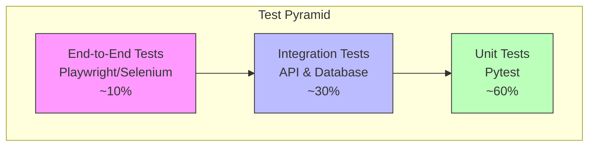

# KubeDash Testing Guide

This comprehensive guide covers testing strategies, frameworks, and best practices for KubeDash from a test automation perspective. It includes unit testing, integration testing, end-to-end testing, and security testing methodologies.

## Table of Contents

- [Testing Strategy Overview](#testing-strategy-overview)
- [Test Environment Setup](#test-environment-setup)
- [Unit Testing](#unit-testing)
- [Integration Testing](#integration-testing)
- [End-to-End Testing](#end-to-end-testing)
- [API Testing](#api-testing)
- [Security Testing](#security-testing)
- [Performance Testing](#performance-testing)
- [Test Coverage](#test-coverage)
- [CI/CD Integration](#cicd-integration)

---

## Testing Strategy Overview

### Test Pyramid



### Testing Scope by Component

| Component | Test Type | Tools | Coverage Target |
|-----------|-----------|-------|-----------------|
| K8s Library | Unit | pytest, mock | 80% |
| Blueprints | Integration | pytest-flask | 75% |
| Templates | Functional | pytest | 70% |
| API Endpoints | Contract | pytest, responses | 85% |
| UI Flows | E2E | Playwright | Critical paths |
| Security | SAST/DAST | safety, pip-audit | All dependencies |

---

## Test Environment Setup

### Prerequisites

```bash
# Install development dependencies
pip install -r tests/requirements.txt

# Or with poetry
poetry install --with dev
```

### Test Dependencies

```
# tests/requirements.txt
pytest>=7.1.3
pytest-flask>=1.2.0
pytest-cov>=4.0.0
responses>=0.22.0
playwright>=1.40.0
pytest-playwright>=0.4.0
factory-boy>=3.3.0
faker>=19.0.0
```

### Test Configuration

```toml
# pyproject.toml
[tool.pytest.ini_options]
log_cli = true
filterwarnings = [
    "ignore::urllib3.exceptions.InsecureRequestWarning",
    "ignore::DeprecationWarning",
    "ignore::sqlalchemy.exc.SAWarning",
]
pythonpath = "."
live_server_scope = "function"
testpaths = ["tests"]
addopts = "-v --tb=short"

[tool.coverage.run]
branch = true
source = ["blueprint", "lib", "plugins"]
omit = ["tests/*", "migrations/*"]

[tool.coverage.report]
exclude_lines = [
    "pragma: no cover",
    "def __repr__",
    "raise NotImplementedError",
]
```

### Test Database Configuration

```python
# lib/config.py
class TestingConfig(Config):
    """Testing configurations"""
    TESTING = True
    SQLALCHEMY_DATABASE_URI = "sqlite:///:memory:"
    WTF_CSRF_ENABLED = False
    SERVER_NAME = "localhost.localdomain"
```

---

## Unit Testing

### Test Structure

```
tests/
├── conftest.py              # Shared fixtures
├── unit/
│   ├── __init__.py
│   ├── test_user.py         # User model tests
│   ├── test_k8s_client.py   # K8s client tests
│   ├── test_cache.py        # Cache tests
│   └── test_helpers.py      # Helper function tests
├── integration/
│   └── ...
└── functional/
    └── ...
```

### Base Fixtures

```python
# tests/conftest.py
import pytest
import flask_migrate
from flask.testing import FlaskClient
from kubedash import create_app
from lib.components import db

@pytest.fixture(scope='module')
def app():
    """Create and configure test application"""
    app = create_app("testing")
    
    with app.app_context():
        flask_migrate.upgrade()
        yield app
        db.session.remove()
        db.drop_all()

@pytest.fixture(scope='module')
def client(app):
    """Create test client"""
    ctx = app.test_request_context()
    ctx.push()
    app.test_client_class = FlaskClient
    return app.test_client()

@pytest.fixture(scope='function')
def session(app):
    """Create database session for each test"""
    with app.app_context():
        connection = db.engine.connect()
        transaction = connection.begin()
        
        yield db.session
        
        db.session.remove()
        transaction.rollback()
        connection.close()

@pytest.fixture
def authenticated_client(client):
    """Client with authenticated session"""
    client.post("/", data={
        "username": "admin",
        "password": "admin"
    }, follow_redirects=True)
    return client
```

### User Model Tests

```python
# tests/unit/test_user.py
import pytest
from lib.user import User, UserCreate, UserTest, UserDelete, RoleCreate

class TestUserModel:
    """Test User model and operations"""
    
    def test_user_creation(self, session):
        """Test creating a new user"""
        RoleCreate("TestRole")
        UserCreate(
            username="testuser",
            password="testpass123",
            email="test@example.com",
            user_type="Local",
            role="TestRole"
        )
        
        user = UserTest("testuser")
        assert user is not None
        assert user.username == "testuser"
        assert user.email == "test@example.com"
        assert user.user_type == "Local"
    
    def test_user_password_hashing(self, session):
        """Test password is properly hashed"""
        UserCreate(
            username="hashtest",
            password="plaintext",
            email="hash@test.com",
            user_type="Local"
        )
        
        user = UserTest("hashtest")
        assert user.password_hash != "plaintext"
        assert user.password_hash.startswith("scrypt:")
    
    def test_duplicate_user(self, session):
        """Test duplicate user handling"""
        UserCreate("dupuser", "pass", "dup@test.com", "Local")
        UserCreate("dupuser", "pass2", "dup2@test.com", "Local")  # Should not create
        
        users = User.query.filter_by(username="dupuser").all()
        assert len(users) == 1
    
    def test_user_deletion(self, session):
        """Test user deletion"""
        RoleCreate("DeleteRole")
        UserCreate("deleteuser", "pass", "del@test.com", "Local", "DeleteRole")
        
        user = UserTest("deleteuser")
        assert user is not None
        
        UserDelete("deleteuser")
        user = UserTest("deleteuser")
        assert user is None
```

### Kubernetes Client Tests

```python
# tests/unit/test_k8s_client.py
import pytest
from unittest.mock import Mock, patch, MagicMock
from kubernetes.client.rest import ApiException

class TestK8sClient:
    """Test Kubernetes client operations"""
    
    @patch('lib.k8s.namespace.k8s_client.CoreV1Api')
    def test_list_namespaces_success(self, mock_api):
        """Test successful namespace listing"""
        from lib.k8s.namespace import k8sListNamespaces
        
        # Mock namespace response
        mock_ns = MagicMock()
        mock_ns.metadata.name = "test-namespace"
        mock_api.return_value.list_namespace.return_value.items = [mock_ns]
        
        result, error = k8sListNamespaces("Admin", None)
        
        assert error is None
        assert len(result.items) == 1
        assert result.items[0].metadata.name == "test-namespace"
    
    @patch('lib.k8s.namespace.k8s_client.CoreV1Api')
    def test_list_namespaces_api_error(self, mock_api):
        """Test namespace listing with API error"""
        from lib.k8s.namespace import k8sListNamespaces
        
        mock_api.return_value.list_namespace.side_effect = ApiException(
            status=403, reason="Forbidden"
        )
        
        result, error = k8sListNamespaces("User", "token")
        
        assert error is not None
        assert result == ""
    
    @patch('lib.k8s.server.k8s_config')
    def test_admin_config_loading(self, mock_config):
        """Test admin configuration loading"""
        from lib.k8s.server import k8sClientConfigGet
        
        k8sClientConfigGet("Admin", None)
        
        # Should try local config first
        mock_config.load_kube_config.assert_called_once()
    
    @patch('lib.k8s.server.k8s_config')
    @patch('lib.k8s.server.k8sServerConfigGet')
    def test_user_config_loading(self, mock_server_config, mock_config):
        """Test user OIDC configuration loading"""
        from lib.k8s.server import k8sClientConfigGet
        
        mock_server_config.return_value = MagicMock(
            k8s_server_url="https://k8s.example.com",
            k8s_server_ca="base64encodedca"
        )
        
        user_token = {"access_token": "test-token"}
        k8sClientConfigGet("User", user_token)
        
        mock_server_config.assert_called_once()
```

### Cache Tests

```python
# tests/unit/test_cache.py
import pytest
import time
from unittest.mock import patch

class TestCache:
    """Test caching functionality"""
    
    def test_cache_decorator(self, app):
        """Test cache decorator behavior"""
        from lib.cache import cache_request_with_timeout
        
        call_count = 0
        
        @cache_request_with_timeout(timeout=1)
        def expensive_operation(x):
            nonlocal call_count
            call_count += 1
            return x * 2
        
        # First call - should execute function
        result1 = expensive_operation(5)
        assert result1 == 10
        assert call_count == 1
        
        # Second call - should return cached result
        result2 = expensive_operation(5)
        assert result2 == 10
        assert call_count == 1  # Not incremented
        
        # Wait for cache expiry
        time.sleep(1.1)
        
        # Third call - should execute function again
        result3 = expensive_operation(5)
        assert result3 == 10
        assert call_count == 2
    
    def test_redis_cache_fallback(self, app):
        """Test fallback to SimpleCache when Redis unavailable"""
        assert app.config['CACHE_TYPE'] in ['SimpleCache', 'RedisCache']
```

---

## Integration Testing

### Blueprint Integration Tests

```python
# tests/integration/test_auth_integration.py
import pytest
from flask import session

class TestAuthIntegration:
    """Test authentication integration"""
    
    def test_login_flow(self, client):
        """Test complete login flow"""
        # Get login page
        response = client.get("/")
        assert response.status_code == 200
        assert b"Login" in response.data
        
        # Submit credentials
        response = client.post("/", data={
            "username": "admin",
            "password": "admin"
        }, follow_redirects=True)
        
        assert response.status_code == 200
        assert b"Cluster Metrics" in response.data or response.status_code == 302
    
    def test_invalid_login(self, client):
        """Test invalid login attempt"""
        response = client.post("/", data={
            "username": "invalid",
            "password": "invalid"
        }, follow_redirects=True)
        
        assert b"Please check your login details" in response.data
    
    def test_logout(self, authenticated_client):
        """Test logout functionality"""
        response = authenticated_client.get("/logout", follow_redirects=True)
        assert b"Login" in response.data
    
    def test_protected_route_redirect(self, client):
        """Test unauthenticated access to protected route"""
        response = client.get("/dashboard/cluster-metric")
        assert response.status_code == 302  # Redirect to login
```

### Database Integration Tests

```python
# tests/integration/test_db_integration.py
import pytest
from lib.components import db
from lib.user import User, Role, UsersRoles

class TestDatabaseIntegration:
    """Test database operations"""
    
    def test_user_role_relationship(self, app):
        """Test user-role relationship"""
        with app.app_context():
            # Create role
            role = Role(name="TestRole")
            db.session.add(role)
            db.session.commit()
            
            # Create user with role
            user = User(
                username="roletest",
                password_hash="hash",
                email="role@test.com",
                user_type="Local"
            )
            user.roles.append(role)
            db.session.add(user)
            db.session.commit()
            
            # Verify relationship
            retrieved = User.query.filter_by(username="roletest").first()
            assert len(retrieved.roles) == 1
            assert retrieved.roles[0].name == "TestRole"
    
    def test_cascade_delete(self, app):
        """Test cascade deletion of user relationships"""
        with app.app_context():
            # Setup user with relationships
            role = Role(name="CascadeRole")
            db.session.add(role)
            
            user = User(
                username="cascadetest",
                password_hash="hash",
                email="cascade@test.com",
                user_type="Local"
            )
            user.roles.append(role)
            db.session.add(user)
            db.session.commit()
            
            user_id = user.id
            
            # Delete user
            db.session.delete(user)
            db.session.commit()
            
            # Verify cascade
            user_role = UsersRoles.query.filter_by(user_id=user_id).first()
            assert user_role is None
```

---

## End-to-End Testing

### Playwright Setup

```python
# tests/e2e/conftest.py
import pytest
from playwright.sync_api import sync_playwright

@pytest.fixture(scope="session")
def browser():
    """Create browser instance"""
    with sync_playwright() as p:
        browser = p.chromium.launch(headless=True)
        yield browser
        browser.close()

@pytest.fixture
def page(browser):
    """Create new page for each test"""
    context = browser.new_context()
    page = context.new_page()
    yield page
    context.close()

@pytest.fixture
def authenticated_page(page, live_server):
    """Page with authenticated session"""
    page.goto(live_server.url())
    page.fill('input[name="username"]', 'admin')
    page.fill('input[name="password"]', 'admin')
    page.click('button[type="submit"]')
    page.wait_for_load_state('networkidle')
    return page
```

### E2E Test Examples

```python
# tests/e2e/test_dashboard.py
import pytest
from playwright.sync_api import expect

class TestDashboardE2E:
    """End-to-end dashboard tests"""
    
    def test_login_page_renders(self, page, live_server):
        """Test login page rendering"""
        page.goto(live_server.url())
        
        expect(page.locator("h1")).to_contain_text("Login")
        expect(page.locator('input[name="username"]')).to_be_visible()
        expect(page.locator('input[name="password"]')).to_be_visible()
    
    def test_successful_login(self, page, live_server):
        """Test successful login flow"""
        page.goto(live_server.url())
        
        page.fill('input[name="username"]', 'admin')
        page.fill('input[name="password"]', 'admin')
        page.click('button[type="submit"]')
        
        page.wait_for_url("**/cluster-metric")
        expect(page.locator(".navbar")).to_be_visible()
    
    def test_navigation(self, authenticated_page):
        """Test sidebar navigation"""
        page = authenticated_page
        
        # Click on Workloads menu
        page.click('text=Workloads')
        page.click('text=Pods')
        
        page.wait_for_url("**/workload/pods")
        expect(page.locator("h4")).to_contain_text("Pods")
    
    def test_namespace_selector(self, authenticated_page):
        """Test namespace selector functionality"""
        page = authenticated_page
        
        page.goto(authenticated_page.url + "/workload/pods")
        
        # Select namespace
        page.select_option('select[name="ns_select"]', 'kube-system')
        page.click('button[type="submit"]')
        
        page.wait_for_load_state('networkidle')
        # Verify namespace is selected
        expect(page.locator('select[name="ns_select"]')).to_have_value('kube-system')
```

### Visual Regression Testing

```python
# tests/e2e/test_visual.py
import pytest

class TestVisualRegression:
    """Visual regression tests"""
    
    def test_login_page_screenshot(self, page, live_server):
        """Compare login page screenshot"""
        page.goto(live_server.url())
        
        # Take screenshot and compare
        page.screenshot(path="tests/screenshots/login.png")
        # Use pixelmatch or similar for comparison
    
    def test_dashboard_screenshot(self, authenticated_page):
        """Compare dashboard screenshot"""
        authenticated_page.screenshot(
            path="tests/screenshots/dashboard.png",
            full_page=True
        )
```

---

## API Testing

### REST API Tests

```python
# tests/api/test_api_endpoints.py
import pytest
import json

class TestAPIEndpoints:
    """Test REST API endpoints"""
    
    def test_health_live(self, client):
        """Test liveness probe"""
        response = client.get('/api/health/live')
        assert response.status_code == 200
        data = json.loads(response.data)
        assert data['message'] == 'OK'
    
    def test_health_ready(self, client):
        """Test readiness probe"""
        response = client.get('/api/health/ready')
        # May return 200 or 503 depending on connections
        assert response.status_code in [200, 503]
        data = json.loads(response.data)
        assert 'database' in data
        assert 'kubernetes' in data
    
    def test_ping(self, client):
        """Test ping endpoint"""
        response = client.get('/api/ping')
        assert response.status_code == 200
        data = json.loads(response.data)
        assert data['message'] == 'pong'
```

### Extension API Tests

```python
# tests/api/test_extension_api.py
import pytest
import json
from unittest.mock import patch

class TestExtensionAPI:
    """Test Kubernetes Extension API"""
    
    def test_api_group_list(self, client):
        """Test API group listing"""
        response = client.get('/apis/')
        assert response.status_code == 200
        
        data = json.loads(response.data)
        assert data['kind'] == 'APIGroupList'
        assert len(data['groups']) > 0
    
    def test_api_resources(self, client):
        """Test API resource listing"""
        response = client.get('/apis/kubedash.devopstales.github.io/v1')
        assert response.status_code == 200
        
        data = json.loads(response.data)
        assert data['kind'] == 'APIResourceList'
        assert any(r['name'] == 'projects' for r in data['resources'])
    
    @patch('lib.extension_api.get_user_from_session_or_token')
    def test_list_projects_unauthorized(self, mock_auth, client):
        """Test unauthorized project listing"""
        mock_auth.return_value = None
        
        response = client.get('/apis/kubedash.devopstales.github.io/v1/projects')
        assert response.status_code == 401
    
    @patch('lib.extension_api.get_user_from_session_or_token')
    @patch('lib.extension_api.projects.list_projects')
    def test_list_projects_success(self, mock_list, mock_auth, client):
        """Test successful project listing"""
        from lib.user import User
        
        mock_user = User(username="testuser")
        mock_auth.return_value = mock_user
        mock_list.return_value = ({"items": []}, None)
        
        response = client.get('/apis/kubedash.devopstales.github.io/v1/projects')
        assert response.status_code == 200
```

### API Contract Testing

```python
# tests/api/test_api_contracts.py
import pytest
import json
from jsonschema import validate

# Define API schemas
PROJECT_SCHEMA = {
    "type": "object",
    "required": ["apiVersion", "kind", "metadata"],
    "properties": {
        "apiVersion": {"type": "string"},
        "kind": {"type": "string", "enum": ["Project"]},
        "metadata": {
            "type": "object",
            "required": ["name"],
            "properties": {
                "name": {"type": "string"},
                "uid": {"type": "string"},
                "creationTimestamp": {"type": "string"}
            }
        },
        "spec": {
            "type": "object",
            "properties": {
                "protected": {"type": "boolean"},
                "owner": {"type": "string"}
            }
        }
    }
}

class TestAPIContracts:
    """Test API response contracts"""
    
    def test_project_response_schema(self, authenticated_client):
        """Validate project response matches schema"""
        response = authenticated_client.get(
            '/apis/kubedash.devopstales.github.io/v1/projects/default'
        )
        
        if response.status_code == 200:
            data = json.loads(response.data)
            validate(instance=data, schema=PROJECT_SCHEMA)
```

---

## Security Testing

### Dependency Vulnerability Scanning

```bash
# Check for known vulnerabilities
pip-audit

# Check with safety
safety check

# Generate report
pip-audit --format=json > security-report.json
```

### Security Test Cases

```python
# tests/security/test_security.py
import pytest

class TestSecurityHeaders:
    """Test security headers"""
    
    def test_csrf_protection(self, client):
        """Test CSRF protection on forms"""
        # POST without CSRF token should fail
        response = client.post("/", data={
            "username": "admin",
            "password": "admin"
        })
        # In testing mode CSRF is disabled
        # In production this would return 400
    
    def test_content_security_policy(self, app, client):
        """Test CSP header is set"""
        with app.test_client() as c:
            response = c.get("/")
            # Check CSP header exists (set by Talisman)
            assert response.headers.get('Content-Security-Policy') is not None
    
    def test_xss_prevention(self, authenticated_client):
        """Test XSS prevention in templates"""
        # Attempt to inject script
        response = authenticated_client.post("/workload/pods", data={
            "ns_select": "<script>alert('xss')</script>"
        })
        
        # Script should be escaped
        assert b"<script>" not in response.data
    
    def test_sql_injection_prevention(self, client):
        """Test SQL injection prevention"""
        response = client.post("/", data={
            "username": "admin' OR '1'='1",
            "password": "anything"
        })
        
        # Should fail authentication, not bypass it
        assert b"Please check your login details" in response.data
    
    def test_session_fixation(self, client):
        """Test session regeneration on login"""
        # Get initial session
        client.get("/")
        
        # Login
        response = client.post("/", data={
            "username": "admin",
            "password": "admin"
        }, follow_redirects=True)
        
        # Session should be regenerated (new session ID)
        # This is handled by Flask-Login
```

### Authentication Tests

```python
# tests/security/test_auth_security.py
import pytest
import time

class TestAuthSecurity:
    """Test authentication security"""
    
    def test_password_hashing(self, app):
        """Test passwords are properly hashed"""
        from lib.user import User, UserCreate
        
        with app.app_context():
            UserCreate("hashtest", "mypassword", "hash@test.com", "Local")
            user = User.query.filter_by(username="hashtest").first()
            
            # Password should be hashed with scrypt
            assert "scrypt:" in user.password_hash
            assert user.password_hash != "mypassword"
    
    def test_session_timeout(self, app, client):
        """Test session timeout configuration"""
        assert app.config['PERMANENT_SESSION_LIFETIME'] == 600  # 10 minutes
    
    def test_secure_cookies(self, app):
        """Test cookie security settings"""
        assert app.config['SESSION_COOKIE_SECURE'] == True
        assert app.config['SESSION_COOKIE_HTTPONLY'] == True
        assert app.config['SESSION_COOKIE_SAMESITE'] == "Lax"
```

---

## Performance Testing

### Load Testing with Locust

```python
# tests/performance/locustfile.py
from locust import HttpUser, task, between

class KubeDashUser(HttpUser):
    wait_time = between(1, 3)
    
    def on_start(self):
        """Login before tests"""
        self.client.post("/", data={
            "username": "admin",
            "password": "admin"
        })
    
    @task(3)
    def view_dashboard(self):
        """View cluster metrics"""
        self.client.get("/dashboard/cluster-metric")
    
    @task(2)
    def view_pods(self):
        """View pod list"""
        self.client.get("/workload/pods")
    
    @task(1)
    def view_services(self):
        """View services"""
        self.client.get("/network/service")
    
    @task(1)
    def api_health(self):
        """Check API health"""
        self.client.get("/api/health/ready")
```

### Response Time Tests

```python
# tests/performance/test_response_times.py
import pytest
import time

class TestResponseTimes:
    """Test endpoint response times"""
    
    @pytest.mark.parametrize("endpoint,max_time", [
        ("/", 1.0),
        ("/api/health/live", 0.5),
        ("/api/ping", 0.5),
    ])
    def test_endpoint_response_time(self, client, endpoint, max_time):
        """Test endpoint responds within acceptable time"""
        start = time.time()
        response = client.get(endpoint)
        elapsed = time.time() - start
        
        assert response.status_code in [200, 302]
        assert elapsed < max_time, f"{endpoint} took {elapsed}s (max: {max_time}s)"
```

---

## Test Coverage

### Running Coverage

```bash
# Run tests with coverage
pytest --cov=. --cov-report=html --cov-report=xml

# View HTML report
open reports/coverage_html/index.html
```

### Coverage Configuration

```toml
# pyproject.toml
[tool.coverage.run]
branch = true
source = ["blueprint", "lib", "plugins"]
command_line = "-m pytest tests --junitxml reports/test.xml"

[tool.coverage.report]
exclude_lines = [
    "pragma: no cover",
    "def __repr__",
    "raise NotImplementedError",
    "if __name__ == .__main__.:",
]
fail_under = 70

[tool.coverage.html]
directory = "reports/coverage_html"

[tool.coverage.xml]
output = "reports/coverage.xml"
```

---

## CI/CD Integration

### GitHub Actions Workflow

```yaml
# .github/workflows/test.yaml
name: Tests

on:
  push:
    branches: [main, develop]
  pull_request:
    branches: [main]

jobs:
  test:
    runs-on: ubuntu-latest
    
    services:
      redis:
        image: redis:7
        ports:
          - 6379:6379
    
    steps:
      - uses: actions/checkout@v4
      
      - name: Set up Python
        uses: actions/setup-python@v4
        with:
          python-version: '3.11'
      
      - name: Install dependencies
        run: |
          pip install poetry
          cd src/kubedash
          poetry install --with dev
      
      - name: Run linting
        run: |
          cd src/kubedash
          poetry run flake8 .
          poetry run black --check .
      
      - name: Run tests
        run: |
          cd src/kubedash
          poetry run pytest --cov=. --cov-report=xml
        env:
          FLASK_ENV: testing
      
      - name: Upload coverage
        uses: codecov/codecov-action@v3
        with:
          file: src/kubedash/coverage.xml
      
      - name: Security scan
        run: |
          cd src/kubedash
          poetry run pip-audit
          poetry run safety check

  e2e:
    runs-on: ubuntu-latest
    needs: test
    
    steps:
      - uses: actions/checkout@v4
      
      - name: Install Playwright
        run: |
          pip install playwright pytest-playwright
          playwright install chromium
      
      - name: Run E2E tests
        run: |
          cd src/kubedash
          pytest tests/e2e/ --browser chromium
```

### Test Report Generation

```bash
# Generate JUnit XML report
pytest --junitxml=reports/junit.xml

# Generate HTML report
pytest --html=reports/report.html --self-contained-html
```

---

## Best Practices

### Test Naming Convention

```python
# Good test names
def test_user_creation_with_valid_data():
    pass

def test_login_fails_with_invalid_password():
    pass

def test_namespace_list_returns_empty_when_no_access():
    pass
```

### Test Organization

```python
# Group related tests in classes
class TestUserAuthentication:
    def test_valid_login(self):
        pass
    
    def test_invalid_password(self):
        pass
    
    def test_account_lockout(self):
        pass
```

### Fixture Scopes

| Scope | Use Case |
|-------|----------|
| `function` | Test isolation, default |
| `class` | Shared setup within test class |
| `module` | Shared across module (e.g., app instance) |
| `session` | Expensive setup (e.g., browser) |

### Mocking Guidelines

```python
# Mock at the right level
@patch('lib.k8s.namespace.k8s_client.CoreV1Api')  # Good - specific
@patch('kubernetes.client')  # Too broad

# Use MagicMock for complex objects
mock_pod = MagicMock()
mock_pod.metadata.name = "test-pod"
mock_pod.metadata.namespace = "default"
```

---

*Last Updated: December 2025*
*Version: 4.1.0*
