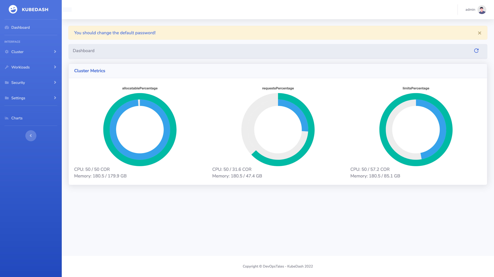
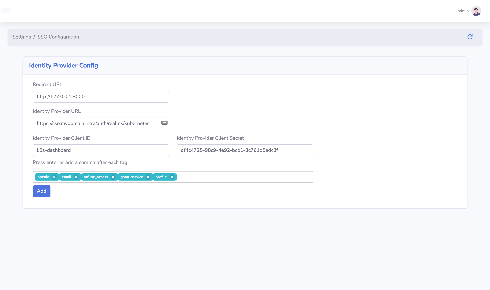

## First Log In

To log in for the first time the default user and password is `admin` `admin`. After you log into the web-ui you will alert to change the default admin password.

## Authentication

One of the key features that KubeDash adds to Kubernetes is centralized user management. This feature allows to set up local users and/or connect to an external Oath2 authentication provider. By connecting to an external authentication provider, you can leverage that provider's user and groups.

### Configure Oauth2 provider

To add an oauth2 provider to KubeDash go to `Settings > SSO Configuration`:

| Parameter | Description |
|-----------|-------------|
| Redirect URI | `https://yourKubDashHostURL` |
| Identity Provider URL | The URL of your IdP. |
| Identity Provider Client ID | The `Client ID` of your IdP client. |
| Identity Provider Client Secret | The generated `Secret` of your IdP client.  |

## Authorization

Once an user logged in to KubeDash the their access rights within the system, is determined by the user's role. There i two role in KubeDash User and Admin. This role determinate what you can configure in KubeDash. 

## Role-Based Access Control (RBAC)

From kubernetes perspective all of your privileges are determined by Role-Based Access Control (RBAC). The KubeDash Admin role allow you to use the KubeDash pod's cluster-admin ServiceAccount for the interactions with the kubernetes API. 

With the Local role KubeDash use your Oath2 token for the same purpose, so you have the same privileges as in the cli.