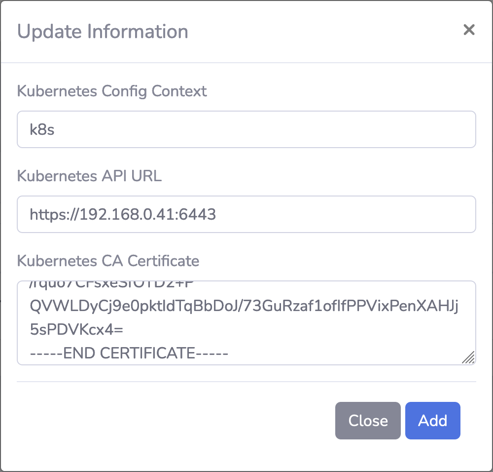

# Setting up Kubernetes Clusters in KubeDash

## Configure Kubernetes cluster connection

To add a Kubernetes Cluster to KubeDash go to `Settings > Cluster Configuration` and Click `New`:

| Parameter | Description |
|-----------|-------------|
| Kubernetes Config Context  | The name of the cluster context |
| Kubernetes API URL | `https://yourKubernetesHostURL:8443` |
| Kubernetes CA Certificate | Certificate |

Select `Add` to create the Kubernetes connection. You can add only one cluster for KubeDash. To edit the cluster select the pencil icon next to the line of the cluster.

