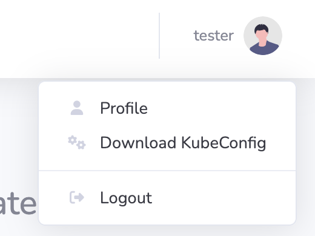

# Download Kubectl Config for your user

In KubeDash you can download your kubectl configuration in your profile menu: 

The configuration is differs based on the user type:

* The SSO users gat a config for SSO authentication.
* The local users gat a config for with certificate based authentication. The KubeDash Dashboard generates the certificate.

