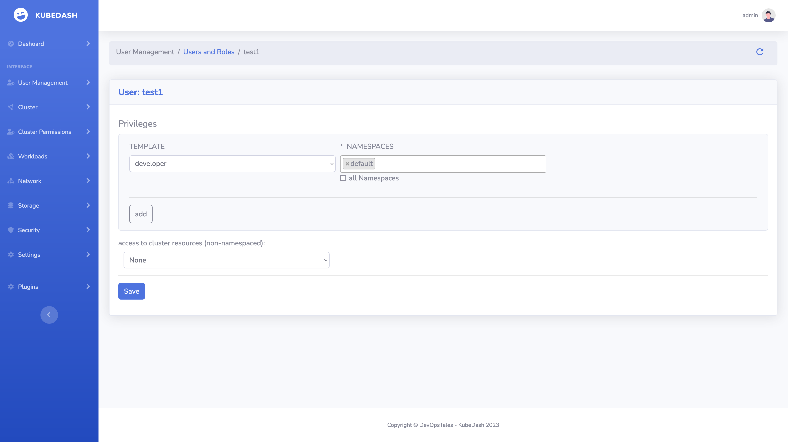

# Users

Within KubDash, each person authenticates as a **user**, which is a login that grants you access to KubDash. As mentioned in [Authentication](authentication.md), users can either be local or external.

## Manage User Roles

KuDash enables a super-easy and user-friendly RBAC management for users in Kubernetes. If you are looking for a simple and intuitive way of managing your users within a Kubernetes cluster, this is the right place.

With KuDash, you can create users, assign namespaces/permissions, via a nice and easy web UI.

## Manage Group Roles

KuDash automatically creates groups from SSO login information. You can map this groups with Role templates.

## Edit Kubernetes Roles and Role bindings
The application allows us to define and select permission-templates and associate them with all the users you might want to create. This defining can be done, within a namespace or globally. The template system is an abstraction over Cluster-Roles, RoleBinding, and ClusterRolesBindigs. A template is a ClusterRole with a prefix `template-namespaced-resources___` for example `template-namespaced-resources___developer` 

You can create your own templates by creating a clusterRole starting with the `template-namespaced-resources___` prefix. KubeDash will automatically detect your custom templates.