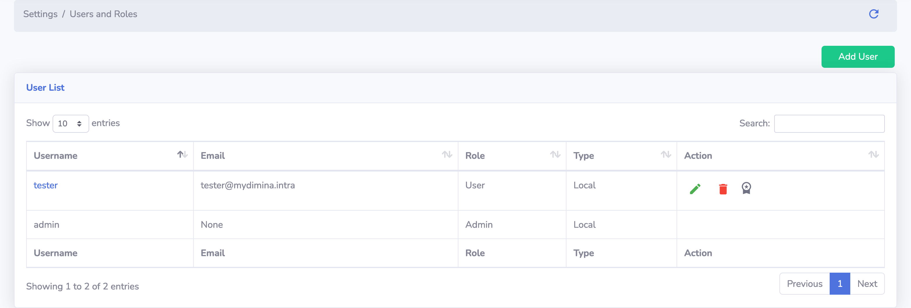

# User Management

KubeDash use OIDC as its main [authentication mechanism](authentication.md) but from KubeDash 2.0 you can create local users from the UI and convert them into Kubernetes users. With this solution Kubernetes will use certificate based authentication. The benefit of this approach date you can authenticate without a working OIDC Identity Provider so it is perfect for admin users.

You can manage your users under the `Settings > Users and Roles` menu:

You can Create a new user wit the `Add User` button:

You can change the type of an existing user with the pencile icon next to the user:

