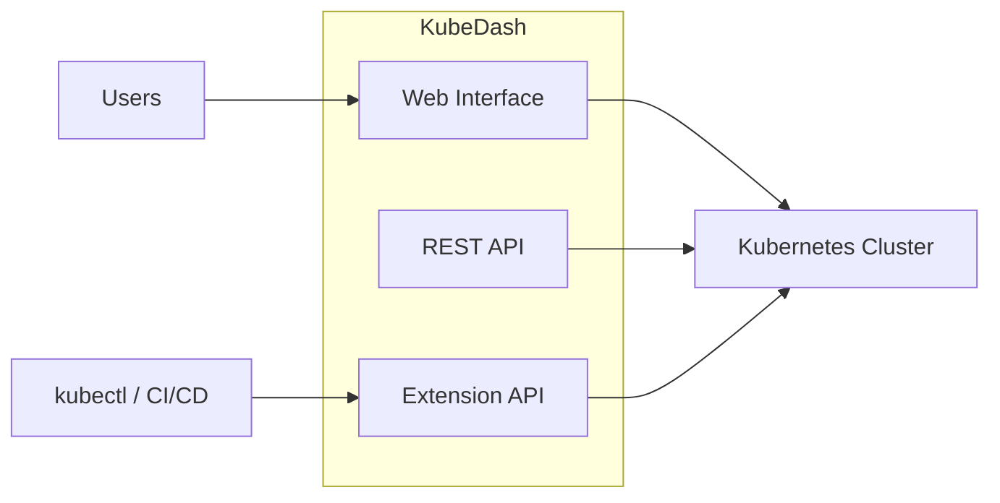
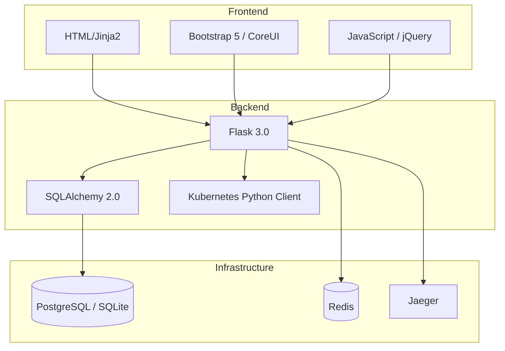

# What is KubeDash?

KubeDash is a general purpose, web-based UI for Kubernetes clusters. It allows users to observe applications running in the cluster and troubleshoot them, as well as manage the cluster itself.

KubeDash was created to be a Kubernetes web UI that has the traditional functionality of other web UIs/dashboards available (i.e. to list and view resources) as well as other features.



## Quick Links

| Documentation | Description |
|---------------|-------------|
| [Installation Guide](installation/installation.md) | Get started with KubeDash |
| [Configuration](installation/configuration.md) | Configure KubeDash settings |
| [Architecture](development/architecture.md) | System architecture overview |
| [Developer Guide](development/developer-guide.md) | Development documentation |
| [API Reference](development/api-reference.md) | REST and Extension API docs |
| [Security Guide](development/security.md) | Security best practices |

## Key Highlights

### 🚀 Modern Architecture

- **Python/Flask** backend with modular blueprint architecture
- **Plugin system** for extensibility without core modifications
- **Redis caching** for performance at scale
- **OpenTelemetry** integration for observability

### 🔐 Enterprise Security

- **Multiple authentication methods**: Local, OIDC/SSO, ServiceAccount tokens
- **Kubernetes RBAC integration** for fine-grained access control
- **Security headers** (CSP, HSTS, XSS protection) via Flask-Talisman
- **Session management** with secure cookie handling

### 🔌 Extension API (v4.1+)

- Kubernetes-style aggregated API server
- Compatible with `kubectl` and other Kubernetes clients
- Enables GitOps and automation workflows

```bash
# Use kubectl with KubeDash Extension API
kubectl get projects
kubectl create -f project.yaml
```

## Features

### Dashboard & Monitoring

* **Dark mode** support
* **Cluster Metrics Dashboard** - CPU and memory visualization
* **Cluster Events** - Real-time event monitoring
* **Resource Map** - Visual representation of Kubernetes resources and their connections

### Workload Management

* **Pods** - List, view details, delete
* **Pod Debugging** - Real-time log streaming and interactive terminal (exec)
* **Deployments** - List, view, scale replicas
* **StatefulSets** - List, view, scale replicas
* **DaemonSets** - List, view, scale up/down
* **ReplicaSets** - List, view

### Cluster Resources

* **Namespaces** - Create, delete, scale all workloads up/down
* **Nodes** - List, view details and metrics
* **Custom Resource Definitions (CRDs)** - Browse any CRD and its instances

### Network Resources

* **Services** - List, view details with pod selectors
* **Ingresses** - List, view routing rules
* **Ingress Classes** - List, view controllers

### Storage Resources

* **Storage Classes** - List, view provisioners
* **Persistent Volumes (PV)** - List, view
* **Persistent Volume Claims (PVC)** - List, view with usage metrics
* **ConfigMaps** - List, view key-value data
* **Volume Snapshots** - List
* **Snapshot Classes** - List

### Security Resources

* **Secrets** - List, view (metadata only)
* **Network Policies** - List, view rules
* **Priority Classes** - List, view scheduling priorities

### Autoscaling & Resource Management

* **Horizontal Pod Autoscaler (HPA)** - List, view
* **Vertical Pod Autoscaler (VPA)** - List, view
* **Pod Disruption Budgets (PDB)** - List, view
* **Resource Quotas** - List, view
* **Limit Ranges** - List, view

### Cluster Permissions (RBAC)

* **Service Accounts** - List
* **Roles** - List, view permissions
* **Role Bindings** - List
* **Cluster Roles** - List, view permissions
* **Cluster Role Bindings** - List

### User Management

* **Local Users** - Create and manage local users
* **Kubernetes Users** - Certificate-based authentication
* **SSO/OIDC Users** - Single sign-on integration
* **User Roles** - Admin and User dashboard roles
* **User Groups** - SSO group management
* **Role Templates** - Simplified RBAC assignment

### Authentication & Authorization

* Local user authentication
* **Single sign-on (OIDC)** integration
* Role-based dashboard access (Admin/User)
* Kubernetes RBAC integration

### Kubectl Configuration

* **Kubectl config generation** for SSO users (OIDC-based)
* **Kubectl config generation** for local users (certificate-based)
* **kubectl plugin** for easier config download

### Plugins & Integrations

* **Docker Registry UI** - Browse images, tags, manage registries
* **Helm Chart Dashboard** - View installed releases and history
* **Cert-Manager Plugin** - Certificate and issuer visualization
* **External LoadBalancer Plugin** - MetalLB and Cilium support
* **Flux Plugin** - GitOps visualization and management
* **Extension API** - Kubernetes-style API for Projects

### Extension API

* Kubernetes-style aggregated API server
* **Projects resource** - Namespace management via API
* Bearer token authentication (ServiceAccount tokens)
* Full CRUD operations
* Compatible with kubectl and other Kubernetes clients

## Technology Stack



| Layer | Technology | Purpose |
|-------|------------|---------|
| **Web Framework** | Flask 3.0 | Application core |
| **Database** | SQLAlchemy + PostgreSQL/SQLite | Data persistence |
| **Caching** | Redis / In-memory | Performance |
| **K8s Client** | kubernetes-python | Cluster interaction |
| **Tracing** | OpenTelemetry + Jaeger | Observability |
| **UI** | Bootstrap 5 + CoreUI | Responsive design |

## Getting Started

See the [Installation Guide](installation/installation.md) to get started with KubeDash.

### Quick Install with Helm

```bash
helm repo add devopstales https://devopstales.github.io/helm-charts
helm repo update
helm upgrade --install kubedash devopstales/kubedash
```

### Default Credentials

| Username | Password |
|----------|----------|
| admin | admin |

!!! warning
    Please change the default password after your first login!

## Documentation Overview

### For Users

- [Installation Guide](installation/installation.md) - Deploy KubeDash
- [Configuration](installation/configuration.md) - Configure settings
- [Functions](functions/features.md) - Feature documentation

### For Developers

- [Architecture](development/architecture.md) - System design
- [Developer Guide](development/developer-guide.md) - Development setup
- [Testing Guide](development/testing.md) - Testing strategies
- [API Reference](development/api-reference.md) - API documentation

### For Operations

- [Security Guide](development/security.md) - Security practices
- [Product Overview](development/product-overview.md) - Product roadmap

## Community & Support

- **GitHub**: [devopstales/KubeDash](https://github.com/devopstales/KubeDash)
- **Issues**: [GitHub Issues](https://github.com/devopstales/KubeDash/issues)
- **Discussions**: [GitHub Discussions](https://github.com/devopstales/KubeDash/discussions)

## License

KubeDash is licensed under the [Apache 2.0 License](https://www.apache.org/licenses/LICENSE-2.0).

---

*Current Version: 4.0.x | Last Updated: December 2025*
