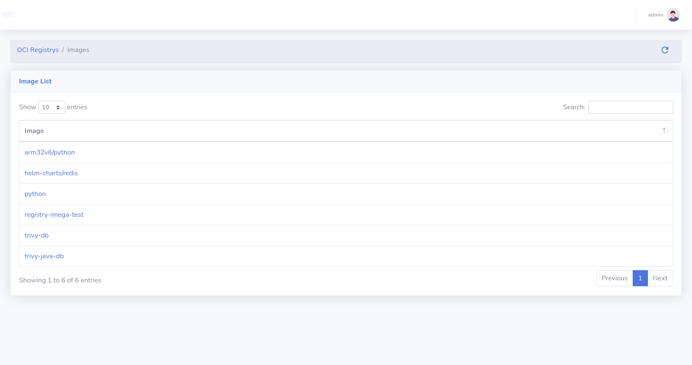
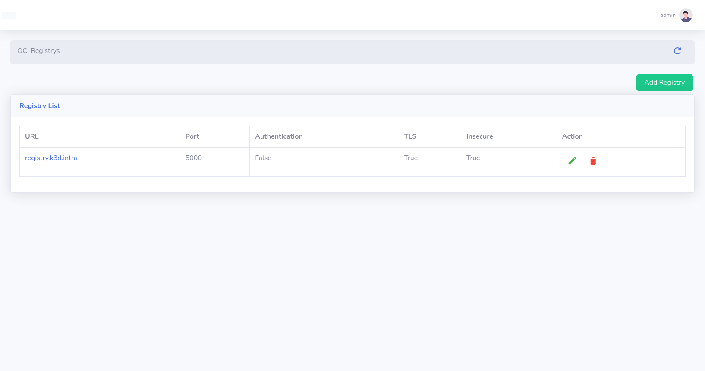

# Docker Registry Integration

From KubeDash 2.0 you can configure your dashboard as a Docker Registry UI:




## Using CORS

Your server should be configured to accept CORS.

If your docker registry does not need credentials, you will need to send this HEADER:

```yaml
Access-Control-Allow-Origin: ['*']
```

If your docker registry need credentials, you will need to send these HEADERS (you must add the protocol `http`/`https` and the port when not default `80`/`443`):

```yaml
http:
  headers:
    Access-Control-Allow-Origin: ['http://registry.example.com']
    Access-Control-Allow-Credentials: [true]
    Access-Control-Allow-Headers: ['Authorization', 'Accept', 'Cache-Control']
    Access-Control-Allow-Methods: ['HEAD', 'GET', 'OPTIONS'] # Optional
```

## Enable delete

For deleting images, you need to activate the delete feature in the UI with `DELETE_IMAGES=true` and in your registry:

```yaml
storage:
    delete:
      enabled: true
```

And you need to add these HEADERS:

```yaml
http:
  headers:
    Access-Control-Allow-Methods: ['HEAD', 'GET', 'OPTIONS', 'DELETE']
    Access-Control-Allow-Headers: ['Authorization', 'Accept', 'Cache-Control']
    Access-Control-Expose-Headers: ['Docker-Content-Digest']
```

## Basic Authentication

Enable authentication in the registry config:

```yaml
auth:
  htpasswd:
    realm: basic-realm
    path: /etc/docker/registry/htpasswd
```

Then add the Registry at `OCI Registrys > Add Registry`




## Registry Events

If your Registry supports sending webhook notifications in response to events happening within the registry, then the KubeDash can store this events in its database and visualize.

```bash
notifications:
  endpoints:
    - name: kubedash
      url: https://kubedash.mydomain.intra/plugins/registry/events
      timeout: 1s
      threshold: 5
      backoff: 10s
      ignoredmediatypes:
        - application/octet-stream
```


## Image Tagging


## Image Lableing

The Doker registry UI can show stander docker labels based on common standards:

* https://specs.opencontainers.org/image-spec/annotations/
* http://label-schema.org/rc1/

## OCI Helm Charts

If you use an OCI compatible Docker Registry you can store your Helm chart in OCI format. With KubeDash, you can visualize the Helm Chart metadata:


## Image Security SBOM

SBOMs can also be stored in an OCI registry, using OCI specification:

```bash
trivy i --format cosign-vuln \
registry.mydomain.intra:5000/registry-imega-test:1.0 > image.sbom

cosign attach sbom --sbom image.sbom \
registry.mydomain.intra:5000/registry-imega-test:1.0
```


