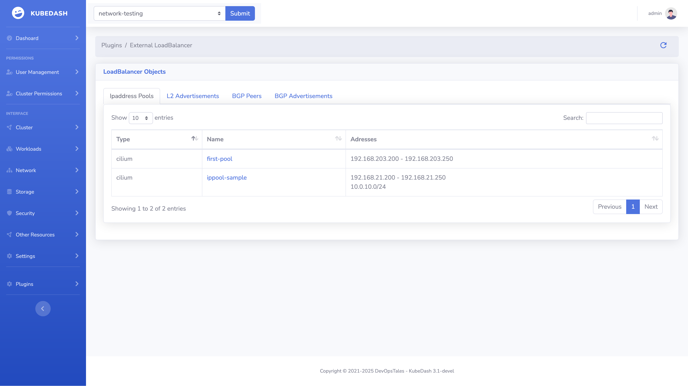
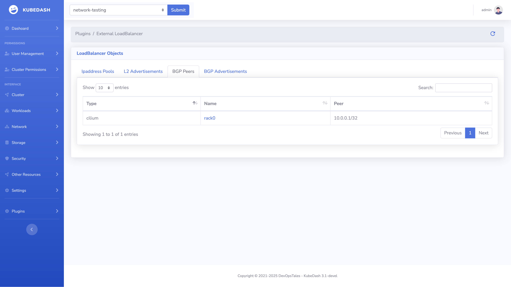

# External LoadBalancer Plugin

Whit the KubeDatabase UI you can see your `External LoadBalancer` configurations and there sates. Currently the two supported loadbalancing application is `MetalLB` and `Clilium`.

