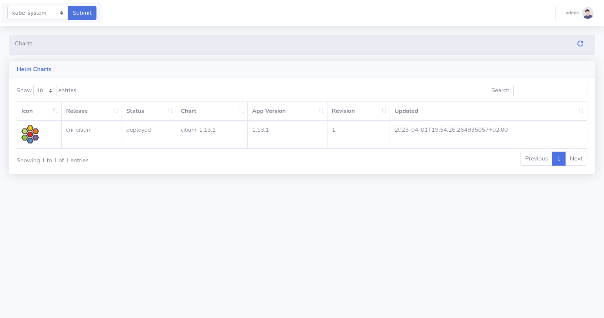

# HelmChart

KubeDash offers a UI-driven way to view the installed Helm charts, see their revision history and corresponding k8s resources.

Key capabilities of the tool:

* See all installed charts and their revision history
* Browse k8s resources resulting from the chart

