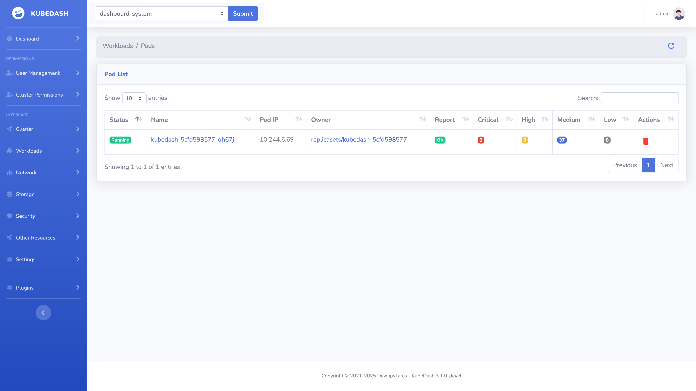
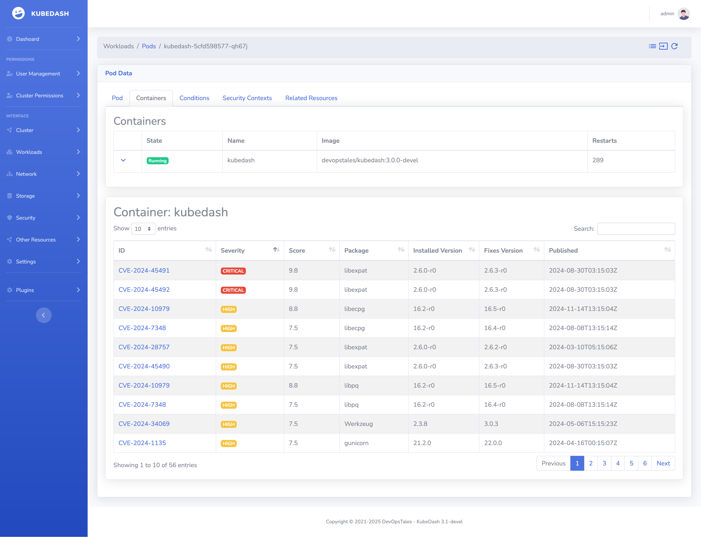

# trivy-operator integration

KubeDash can integrate with my original [trivy-operator](https://devopstales.github.io/trivy-operator/) and aquasecurity's official operator to show vulnerabilities in your cluster. Kubdash automatically detects the [VulnerabilityReport](https://devopstales.github.io/trivy-operator/latest/crds/vulnerability-report/) Custom Resource Objects created by trivy-operator.

You can find the vulnerabilities on the pod page:

Then the full list of vulnerabilities are shown below the container data:
