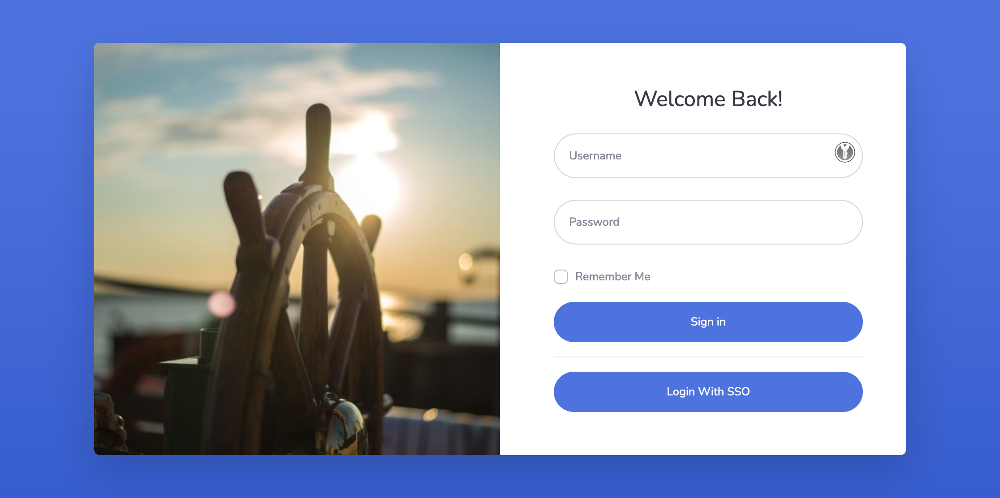
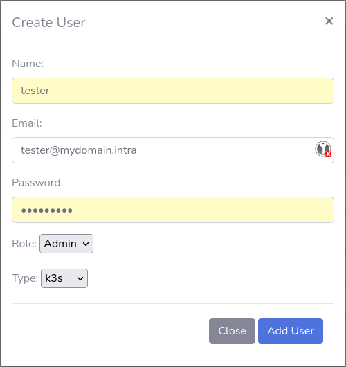
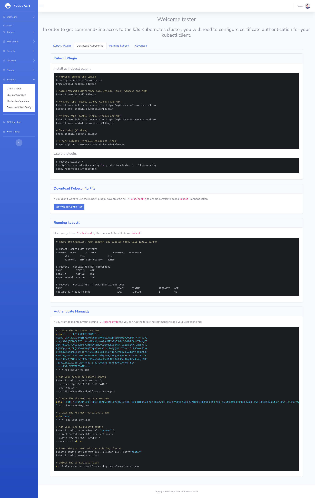
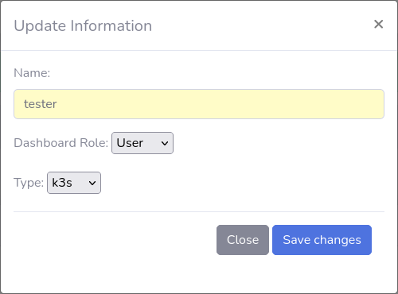
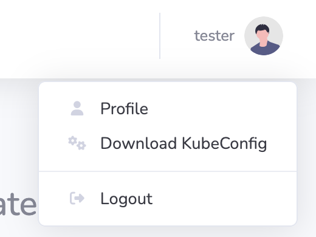
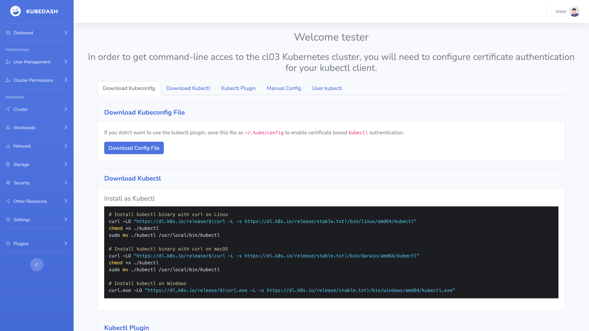
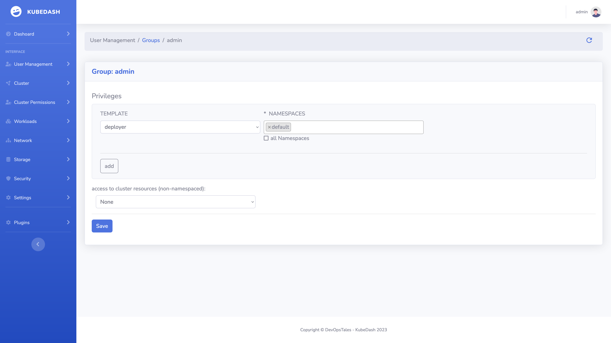

# Product Requirements Document: Authentication & User Management

**Document Version**: 1.0  
**Last Updated**: December 2025  
**Product**: KubeDash  
**Feature Area**: Authentication & User Management  
**Status**: Active  

---

## Implementation Status

> **Overall Progress: ~85% Complete**

This section tracks the current implementation status against the requirements defined in this PRD.

### Feature Implementation Matrix

| Feature Category | Status | Completion | Notes |
|-----------------|--------|------------|-------|
| **Local Authentication** | ✅ Implemented | 100% | Full login/logout with password hashing |
| **SSO/OIDC Authentication** | ✅ Implemented | 95% | OIDC flow, token refresh, group mapping |
| **Session Management** | ✅ Implemented | 90% | Session timeout, secure cookies |
| **User Management (Admin)** | ✅ Implemented | 90% | Create, list, edit, delete users |
| **Password Management** | ✅ Implemented | 85% | Change password, CLI reset |
| **Kubectl Config Generation** | ✅ Implemented | 100% | OIDC and certificate-based configs |
| **Remember Me** | ✅ Implemented | 100% | Extended session duration |
| **Default Password Warning** | ✅ Implemented | 100% | Dashboard warning banner |
| **Role-Based Access** | ✅ Implemented | 100% | Admin/User roles with K8s RBAC |
| **SSO Group Mapping** | ✅ Implemented | 90% | Map IdP groups to roles |
| **Multi-Factor Authentication** | ❌ Not Started | 0% | Planned for future release |
| **API Token Authentication** | ✅ Implemented | 100% | Bearer token for Extension API |
| **Account Lockout** | ❌ Not Started | 0% | Planned for future release |
| **Password Expiration** | ❌ Not Started | 0% | Planned for future release |

### User Story Implementation Status

#### Local Authentication
| User Story | Status | Implementation File |
|------------|--------|---------------------|
| US-AUTH-001: First-Time Login | ✅ Done | `blueprint/auth.py` |
| US-AUTH-002: Local User Login | ✅ Done | `blueprint/auth.py` |
| US-AUTH-003: Password Change | ✅ Done | `blueprint/user.py` |
| US-AUTH-004: Password Reset (Admin) | ✅ Done | CLI command |
| US-AUTH-005: Session Timeout | ✅ Done | `lib/config.py` |
| US-AUTH-006: Logout | ✅ Done | `blueprint/auth.py` |

#### SSO/OIDC Authentication
| User Story | Status | Implementation File |
|------------|--------|---------------------|
| US-AUTH-010: SSO Login | ✅ Done | `blueprint/sso.py` |
| US-AUTH-011: Configure OIDC Provider | ✅ Done | `blueprint/settings.py` |
| US-AUTH-012: SSO Group Mapping | ✅ Done | `lib/sso.py` |
| US-AUTH-013: Token Refresh | ✅ Done | `lib/sso.py` |
| US-AUTH-014: IdP Unavailability Handling | ⚠️ Partial | Basic error handling |

#### User Management
| User Story | Status | Implementation File |
|------------|--------|---------------------|
| US-USER-001: Create Local User | ✅ Done | `blueprint/user.py` |
| US-USER-002: List Users | ✅ Done | `blueprint/user.py` |
| US-USER-003: Edit User | ✅ Done | `blueprint/user.py` |
| US-USER-004: Delete User | ✅ Done | `blueprint/user.py` |
| US-USER-005: View SSO Groups | ✅ Done | `blueprint/user.py` |

#### Kubernetes Integration
| User Story | Status | Implementation File |
|------------|--------|---------------------|
| US-K8S-001: Generate Kubectl Config (OIDC) | ✅ Done | `blueprint/auth.py` |
| US-K8S-002: Generate Kubectl Config (Certificate) | ✅ Done | `blueprint/auth.py` |
| US-K8S-003: kubectl Plugin Login | ✅ Done | Separate kubectl plugin |

### Technical Debt & Known Issues

1. **Password complexity validation** - Currently basic, could be enhanced
2. **Session binding** - IP-based binding not implemented
3. **Audit logging** - Basic logging exists, comprehensive audit trail pending
4. **Rate limiting** - Not implemented for login endpoint

### Next Steps

1. Implement MFA (TOTP) support
2. Add account lockout after failed attempts
3. Implement password expiration policies
4. Enhanced audit logging UI

---

## 1. Executive Summary

### 1.1 Purpose

This PRD defines the requirements for KubeDash's authentication and user management system. The system must provide secure, flexible authentication options while integrating seamlessly with Kubernetes RBAC and enterprise identity providers.

### 1.2 Background

Kubernetes clusters contain sensitive workloads and configurations. Access to a dashboard that can view, modify, or delete these resources must be carefully controlled. KubeDash needs to balance security with usability, providing both standalone deployment options (local authentication) and enterprise integration (OIDC/SSO).

### 1.3 Goals

1. **Secure Access**: Prevent unauthorized access to cluster resources
2. **Flexible Authentication**: Support multiple authentication methods
3. **Enterprise Integration**: Seamless OIDC/SSO integration
4. **Self-Service**: Allow users to manage their own credentials
5. **Audit Trail**: Track authentication events for compliance

---

## 2. User Personas

### 2.1 Platform Administrator (Admin)

- **Role**: Manages KubeDash deployment and user access
- **Technical Level**: Expert in Kubernetes and identity management
- **Goals**: Secure the platform, manage users, configure integrations
- **Frustrations**: Complex setup, security compliance requirements

### 2.2 DevOps Engineer (User)

- **Role**: Deploys and manages applications in Kubernetes
- **Technical Level**: Intermediate to advanced
- **Goals**: Quick access to cluster resources, troubleshoot issues
- **Frustrations**: Slow authentication, multiple credential sets

### 2.3 Team Lead (Manager)

- **Role**: Oversees team's Kubernetes resources
- **Technical Level**: Basic Kubernetes knowledge
- **Goals**: View team resources, delegate access
- **Frustrations**: Cannot easily manage team permissions

---

## 3. User Stories

### 3.1 Local Authentication

#### US-AUTH-001: First-Time Login
**As a** new administrator  
**I want to** log in with default credentials  
**So that** I can initially access and configure KubeDash  

**Acceptance Criteria**:
- Default credentials (admin/admin) work on fresh installation
- User is prompted to change default password after first login
- Warning banner displayed until password is changed
- Password change is enforced within 24 hours

**Priority**: P0 (Critical)

---

#### US-AUTH-002: Local User Login
**As a** local user  
**I want to** log in with my username and password  
**So that** I can access the dashboard  

**Acceptance Criteria**:
- Login form accepts username and password
- Invalid credentials display appropriate error message
- Successful login redirects to dashboard
- Session is created with appropriate timeout
- "Remember me" option extends session duration
- Login events are logged with timestamp and IP

**Priority**: P0 (Critical)

---

#### US-AUTH-003: Password Change
**As a** user  
**I want to** change my password  
**So that** I can maintain account security  

**Acceptance Criteria**:
- Current password required to change password
- New password must meet complexity requirements:
  - Minimum 8 characters
  - At least one uppercase letter
  - At least one lowercase letter
  - At least one number
- Password confirmation required
- Success message displayed after change
- Session remains valid after password change
- Cannot reuse last 3 passwords

**Priority**: P1 (High)

---

#### US-AUTH-004: Password Reset (Admin)
**As an** administrator  
**I want to** reset a user's password via CLI  
**So that** I can help users who are locked out  

**Acceptance Criteria**:
- CLI command available: `flask cli reset-password`
- Command prompts for new password
- Password change takes effect immediately
- User must change password on next login
- Action is logged for audit

**Priority**: P1 (High)

---

#### US-AUTH-005: Session Timeout
**As a** security-conscious user  
**I want** my session to automatically expire after inactivity  
**So that** my account is protected if I forget to log out  

**Acceptance Criteria**:
- Default session timeout: 10 minutes of inactivity
- Warning displayed 1 minute before timeout
- User can extend session from warning dialog
- Expired sessions redirect to login page
- Sensitive pages require re-authentication after timeout

**Priority**: P0 (Critical)

---

#### US-AUTH-006: Logout
**As a** user  
**I want to** log out of the dashboard  
**So that** others cannot access my session  

**Acceptance Criteria**:
- Logout button visible in navigation
- Logout clears session completely
- Redirect to login page after logout
- Cannot use back button to access previous pages
- OAuth tokens invalidated (if applicable)

**Priority**: P0 (Critical)

---

### 3.2 SSO/OIDC Authentication

#### US-AUTH-010: SSO Login
**As a** user with corporate identity  
**I want to** log in using my company SSO  
**So that** I don't need separate credentials for KubeDash  

**Acceptance Criteria**:
- "Login with SSO" button displayed on login page
- Clicking redirects to identity provider
- After IdP authentication, user is returned to KubeDash
- User profile created/updated from IdP claims
- User role assigned based on IdP groups (if configured)
- ID token and refresh token stored securely

**Priority**: P0 (Critical)

---

#### US-AUTH-011: Configure OIDC Provider
**As an** administrator  
**I want to** configure an OIDC identity provider  
**So that** users can authenticate via SSO  

**Acceptance Criteria**:
- Configuration page in Settings
- Required fields:
  - Identity Provider URL
  - Client ID
  - Client Secret
  - Redirect URI (displayed, not editable)
- Optional fields:
  - Custom CA certificate (for self-signed IdP certs)
  - Group claim mapping
- Test connection button validates configuration
- Changes require admin authentication
- Configuration encrypted at rest

**Priority**: P0 (Critical)

---

#### US-AUTH-012: SSO Group Mapping
**As an** administrator  
**I want to** map SSO groups to KubeDash roles  
**So that** user permissions are managed centrally in the IdP  

**Acceptance Criteria**:
- Configure which IdP groups map to Admin role
- Configure which IdP groups map to User role
- Users without matching groups denied access
- Group membership refreshed on each login
- Changes take effect on next user login

**Priority**: P1 (High)

---

#### US-AUTH-013: Token Refresh
**As a** logged-in SSO user  
**I want** my session to remain valid  
**So that** I don't have to re-authenticate frequently  

**Acceptance Criteria**:
- Access tokens refreshed automatically before expiry
- Refresh token used to obtain new access token
- If refresh fails, user redirected to login
- User notified if re-authentication required
- Refresh happens transparently (no UI interruption)

**Priority**: P1 (High)

---

#### US-AUTH-014: IdP Unavailability Handling
**As a** user  
**I want** clear feedback when the IdP is unavailable  
**So that** I understand why I cannot log in  

**Acceptance Criteria**:
- Display user-friendly error message
- Suggest retry or contact administrator
- Log error details for troubleshooting
- Fall back to local authentication (if available)
- Health check shows IdP status

**Priority**: P2 (Medium)

---

### 3.3 User Management

#### US-USER-001: Create Local User
**As an** administrator  
**I want to** create local user accounts  
**So that** users can access the dashboard without SSO  

**Acceptance Criteria**:
- Form to create new user:
  - Username (required, unique)
  - Password (required, meets complexity)
  - Email (optional)
  - Role (Admin/User)
- Validation prevents duplicate usernames
- Password stored as secure hash
- New user can log in immediately
- Creation logged for audit

**Priority**: P1 (High)

---

#### US-USER-002: List Users
**As an** administrator  
**I want to** view all users  
**So that** I can manage access to the dashboard  

**Acceptance Criteria**:
- Table displaying all users:
  - Username
  - Email
  - User type (Local/OpenID)
  - Role (Admin/User)
  - Last login timestamp
- Search/filter functionality
- Pagination for large user lists
- Export capability (CSV)

**Priority**: P1 (High)

---

#### US-USER-003: Edit User
**As an** administrator  
**I want to** modify user properties  
**So that** I can update roles and information  

**Acceptance Criteria**:
- Can modify:
  - Email
  - Role
- Cannot modify:
  - Username (immutable)
  - User type (system determined)
- Changes take effect on next login
- Modification logged for audit

**Priority**: P1 (High)

---

#### US-USER-004: Delete User
**As an** administrator  
**I want to** delete user accounts  
**So that** former employees cannot access the dashboard  

**Acceptance Criteria**:
- Confirmation required before deletion
- Cannot delete own account
- Cannot delete last admin account
- Deletion removes:
  - User record
  - Role assignments
  - Session data
  - Kubectl configurations
- Deletion logged for audit

**Priority**: P1 (High)

---

#### US-USER-005: View SSO Groups
**As an** administrator  
**I want to** view SSO groups and their members  
**So that** I can understand user access levels  

**Acceptance Criteria**:
- List all discovered SSO groups
- Show group creation timestamp
- Show member count per group
- Drill down to view group members
- Export group membership

**Priority**: P2 (Medium)

---

### 3.4 Kubernetes User Integration

#### US-K8S-001: Generate Kubectl Config (OIDC)
**As an** SSO user  
**I want to** download a kubectl configuration  
**So that** I can use CLI with my OIDC credentials  

**Acceptance Criteria**:
- Download button available after SSO login
- Generated kubeconfig includes:
  - Cluster server URL
  - Cluster CA certificate
  - OIDC credentials (client-id, tokens, issuer)
- Configuration works with kubectl immediately
- Instructions provided for usage
- Refresh token enables automatic token renewal

**Priority**: P1 (High)

---

#### US-K8S-002: Generate Kubectl Config (Certificate)
**As a** local user  
**I want to** obtain certificate-based kubectl credentials  
**So that** I can use CLI with my identity  

**Acceptance Criteria**:
- Request certificate signing for user
- Generate client key and certificate
- Bundle in kubeconfig format
- Certificate validity period configurable
- Revocation possible by admin

**Priority**: P2 (Medium)

---

#### US-K8S-003: kubectl Plugin Login
**As a** user  
**I want to** authenticate via kubectl plugin  
**So that** I can seamlessly obtain credentials  

**Acceptance Criteria**:
- `kubectl kubedash login` command initiates auth
- Opens browser for authentication
- Receives credentials after successful auth
- Updates local kubeconfig automatically
- Works with both local and SSO authentication

**Priority**: P2 (Medium)

---

## 4. Functional Requirements

### 4.1 Authentication System

| ID | Requirement | Priority |
|----|-------------|----------|
| FR-AUTH-01 | System shall support local username/password authentication | P0 |
| FR-AUTH-02 | System shall support OIDC/OAuth 2.0 authentication | P0 |
| FR-AUTH-03 | System shall support Bearer token authentication for API | P0 |
| FR-AUTH-04 | Passwords shall be hashed using scrypt algorithm | P0 |
| FR-AUTH-05 | Sessions shall be stored server-side with configurable timeout | P0 |
| FR-AUTH-06 | System shall log all authentication events | P1 |
| FR-AUTH-07 | System shall support "Remember Me" functionality | P2 |
| FR-AUTH-08 | System shall enforce password complexity requirements | P1 |

### 4.2 User Management

| ID | Requirement | Priority |
|----|-------------|----------|
| FR-USER-01 | Administrators shall be able to create local users | P1 |
| FR-USER-02 | Administrators shall be able to modify user roles | P1 |
| FR-USER-03 | Administrators shall be able to delete users | P1 |
| FR-USER-04 | System shall automatically create users from SSO on first login | P0 |
| FR-USER-05 | System shall sync SSO group membership on login | P1 |
| FR-USER-06 | Users shall be able to view and modify their own profile | P2 |

### 4.3 Authorization

| ID | Requirement | Priority |
|----|-------------|----------|
| FR-AUTHZ-01 | System shall support Admin and User dashboard roles | P0 |
| FR-AUTHZ-02 | Admin role shall have full Kubernetes access via ServiceAccount | P0 |
| FR-AUTHZ-03 | User role shall have RBAC-filtered Kubernetes access via OIDC token | P0 |
| FR-AUTHZ-04 | System shall filter namespace access based on Kubernetes RBAC | P0 |
| FR-AUTHZ-05 | Admin-only features shall be hidden from User role | P1 |

---

## 5. Non-Functional Requirements

### 5.1 Security

| ID | Requirement | Target |
|----|-------------|--------|
| NFR-SEC-01 | All authentication traffic shall use TLS | 100% |
| NFR-SEC-02 | Session cookies shall be HttpOnly and Secure | Mandatory |
| NFR-SEC-03 | CSRF protection shall be enabled on all forms | Mandatory |
| NFR-SEC-04 | Password brute-force protection | Max 5 attempts |
| NFR-SEC-05 | Sensitive data shall be encrypted at rest | AES-256 |

### 5.2 Performance

| ID | Requirement | Target |
|----|-------------|--------|
| NFR-PERF-01 | Login response time | < 2 seconds |
| NFR-PERF-02 | SSO callback processing | < 3 seconds |
| NFR-PERF-03 | User list load time (100 users) | < 1 second |

### 5.3 Availability

| ID | Requirement | Target |
|----|-------------|--------|
| NFR-AVAIL-01 | Authentication service uptime | 99.9% |
| NFR-AVAIL-02 | Graceful degradation when IdP unavailable | Required |

### 5.4 Compliance

| ID | Requirement | Standard |
|----|-------------|----------|
| NFR-COMP-01 | Audit logging for authentication events | SOC 2 |
| NFR-COMP-02 | Password policy enforcement | NIST 800-63B |
| NFR-COMP-03 | Session management security | OWASP |

---

## 6. User Experience Guidelines

### 6.1 Login Page

- Clean, uncluttered design
- Clear indication of SSO vs Local login options
- Helpful error messages (without revealing security details)
- Loading indicators during authentication
- Responsive design for mobile access

### 6.2 User Management

- Intuitive table layout with sorting/filtering
- Inline editing where appropriate
- Confirmation dialogs for destructive actions
- Bulk operations for efficiency

### 6.3 Error Handling

- User-friendly error messages
- Guidance on how to resolve issues
- Contact information for help
- Detailed errors in logs (not shown to users)

---

## 7. Dependencies

### 7.1 Internal Dependencies

- Database system (SQLAlchemy)
- Flask session management
- Kubernetes Python client

### 7.2 External Dependencies

- OIDC Identity Provider (if SSO enabled)
- Kubernetes API server (for RBAC validation)

---

## 8. Risks & Mitigations

| Risk | Impact | Probability | Mitigation |
|------|--------|-------------|------------|
| IdP outage blocks all SSO users | High | Medium | Enable local admin fallback |
| Token theft enables unauthorized access | High | Low | Short token lifetime, refresh tokens |
| Default credentials not changed | High | Medium | Force password change on first login |
| Session hijacking | High | Low | Secure cookies, session binding |

---

## 9. Success Metrics

| Metric | Target | Measurement |
|--------|--------|-------------|
| Login success rate | > 99% | Successful logins / total attempts |
| Average login time | < 3 seconds | Time from submit to dashboard |
| Password reset frequency | < 5% monthly | Resets / total users |
| SSO adoption | > 80% | SSO users / total users |
| Security incidents | 0 | Authentication-related breaches |

---

## 10. Future Considerations

### 10.1 Potential Enhancements

1. **Multi-Factor Authentication (MFA)**: TOTP support for local users
2. **Account Lockout**: Automatic lockout after failed attempts
3. **Password Expiration**: Configurable password rotation policy
4. **Session Management UI**: View and revoke active sessions
5. **API Keys**: Long-lived tokens for automation
6. **LDAP Integration**: Direct LDAP authentication

### 10.2 Out of Scope (This Version)

- SAML 2.0 support
- Social login (Google, GitHub)
- Hardware key authentication (FIDO2)
- Multi-tenant user isolation

---

## 11. Appendix

### 11.1 Glossary

| Term | Definition |
|------|------------|
| OIDC | OpenID Connect - authentication layer on OAuth 2.0 |
| SSO | Single Sign-On - one set of credentials for multiple applications |
| RBAC | Role-Based Access Control |
| IdP | Identity Provider |
| JWT | JSON Web Token |

### 11.2 References

- [OIDC Specification](https://openid.net/specs/openid-connect-core-1_0.html)
- [Kubernetes RBAC](https://kubernetes.io/docs/reference/access-authn-authz/rbac/)
- [OWASP Session Management](https://cheatsheetseries.owasp.org/cheatsheets/Session_Management_Cheat_Sheet.html)
- [NIST Password Guidelines](https://pages.nist.gov/800-63-3/sp800-63b.html)

---

## 12. Screenshots

### Login Page

*KubeDash login page with username/password authentication*

### User Management

*User management interface showing local users*

*Create new local user form*

*User role and namespace assignment*

### Kubeconfig Generation

*Kubeconfig generation interface*

*Kubeconfig download options (OIDC/Certificate)*

### RBAC Configuration

*Role-based access control overview*

*Detailed RBAC configuration view*

---

*Document Owner: Product Management*  
*Stakeholders: Engineering, Security, UX*
