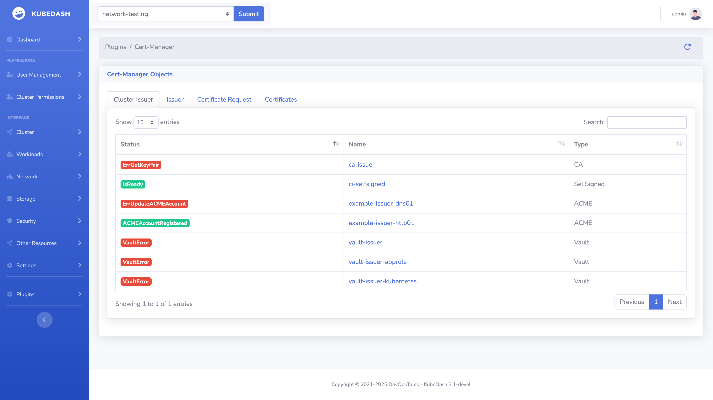
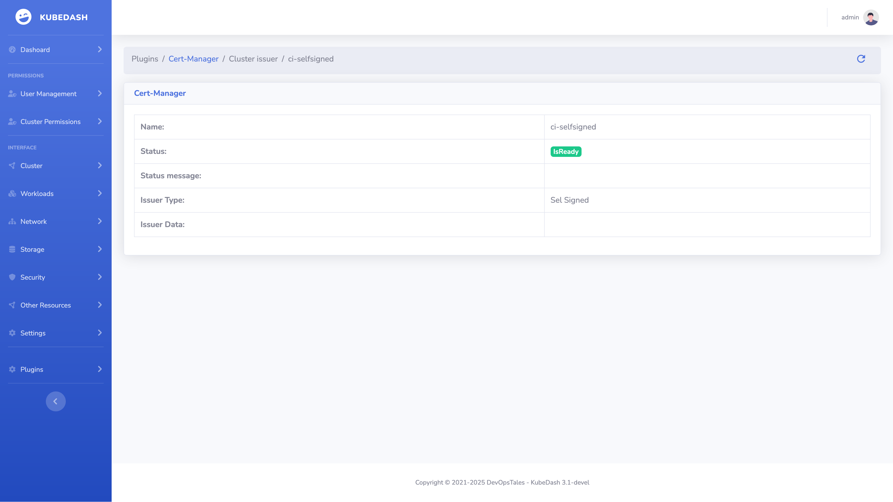
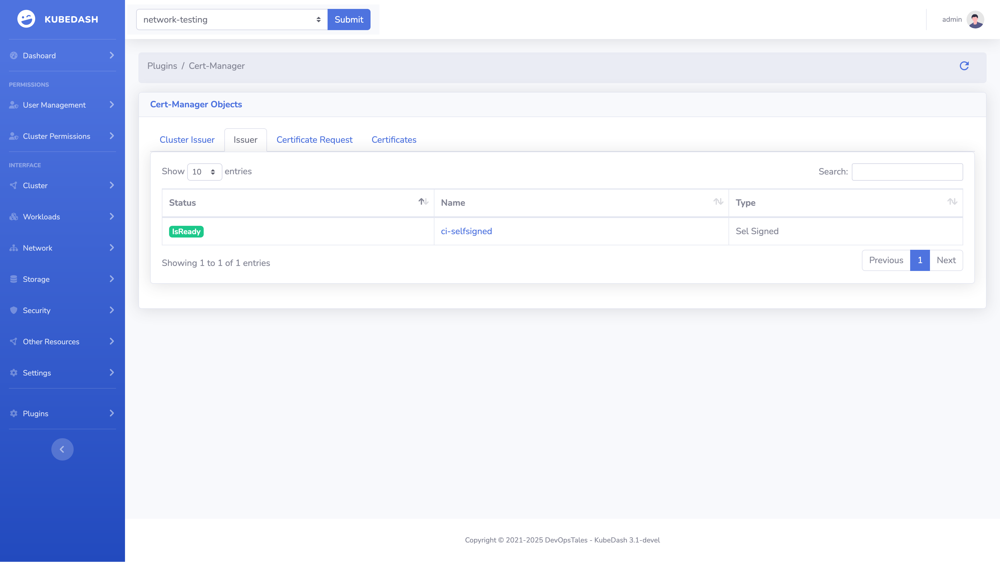
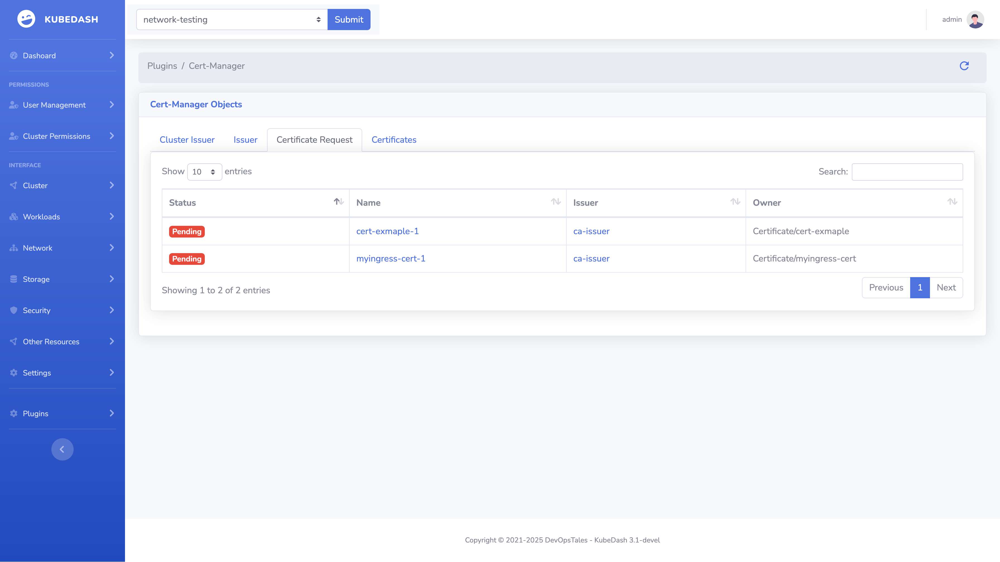

# Product Requirements Document: Cert-Manager Plugin

**Document Version**: 1.0  
**Last Updated**: December 2025  
**Product**: KubeDash  
**Feature Area**: Cert-Manager Plugin  
**Status**: Active  

---

## Implementation Status

> **Overall Progress: ~75% Complete**

| Feature | Status | Completion | Notes |
|---------|--------|------------|-------|
| **Certificate Listing** | ✅ Implemented | 100% | List certs per namespace |
| **Certificate Details** | ✅ Implemented | 90% | Spec, status, conditions |
| **Issuer Listing** | ✅ Implemented | 100% | Issuer and ClusterIssuer |
| **Issuer Details** | ✅ Implemented | 80% | Basic details |
| **Expiry Indicators** | ⚠️ Partial | 50% | Status shown, no timeline |
| **Certificate Requests** | ❌ Not Started | 0% | Planned |

### User Story Status
| User Story | Status | Implementation File |
|------------|--------|---------------------|
| US-CERT-001: List Certificates | ✅ Done | `plugins/cert_manager/__init__.py` |
| US-CERT-002: View Certificate Details | ✅ Done | `plugins/cert_manager/functions.py` |
| US-CERT-003: View Expiry Timeline | ❌ Not Done | Planned |
| US-ISSUER-001: List Issuers | ✅ Done | `plugins/cert_manager/__init__.py` |
| US-ISSUER-002: View Issuer Details | ⚠️ Partial | Basic info |
| US-CR-001: List Certificate Requests | ❌ Not Done | Planned |

---

## 1. Executive Summary

### 1.1 Purpose

This PRD defines the requirements for the KubeDash Cert-Manager Plugin. The plugin provides visibility into cert-manager certificates and issuers, enabling users to monitor certificate status, expiration, and configuration without using kubectl or the cert-manager CLI.

### 1.2 Background

Cert-Manager is the de facto standard for certificate management in Kubernetes. It automates the provisioning, renewal, and management of TLS certificates. Visibility into certificate status is critical for preventing outages caused by certificate expiration.

### 1.3 Goals

1. **Certificate Visibility**: View all certificates and their status
2. **Expiry Monitoring**: Track certificates approaching expiration
3. **Issuer Management**: View and verify issuer configurations
4. **Troubleshooting**: Identify certificate issuance failures
5. **Compliance**: Support certificate auditing requirements

---

## 2. User Personas

### 2.1 Certificate Administrator

- **Role**: Manages TLS certificates for the organization
- **Technical Level**: Intermediate to advanced
- **Goals**: Monitor certificate expiry, track issuers, ensure compliance
- **Frustrations**: No visibility into cert-manager status without CLI

### 2.2 Application Developer

- **Role**: Deploys applications requiring TLS
- **Technical Level**: Basic to intermediate cert-manager knowledge
- **Goals**: Verify certificate provisioning, debug TLS issues
- **Frustrations**: Complex CRD inspection via kubectl

### 2.3 Security Auditor

- **Role**: Reviews certificate configurations for compliance
- **Technical Level**: Intermediate
- **Goals**: Inventory certificates, verify configurations
- **Frustrations**: Manual certificate enumeration

---

## 3. User Stories

### 3.1 Certificate Management

#### US-CERT-001: List Certificates
**As a** user  
**I want to** see all certificates in a namespace  
**So that** I can monitor certificate status  

**Acceptance Criteria**:
- Display certificates in selected namespace
- Certificate information:
  - Name
  - Secret name (where cert is stored)
  - Issuer name & kind (Issuer/ClusterIssuer)
  - Status (Ready/NotReady)
  - Expiry date (Not After)
  - Renewal date
  - DNS names (SANs)
  - Age
- Visual indicators:
  - Green: Valid, not expiring within 30 days
  - Yellow: Expiring within 30 days
  - Red: Expired or failed
- Filter/sort capabilities
- "All Namespaces" option for admins

**Priority**: P0 (Critical)

---

#### US-CERT-002: View Certificate Details
**As a** user  
**I want to** see detailed certificate information  
**So that** I can troubleshoot issues  

**Acceptance Criteria**:
- Display certificate spec:
  - Common name
  - DNS names (Subject Alternative Names)
  - Duration (validity period)
  - Renew before (renewal threshold)
  - Issuer reference (name, kind, group)
  - Secret name
  - Private key configuration (algorithm, size, encoding)
  - Usages (server auth, client auth, etc.)
- Display certificate status:
  - Conditions (Ready, Issuing)
  - Not Before / Not After dates
  - Renewal time
  - Revision
  - Last failure message (if failed)
- Display related Kubernetes events
- Link to associated secret
- Link to referenced issuer

**Priority**: P1 (High)

---

#### US-CERT-003: View Certificate Expiry Timeline
**As a** security administrator  
**I want to** see certificates expiring soon  
**So that** I can prevent TLS-related outages  

**Acceptance Criteria**:
- Dashboard widget showing expiring certificates
- Configurable threshold (7, 14, 30, 60, 90 days)
- Sort by expiry date (soonest first)
- Show:
  - Certificate name
  - Namespace
  - Days until expiry
  - Issuer
- Quick actions to view details
- Export capability (CSV)
- Alert indicator on main navigation

**Priority**: P1 (High)

---

#### US-CERT-004: View Certificate Chain
**As a** user  
**I want to** view the certificate chain  
**So that** I can verify the trust chain  

**Acceptance Criteria**:
- Display certificate chain hierarchy
- Show each certificate in chain:
  - Subject
  - Issuer
  - Validity dates
  - Serial number
- Visual tree representation
- Identify root vs intermediate vs leaf

**Priority**: P3 (Future)

---

### 3.2 Issuer Management

#### US-ISSUER-001: List Issuers
**As a** user  
**I want to** see all certificate issuers  
**So that** I can understand certificate sources  

**Acceptance Criteria**:
- Display both Issuer (namespaced) and ClusterIssuer (cluster-scoped)
- Issuer information:
  - Name
  - Kind (Issuer/ClusterIssuer)
  - Namespace (for Issuer only)
  - Type (ACME, CA, SelfSigned, Vault, Venafi)
  - Status (Ready/NotReady)
  - Age
- Namespace filter for Issuers
- Visual status indicators
- Count of certificates issued by each

**Priority**: P1 (High)

---

#### US-ISSUER-002: View Issuer Details
**As a** user  
**I want to** see issuer configuration  
**So that** I can verify setup and troubleshoot  

**Acceptance Criteria**:
- Display issuer type-specific configuration:
  - **ACME**:
    - Server URL
    - Email
    - Private key secret reference
    - Solvers (HTTP01, DNS01)
    - Skip TLS verify setting
  - **CA**:
    - Secret reference (CA cert/key)
  - **SelfSigned**:
    - (minimal config)
  - **Vault**:
    - Server URL
    - Path
    - Auth method (token, appRole, kubernetes)
  - **Venafi**:
    - Zone
    - TPP/Cloud configuration
- Display status conditions
- List certificates issued by this issuer
- Display related events
- Show ACME account status (if ACME issuer)

**Priority**: P2 (Medium)

---

### 3.3 Certificate Requests

#### US-CR-001: List Certificate Requests
**As a** user  
**I want to** see pending certificate requests  
**So that** I can track certificate issuance  

**Acceptance Criteria**:
- Display CertificateRequest resources
- Information:
  - Name
  - Namespace
  - Issuer reference
  - Status (Pending/Ready/Failed/Denied)
  - Requestor (who/what created it)
  - Duration requested
  - Age
- Filter by status
- Link to parent certificate
- Show failure reason if failed

**Priority**: P2 (Medium)

---

#### US-CR-002: View Challenge Status
**As a** user  
**I want to** see ACME challenge status  
**So that** I can debug ACME issuance issues  

**Acceptance Criteria**:
- Display Challenge resources (for ACME issuers)
- Challenge information:
  - Type (HTTP01/DNS01)
  - Domain
  - Status (Pending/Valid/Invalid)
  - Token/Key
  - Solver configuration used
- Show challenge history
- Display related events

**Priority**: P2 (Medium)

---

## 4. Functional Requirements

### 4.1 Certificate Management

| ID | Requirement | Priority |
|----|-------------|----------|
| FR-CERT-01 | Plugin shall list Certificate resources per namespace | P0 |
| FR-CERT-02 | Plugin shall display certificate expiry date prominently | P0 |
| FR-CERT-03 | Plugin shall show certificate status conditions | P1 |
| FR-CERT-04 | Plugin shall display DNS names (SANs) | P1 |
| FR-CERT-05 | Plugin shall link to associated Secret | P2 |
| FR-CERT-06 | Plugin shall show certificate events | P1 |

### 4.2 Issuer Management

| ID | Requirement | Priority |
|----|-------------|----------|
| FR-ISS-01 | Plugin shall list Issuer resources per namespace | P1 |
| FR-ISS-02 | Plugin shall list ClusterIssuer resources | P1 |
| FR-ISS-03 | Plugin shall display issuer type and configuration | P1 |
| FR-ISS-04 | Plugin shall show issuer status | P1 |
| FR-ISS-05 | Plugin shall list certificates per issuer | P2 |

### 4.3 Certificate Requests

| ID | Requirement | Priority |
|----|-------------|----------|
| FR-CR-01 | Plugin shall list CertificateRequest resources | P2 |
| FR-CR-02 | Plugin shall show request status and conditions | P2 |
| FR-CR-03 | Plugin shall display Challenge resources for ACME | P2 |

### 4.4 Plugin Behavior

| ID | Requirement | Priority |
|----|-------------|----------|
| FR-PLG-01 | Plugin shall be disabled if cert-manager CRDs not present | P1 |
| FR-PLG-02 | Plugin shall cache certificate data for performance | P2 |
| FR-PLG-03 | Plugin shall respect Kubernetes RBAC | P0 |

---

## 5. Non-Functional Requirements

### 5.1 Performance

| ID | Requirement | Target |
|----|-------------|--------|
| NFR-PERF-01 | Certificate list load time (100 certs) | < 3 seconds |
| NFR-PERF-02 | Certificate details load time | < 2 seconds |
| NFR-PERF-03 | Expiry calculation time | < 1 second |

### 5.2 Compatibility

| ID | Requirement | Target |
|----|-------------|--------|
| NFR-COMP-01 | cert-manager v1.x API support | Required |
| NFR-COMP-02 | cert-manager v0.x compatibility | Not supported |

### 5.3 Usability

| ID | Requirement | Target |
|----|-------------|--------|
| NFR-USE-01 | Find expiring certificates | < 3 clicks |
| NFR-USE-02 | View certificate details | < 2 clicks |

---

## 6. Technical Considerations

### 6.1 Cert-Manager CRDs

| Resource | API Group | API Version | Scope |
|----------|-----------|-------------|-------|
| Certificate | cert-manager.io | v1 | Namespaced |
| CertificateRequest | cert-manager.io | v1 | Namespaced |
| Issuer | cert-manager.io | v1 | Namespaced |
| ClusterIssuer | cert-manager.io | v1 | Cluster |
| Challenge | acme.cert-manager.io | v1 | Namespaced |
| Order | acme.cert-manager.io | v1 | Namespaced |

### 6.2 Certificate Status Conditions

| Condition | Meaning |
|-----------|---------|
| Ready=True | Certificate is valid and stored in secret |
| Ready=False, Issuing=True | Certificate is being issued |
| Ready=False, Issuing=False | Certificate failed to issue |

### 6.3 Implementation Files

```
plugins/cert_manager/
├── __init__.py          # Blueprint routes
├── functions.py         # API calls to cert-manager CRDs
├── helper.py            # Utility functions
└── templates/
    ├── cert-manager.html.j2
    └── cert-manager-data.html.j2
```

---

## 7. User Interface Guidelines

### 7.1 Certificate List View

```
+--------------------------------------------------+
| Certificates                      [Namespace ▼]  |
+--------------------------------------------------+
| 🔍 Search certificates...                         |
+--------------------------------------------------+
| Name      | Status | Expiry     | Issuer | SANs  |
|-----------|--------|------------|--------|-------|
| web-tls   | ✅ Ready| 2026-03-01 | letsenc| *.app |
| api-tls   | ⚠️ 14d | 2025-12-23 | letsenc| api.* |
| old-cert  | ❌ Exp  | 2025-11-01 | self   | old.* |
+--------------------------------------------------+
```

### 7.2 Certificate Details View

```
+--------------------------------------------------+
| ← Back | Certificate: web-tls                     |
+--------------------------------------------------+
| Status: ✅ Ready                                  |
+--------------------------------------------------+
| [Overview] [Conditions] [Events]                 |
+--------------------------------------------------+
| DNS Names:                                        |
|   - www.example.com                              |
|   - api.example.com                              |
|                                                  |
| Issuer: letsencrypt-prod (ClusterIssuer)         |
| Secret: web-tls-secret                           |
|                                                  |
| Valid From: 2025-12-01 00:00:00                  |
| Valid Until: 2026-03-01 00:00:00                 |
| Renews At: 2026-02-01 00:00:00                   |
+--------------------------------------------------+
```

---

## 8. Dependencies

### 8.1 Internal Dependencies

- Kubernetes library (CustomObjects API)
- Plugin framework (blueprint registration)
- Caching layer

### 8.2 External Dependencies

- cert-manager installed in cluster
- cert-manager CRDs available

### 8.3 RBAC Requirements

```yaml
- apiGroups: ["cert-manager.io"]
  resources: ["certificates", "certificaterequests", "issuers", "clusterissuers"]
  verbs: ["get", "list"]
- apiGroups: ["acme.cert-manager.io"]
  resources: ["challenges", "orders"]
  verbs: ["get", "list"]
```

---

## 9. Risks & Mitigations

| Risk | Impact | Probability | Mitigation |
|------|--------|-------------|------------|
| cert-manager not installed | High | Medium | Show install guidance, disable plugin |
| CRD version mismatch | Medium | Low | Version detection, multiple API support |
| Large number of certificates | Medium | Medium | Pagination, filtering |
| Secret data exposure | High | Low | Only show metadata, not secret contents |

---

## 10. Success Metrics

| Metric | Target | Measurement |
|--------|--------|-------------|
| Plugin adoption | 60% of users with cert-manager | Feature analytics |
| Certificate issue detection | -80% time vs kubectl | User research |
| Expiring cert visibility | 100% coverage | Certificate audits |

---

## 11. Future Considerations

### 11.1 Potential Enhancements

1. **Manual Renewal Trigger**: Button to force certificate renewal
2. **Certificate Creation**: Create new Certificate resources via UI
3. **Alerting Integration**: Notify on expiring certificates
4. **Certificate Diff**: Compare certificate versions
5. **Bulk Operations**: Renew multiple certificates

### 11.2 Out of Scope (This Version)

- Certificate creation/modification
- Issuer creation
- Private key viewing
- ACME account management

---

## 12. Plugin Configuration

```ini
# kubedash.ini
[plugin_settings]
cert_manager = true  # Enable Cert-Manager plugin
```

---

## 13. Screenshots

### Certificate List



*Certificate list view showing status and expiry*

### Certificate Details



*Detailed certificate information*

### Issuer List



*Certificate issuers (Issuer and ClusterIssuer)*

### Issuer Details



*Detailed issuer configuration*

---

*Document Owner: Product Management*  
*Stakeholders: Engineering, Security, Platform*
