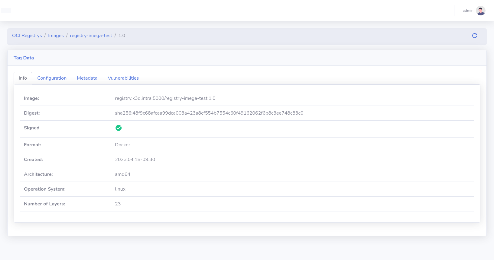
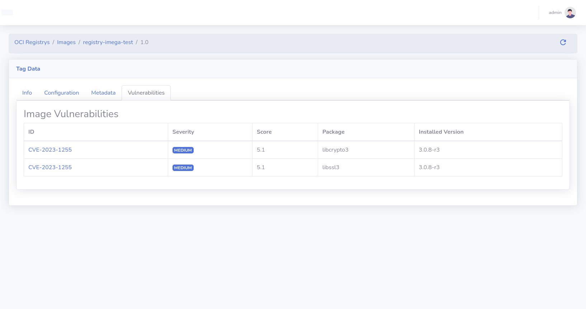
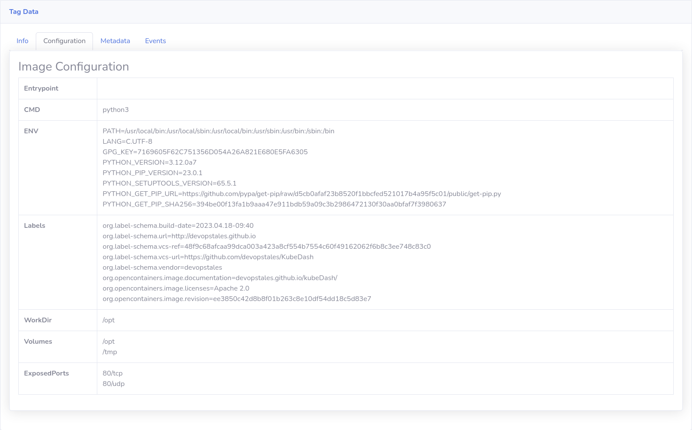

# Product Requirements Document: Docker Registry Plugin

**Document Version**: 1.0  
**Last Updated**: December 2025  
**Product**: KubeDash  
**Feature Area**: Docker Registry Plugin  
**Status**: Active  

---

## Implementation Status

> **Overall Progress: ~85% Complete**

This section tracks the current implementation status against the requirements defined in this PRD.

### Feature Implementation Matrix

| Feature Category | Status | Completion | Notes |
|-----------------|--------|------------|-------|
| **Registry Configuration** | ✅ Implemented | 100% | Add, edit, delete registries |
| **Image Listing** | ✅ Implemented | 100% | Browse repositories |
| **Tag Listing** | ✅ Implemented | 100% | List tags per image |
| **Image Manifest** | ✅ Implemented | 90% | Digest, layers |
| **Tag Deletion** | ⚠️ Partial | 50% | Requires registry config |
| **Event Tracking** | ✅ Implemented | 80% | Webhook endpoint |
| **Authentication** | ✅ Implemented | 100% | Basic auth support |
| **TLS Support** | ✅ Implemented | 100% | TLS and insecure options |

### User Story Implementation Status

#### Registry Configuration
| User Story | Status | Implementation File |
|------------|--------|---------------------|
| US-REG-001: Add Registry | ✅ Done | `plugins/registry/__init__.py` |
| US-REG-002: List Registries | ✅ Done | `plugins/registry/__init__.py` |
| US-REG-003: Edit Registry | ✅ Done | `plugins/registry/__init__.py` |
| US-REG-004: Delete Registry | ✅ Done | `plugins/registry/__init__.py` |

#### Image Browsing
| User Story | Status | Implementation File |
|------------|--------|---------------------|
| US-REG-010: List Repositories | ✅ Done | `plugins/registry/registry.py` |
| US-REG-011: List Image Tags | ✅ Done | `plugins/registry/registry.py` |
| US-REG-012: Search Images | ❌ Not Done | Client-side filter only |

#### Image Details
| User Story | Status | Implementation File |
|------------|--------|---------------------|
| US-REG-020: View Image Manifest | ✅ Done | `plugins/registry/registry.py` |
| US-REG-021: View Image Configuration | ⚠️ Partial | Basic info shown |

#### Tag Management
| User Story | Status | Implementation File |
|------------|--------|---------------------|
| US-REG-030: Delete Image Tag | ⚠️ Partial | Depends on registry support |

#### Event Tracking
| User Story | Status | Implementation File |
|------------|--------|---------------------|
| US-REG-040: Receive Push Events | ✅ Done | `/plugins/registry/events` |
| US-REG-041: View Push Events | ✅ Done | Events in tag view |

### Key Implementation Details

- **Database Models**: `registry_servers` table in `plugins/registry/model.py`
- **API Client**: `plugins/registry/registry_server.py` for Registry API v2
- **Routes**: Multiple routes in `plugins/registry/__init__.py`
- **Templates**: 4 Jinja2 templates for different views
- **Event Endpoint**: Webhook at `/plugins/registry/events`

### Technical Debt & Known Issues

1. **Search** - No server-side search, only client-side filtering
2. **Image configuration** - Limited config details shown
3. **Tag deletion** - Works only if registry has delete enabled
4. **Cloud registries** - ECR, GCR not yet supported

### Next Steps

1. Implement server-side image search
2. Add full image configuration display
3. Add support for AWS ECR authentication
4. Add support for Google GCR authentication
5. Consider vulnerability scanning integration

---

## 1. Executive Summary

### 1.1 Purpose

This PRD defines the requirements for the KubeDash Docker Registry Plugin. The plugin provides a web-based interface to browse and manage container images in Docker registries, view image tags, inspect manifests, and track push events.

### 1.2 Background

Container registries are essential components of container infrastructure. Organizations often run private registries alongside public ones. The Registry Plugin provides visibility into registry contents without requiring registry-specific CLI tools or direct API access.

### 1.3 Goals

1. **Image Discovery**: Browse available images and tags
2. **Image Inspection**: View image manifests and metadata
3. **Registry Management**: Configure multiple registries
4. **Event Tracking**: Monitor image push activities
5. **Security**: Support authenticated registries

---

## 2. User Personas

### 2.1 Developer

- **Role**: Builds and deploys container images
- **Technical Level**: Intermediate
- **Goals**: Find image versions, verify pushes
- **Frustrations**: No visibility into registry contents

### 2.2 Release Engineer

- **Role**: Manages image releases and deployments
- **Technical Level**: Advanced
- **Goals**: Track image versions, manage tags
- **Frustrations**: Multiple tools for registry access

### 2.3 Security Engineer

- **Role**: Audits container images for vulnerabilities
- **Technical Level**: Intermediate to advanced
- **Goals**: Inventory images, track changes
- **Frustrations**: Manual image enumeration

---

## 3. User Stories

### 3.1 Registry Configuration

#### US-REG-001: Add Registry
**As an** administrator  
**I want to** configure a Docker registry connection  
**So that** users can browse its contents  

**Acceptance Criteria**:
- Form to add new registry:
  - Registry URL (required)
  - Port (default: 443/5000)
  - TLS enabled toggle
  - Skip TLS verification toggle
  - Username (optional, for auth)
  - Password (optional, for auth)
- Test connection button
- Validation of URL format
- Save credentials securely (encrypted)
- Success/error feedback

**Priority**: P0 (Critical)

---

#### US-REG-002: List Registries
**As a** user  
**I want to** see configured registries  
**So that** I can select which one to browse  

**Acceptance Criteria**:
- List all configured registries
- Display: URL, authentication status, TLS status
- Visual indicator for connection status
- Select registry to browse
- Admin-only edit/delete options

**Priority**: P0 (Critical)

---

#### US-REG-003: Edit Registry
**As an** administrator  
**I want to** modify registry configuration  
**So that** I can update credentials or settings  

**Acceptance Criteria**:
- Edit all registry fields
- Current password not displayed (placeholder)
- Test connection before save
- Changes take effect immediately
- Audit log of changes

**Priority**: P1 (High)

---

#### US-REG-004: Delete Registry
**As an** administrator  
**I want to** remove a registry configuration  
**So that** it's no longer accessible  

**Acceptance Criteria**:
- Confirmation dialog
- Delete registry and credentials
- Remove associated event history
- Audit log of deletion

**Priority**: P1 (High)

---

### 3.2 Image Browsing

#### US-REG-010: List Repositories (Images)
**As a** user  
**I want to** see all images in a registry  
**So that** I can find available images  

**Acceptance Criteria**:
- List all repositories in selected registry
- Display: Repository name
- Search/filter by name
- Sort alphabetically
- Pagination for large registries
- Handle empty registries gracefully
- Loading indicator during fetch

**Priority**: P0 (Critical)

---

#### US-REG-011: List Image Tags
**As a** user  
**I want to** see all tags for an image  
**So that** I can find specific versions  

**Acceptance Criteria**:
- List all tags for selected image
- Display: Tag name, (digest if available)
- Sort by:
  - Name (alphabetical)
  - Date (if available)
- Filter/search tags
- Handle images with many tags (pagination)
- Link to tag details

**Priority**: P0 (Critical)

---

#### US-REG-012: Search Images
**As a** user  
**I want to** search for images across the registry  
**So that** I can quickly find what I need  

**Acceptance Criteria**:
- Search input on repository list
- Real-time filtering as user types
- Search by repository name
- Clear search functionality
- Result count display

**Priority**: P1 (High)

---

### 3.3 Image Details

#### US-REG-020: View Image Manifest
**As a** user  
**I want to** see image manifest details  
**So that** I can understand image composition  

**Acceptance Criteria**:
- Display manifest information:
  - Schema version
  - Media type
  - Digest (SHA256)
  - Total size
- Layer information:
  - Layer digests
  - Layer sizes
  - Layer media types
- Architecture information (multi-arch)
- Created timestamp
- Copy digest to clipboard

**Priority**: P1 (High)

---

#### US-REG-021: View Image Configuration
**As a** user  
**I want to** see image configuration (labels, env)  
**So that** I can verify build information  

**Acceptance Criteria**:
- Display configuration:
  - Labels
  - Environment variables (non-sensitive)
  - Entrypoint
  - Command
  - Working directory
  - Exposed ports
  - User
- Build information if available
- Base image information if available

**Priority**: P2 (Medium)

---

### 3.4 Tag Management

#### US-REG-030: Delete Image Tag
**As an** administrator  
**I want to** delete an image tag  
**So that** I can remove unused images  

**Acceptance Criteria**:
- Delete button on tag detail
- Confirmation dialog with warning
- Display image and tag to be deleted
- Cannot delete if tag doesn't exist
- Success/error feedback
- Audit log of deletion
- Note: Only removes manifest reference, not layers

**Priority**: P2 (Medium)

---

### 3.5 Event Tracking

#### US-REG-040: Receive Push Events
**As a** system  
**I want to** receive webhook notifications from the registry  
**So that** I can track image pushes  

**Acceptance Criteria**:
- Webhook endpoint: `/plugins/registry/events`
- Accept Docker Registry v2 event format
- Store events in database:
  - Action (push, pull, delete)
  - Repository
  - Tag
  - Digest
  - Source IP
  - User/Actor (if available)
  - Timestamp
- Ignore pull events (or make configurable)

**Priority**: P1 (High)

---

#### US-REG-041: View Push Events
**As a** user  
**I want to** see recent push events for an image  
**So that** I can track image updates  

**Acceptance Criteria**:
- Display events for specific image/tag:
  - Timestamp
  - Action (push)
  - Actor (who pushed)
  - Source IP
  - Digest
- Sort by timestamp (newest first)
- Filter by tag
- Pagination for many events

**Priority**: P2 (Medium)

---

## 4. Functional Requirements

### 4.1 Registry Configuration

| ID | Requirement | Priority |
|----|-------------|----------|
| FR-REG-01 | System shall store registry configurations in database | P0 |
| FR-REG-02 | System shall encrypt registry credentials at rest | P0 |
| FR-REG-03 | System shall support TLS and non-TLS registries | P0 |
| FR-REG-04 | System shall support authenticated and anonymous registries | P0 |
| FR-REG-05 | System shall test registry connectivity on save | P1 |

### 4.2 Image Browsing

| ID | Requirement | Priority |
|----|-------------|----------|
| FR-IMG-01 | System shall list repositories using Registry API v2 | P0 |
| FR-IMG-02 | System shall list tags for a repository | P0 |
| FR-IMG-03 | System shall retrieve image manifests | P1 |
| FR-IMG-04 | System shall support multi-architecture images | P2 |
| FR-IMG-05 | System shall cache image lists for performance | P2 |

### 4.3 Tag Management

| ID | Requirement | Priority |
|----|-------------|----------|
| FR-TAG-01 | System shall delete image tags via Registry API | P2 |
| FR-TAG-02 | System shall log tag deletions for audit | P2 |

### 4.4 Event Tracking

| ID | Requirement | Priority |
|----|-------------|----------|
| FR-EVT-01 | System shall receive Docker Registry webhooks | P1 |
| FR-EVT-02 | System shall store push events in database | P1 |
| FR-EVT-03 | System shall display events for images | P2 |

---

## 5. Non-Functional Requirements

### 5.1 Performance

| ID | Requirement | Target |
|----|-------------|--------|
| NFR-PERF-01 | Repository list load time | < 3 seconds |
| NFR-PERF-02 | Tag list load time | < 2 seconds |
| NFR-PERF-03 | Manifest load time | < 2 seconds |

### 5.2 Security

| ID | Requirement | Target |
|----|-------------|--------|
| NFR-SEC-01 | Credentials encrypted at rest | AES-256 |
| NFR-SEC-02 | Credentials never displayed in UI | Required |
| NFR-SEC-03 | TLS verification enabled by default | Required |
| NFR-SEC-04 | Webhook endpoint CSRF exempt | Required |

### 5.3 Compatibility

| ID | Requirement | Target |
|----|-------------|--------|
| NFR-COMP-01 | Docker Registry API v2 | Required |
| NFR-COMP-02 | Harbor registry | Compatible |
| NFR-COMP-03 | AWS ECR | Future |
| NFR-COMP-04 | Google GCR | Future |

---

## 6. Technical Considerations

### 6.1 Registry API

The plugin uses Docker Registry API v2:

| Endpoint | Description |
|----------|-------------|
| `GET /v2/_catalog` | List repositories |
| `GET /v2/<repo>/tags/list` | List tags |
| `GET /v2/<repo>/manifests/<tag>` | Get manifest |
| `DELETE /v2/<repo>/manifests/<digest>` | Delete manifest |

### 6.2 Authentication

Support for:
- Basic Authentication (username/password)
- Bearer Token (for advanced registries)
- Anonymous access

### 6.3 Event Webhook Format

```json
{
  "events": [{
    "id": "event-id",
    "timestamp": "2025-01-01T00:00:00Z",
    "action": "push",
    "target": {
      "repository": "myimage",
      "tag": "latest",
      "digest": "sha256:..."
    },
    "request": {
      "addr": "192.168.1.1:5000",
      "useragent": "docker/20.10"
    },
    "actor": {
      "name": "username"
    }
  }]
}
```

### 6.4 Database Schema

```sql
-- Registry configurations
CREATE TABLE registry_servers (
  id INTEGER PRIMARY KEY,
  url TEXT NOT NULL,
  port INTEGER,
  tls BOOLEAN,
  insecure_tls BOOLEAN,
  auth BOOLEAN,
  username TEXT,
  password TEXT  -- Encrypted
);

-- Push events
CREATE TABLE registry_events (
  id INTEGER PRIMARY KEY,
  action TEXT,
  repository TEXT,
  tag TEXT,
  digest TEXT,
  source_ip TEXT,
  actor TEXT,
  timestamp DATETIME
);
```

---

## 7. User Interface Guidelines

### 7.1 Registry List

```
+------------------------------------------+
| Docker Registries                   [+Add]|
+------------------------------------------+
| URL                  | Auth   | TLS      |
|---------------------|--------|----------|
| registry.example.com | ✅ Yes | ✅ Yes   |
| harbor.local        | ❌ No  | ✅ Yes   |
+------------------------------------------+
```

### 7.2 Image Browser

```
+------------------------------------------+
| ← Registries | registry.example.com       |
+------------------------------------------+
| 🔍 Search images...                       |
+------------------------------------------+
| Repository Name                           |
|------------------------------------------|
| app/frontend                              |
| app/backend                               |
| library/nginx                             |
| library/redis                             |
+------------------------------------------+
```

### 7.3 Tag List

```
+------------------------------------------+
| ← Images | app/frontend                   |
+------------------------------------------+
| Tag           | Actions                   |
|--------------|---------------------------|
| latest       | [View] [Delete]           |
| v1.0.0       | [View] [Delete]           |
| v0.9.0       | [View] [Delete]           |
+------------------------------------------+
```

### 7.4 Tag Details

```
+------------------------------------------+
| app/frontend:v1.0.0                       |
+------------------------------------------+
| Digest: sha256:abc123...          [Copy] |
| Size: 125 MB                              |
| Created: 2025-01-01 10:00:00              |
+------------------------------------------+
| Layers (5)                                |
| ---------------------------------------- |
| sha256:def... | 50 MB                    |
| sha256:ghi... | 30 MB                    |
| ...                                       |
+------------------------------------------+
| Push Events                               |
| ---------------------------------------- |
| 2025-01-01 | push | user@192.168.1.1    |
+------------------------------------------+
```

---

## 8. Dependencies

### 8.1 Internal Dependencies

- Database (SQLAlchemy models)
- Authentication system (admin check)
- Plugin framework

### 8.2 External Dependencies

- Docker Registry API v2 endpoint
- Network access to registries

---

## 9. Risks & Mitigations

| Risk | Impact | Probability | Mitigation |
|------|--------|-------------|------------|
| Registry API changes | Medium | Low | Version detection, graceful degradation |
| Credential exposure | High | Low | Encryption, never display in UI |
| Large registries slow | Medium | Medium | Pagination, caching |
| Network timeouts | Medium | Medium | Configurable timeouts, error handling |
| Webhook flooding | Low | Low | Rate limiting, duplicate detection |

---

## 10. Success Metrics

| Metric | Target | Measurement |
|--------|--------|-------------|
| Plugin adoption | 40% of users | Feature analytics |
| Registry configurations | Avg 2 per install | Database queries |
| Image browse sessions | 10/week/user | Feature analytics |
| Tag deletion accuracy | 100% | Audit logs |

---

## 11. Future Considerations

### 11.1 Potential Enhancements

1. **Vulnerability Scanning**: Integrate with Trivy/Clair
2. **Image Promotion**: Copy images between registries
3. **Tag Policies**: Automated tag cleanup
4. **Usage Statistics**: Image pull counts
5. **Cloud Registries**: AWS ECR, Google GCR, Azure ACR
6. **OCI Artifacts**: Helm charts, Sigstore signatures
7. **Image Signing**: Verify image signatures

### 11.2 Out of Scope (This Version)

- Image building
- Registry creation/management
- Vulnerability scanning
- Image promotion between registries
- Cloud registry authentication

---

## 12. Plugin Configuration

### 12.1 Enable/Disable

```ini
# kubedash.ini
[plugin_settings]
registry = true  # Enable Registry plugin
```

### 12.2 Webhook Configuration

Configure in registry's `config.yml`:

```yaml
notifications:
  endpoints:
    - name: kubedash
      url: https://kubedash.example.com/plugins/registry/events
      timeout: 3000ms
      threshold: 5
      backoff: 1s
```

---

## 13. Screenshots

### Registry Server List


*Configured Docker registry servers*

### Registry Configuration


*Add/edit registry server configuration*

### Image Repository Browser


*Browse image repositories in registry*

### Image Tags


*Image tags with details*

### Tag Details



*Detailed tag information including layers*

### Image Manifest



*Image manifest viewer*

### Push Events



*Registry push event history*

---

*Document Owner: Product Management*  
*Stakeholders: Engineering, DevOps, Security*
