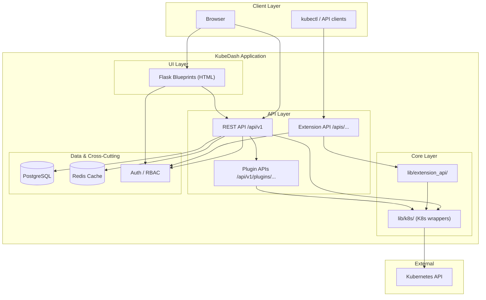
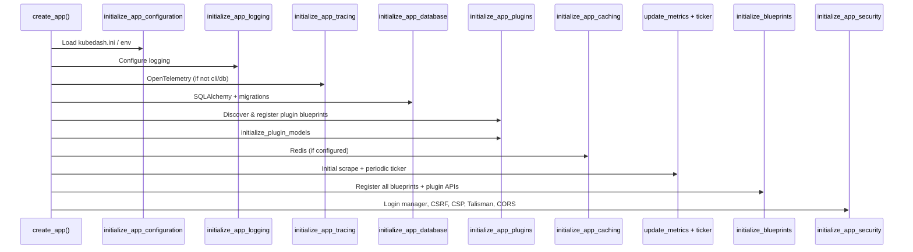
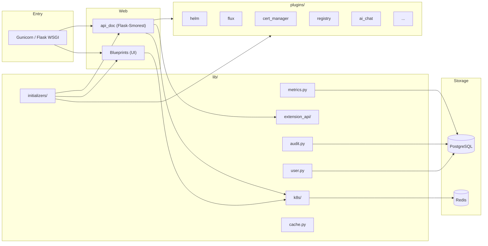
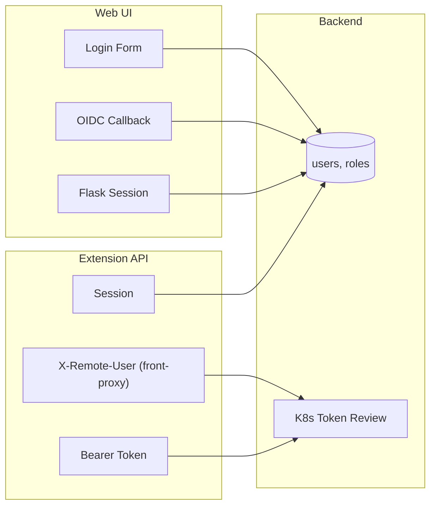
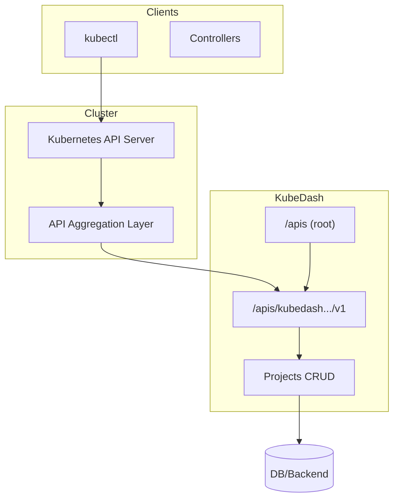
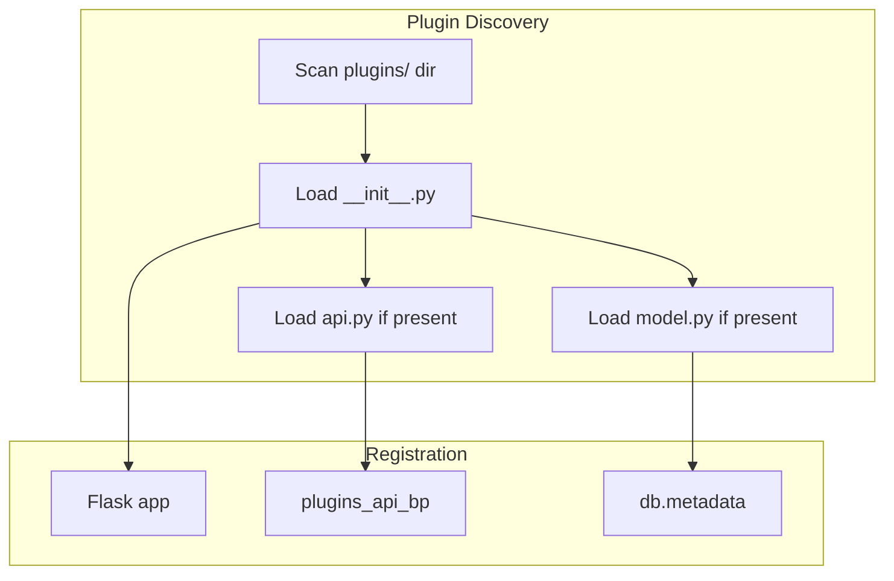
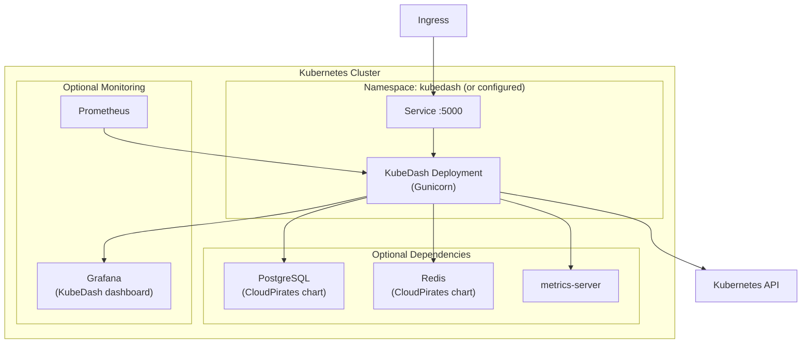
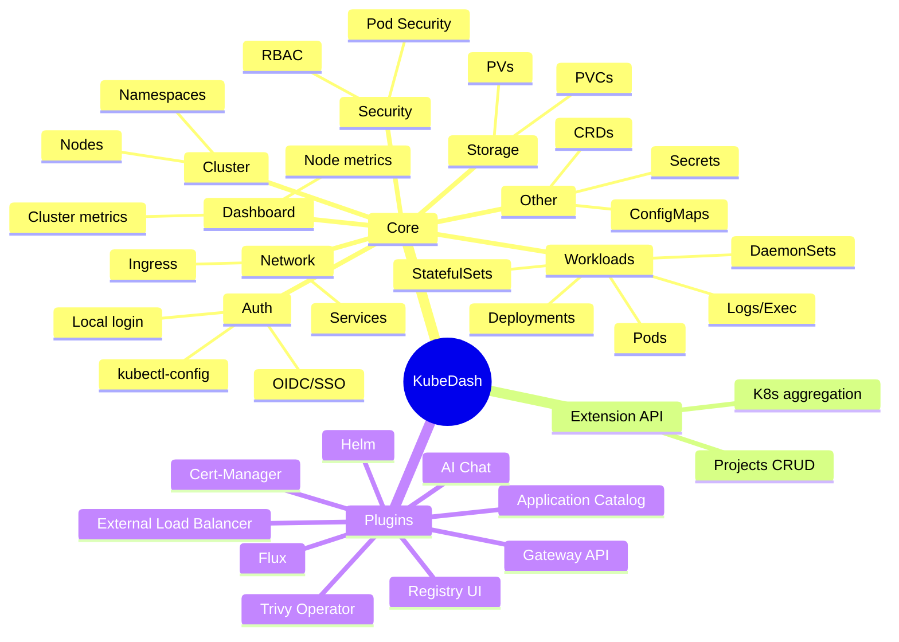

# KubeDash Codebase Overview

A comprehensive exploration of the KubeDash repository from three perspectives: **Software Architect**, **Software Developer**, and **Product Manager**. This document compiles findings from the entire codebase and uses Mermaid diagrams to describe technical concepts.

---

## Table of Contents

1. [Executive Summary](#1-executive-summary)
2. [Software Architect View](#2-software-architect-view)
3. [Software Developer View](#3-software-developer-view)
4. [Product Manager View](#4-product-manager-view)
5. [References](#5-references)

---

## 1. Executive Summary

**KubeDash** is a general-purpose, Python-based Kubernetes Dashboard (version 4.1.0). It provides a web UI to observe applications running in a cluster, troubleshoot them, and manage the cluster. The application is built on **Flask**, uses a **three-layer architecture** (UI → REST API → K8s wrappers → Kubernetes API), supports **plugins** for extensibility, and can expose a **Kubernetes Extension API** (API aggregation) for custom resources such as Projects.

| Dimension | Summary |
|-----------|--------|
| **Architecture** | Monolithic Flask app with blueprints, plugin discovery, optional Redis cache, PostgreSQL, and OpenTelemetry tracing. |
| **Tech Stack** | Python 3.11+, Flask 3.x, SQLAlchemy 2, Flask-Login, Flask-SocketIO, Kubernetes client, Helm chart deployment. |
| **Product** | Dashboard for cluster metrics, workloads, network, storage, security, RBAC, plus optional plugins (Helm, Flux, Cert-Manager, Trivy, Registry, AI Chat, etc.). |

---

## 2. Software Architect View

### 2.1 High-Level System Architecture

The application follows a clear layered design: UI routes render HTML, REST API serves JSON, and K8s wrappers encapsulate all Kubernetes client usage. The Kubernetes API is the primary external dependency for cluster operations.



### 2.2 Application Initialization Flow

Startup is orchestrated from `kubedash.py` via a series of initializers. Order matters: configuration and logging first, then database, plugins, caching, metrics, blueprints, and security.



### 2.3 Component Topology

Core components and their roles:



### 2.4 Request Flow (Authenticated Web Request)

From browser to Kubernetes API:

```mermaid
sequenceDiagram
    participant User
    participant Browser
    participant BeforeRequest as before_request
    participant Blueprint
    participant API as REST / Extension API
    participant K8sLib as lib/k8s
    participant K8s as Kubernetes API

    User->>Browser: Navigate / Click
    Browser->>BeforeRequest: Request (session cookie)
    BeforeRequest->>BeforeRequest: Set correlation_id, start timer
    BeforeRequest->>Blueprint: (or API)
    Blueprint->>API: e.g. /api/v1/namespaces
    API->>K8sLib: get_user_token(); k8s client call
    K8sLib->>K8s: HTTPS (Bearer token)
    K8s-->>K8sLib: JSON
    K8sLib-->>API: Python dict/list
    API-->>Browser: JSON/HTML
```

### 2.5 Authentication and Authorization

Multiple auth mechanisms exist: local login (form + session), OIDC/SSO, kubectl-config–based users, and for the Extension API: front-proxy (aggregation), Bearer token, or session.



- **Web UI:** Flask-Login, session protection “strong”, CSRF, CSP with nonce for scripts.
- **Extension API:** `get_user_from_session_or_token()` tries front-proxy → Bearer → session; namespace access filtered via `check_namespace_access` / `filter_namespaces_by_permission`.

### 2.6 Kubernetes Extension API (Aggregation)

KubeDash can act as an **Extension API Server**: it registers under `apis/kubedash.devopstales.github.io/v1` and serves custom resources (e.g. **Projects**). The cluster’s API server aggregates this via an `APIService` pointing to KubeDash’s service.



- **Auth:** Front-proxy (from API server), Bearer token, or session.
- **Endpoints:** API group list, group versions, resource list, Projects CRUD; Kubernetes-style error responses.

### 2.7 Plugin System Architecture

Plugins are discovered by scanning the `plugins/` directory for subdirectories with `__init__.py`. Each can provide a blueprint (`<name>_bp`), an optional `api.py` (registered under `/api/v1/plugins/<plugin>/`), and optional `model.py` (SQLAlchemy models registered with the main `db`).



- **Blueprint:** Registered on the main app (e.g. `url_prefix=/plugins` or plugin-specific).
- **API:** Sub-blueprint of `plugins_api_bp` at `/api/v1/plugins/<plugin>/...`.
- **Models:** `initialize_plugin_models()` and `ensure_plugin_models_loaded()` for Alembic.

### 2.8 Data Flow: Metrics and Caching

- **Metrics:** A periodic ticker runs `update_metrics(app, db, 30)`; `lib/k8s/metrics` and `lib/metrics` scrape node/pod metrics and persist them to PostgreSQL (e.g. `metrics_nodes`, `metrics_pods`). Optional **cluster-metrics warmup** keeps the cluster metrics view responsive.
- **Caching:** Redis (optional) via `lib/cache` and `lib/components.cache`; `cached_base`/`cached_base2` used in `before_request` for HTML base templates (skipped for `/openapi`, `/apis`).

### 2.9 Deployment Topology (Helm)

Typical production deployment with optional dependencies:



### 2.10 Security Architecture

- **Talisman:** HSTS, CSP (script nonce, restrict CDNs in air-gapped).
- **CSRF:** Flask-WTF CSRF; Extension API and plugin APIs often exempt (Bearer/session).
- **Auth:** Login manager, strong session protection, parameterized queries (SQL injection prevention).
- **Audit:** `lib/audit` logs login/logout, privilege changes, destructive actions to `AuditLog` table.
- **Security tests:** `tests/security/` (auth, API, XSS, dependency checks).

---

## 3. Software Developer View

### 3.1 Technology Stack

| Category | Technology |
|----------|------------|
| **Language** | Python 3.11+ (3.11–3.12 in pyproject) |
| **Web** | Flask 3.0.2, Werkzeug 3.1.5 |
| **API** | Flask-Smorest, APIFlask (OpenAPI/Swagger) |
| **Auth** | Flask-Login, Flask-Session, requests-oauthlib (OIDC) |
| **Database** | SQLAlchemy 2, Flask-SQLAlchemy, Flask-Migrate (Alembic), PostgreSQL (psycopg2-binary) |
| **Cache** | Flask-Caching, Redis |
| **Kubernetes** | kubernetes 26.1.0 |
| **Real-time** | Flask-SocketIO, eventlet, gevent-websocket |
| **Observability** | OpenTelemetry (Flask, SQLAlchemy, Redis, Requests), Prometheus (prometheus-flask-exporter, flask-prometheus-metrics), colorlog |
| **Deployment** | Gunicorn, Docker, Helm (Chart 4.1.0) |

### 3.2 Project Structure (Source)

```
src/kubedash/
├── kubedash.py              # App factory create_app()
├── blueprint/               # UI and API routes
│   ├── api_base/            # Health, ping, debug
│   ├── api/                 # REST v1 sub-blueprints (workloads, cluster, network, storage, users, etc.)
│   ├── auth/                # Login, logout
│   ├── cluster/, workload/, network/, storage/, security/, other_resources/
│   ├── dashboard/, history/, metrics/
│   ├── extension_api/       # K8s Extension API (Projects)
│   ├── extension_root/      # /apis, openapi, healthz
│   ├── cluster_permission/, user/, settings/
│   └── ...
├── lib/                     # Core library (no Flask in low-level K8s code where possible)
│   ├── k8s/                 # workload, node, namespace, metrics, server, storage, network, crds, security, ...
│   ├── extension_api/       # Extension API helpers, auth, projects, errors
│   ├── initializers/         # config, logging, database, blueprints, plugins, caching, security, tracing, socketio, ...
│   ├── components.py        # db, login_manager, cache, csrf, socketio, api_doc
│   ├── user.py, audit.py, metrics.py, cache.py, config.py, sso.py, ...
│   └── cli.py, commands.py
├── plugins/                 # Optional plugins
│   ├── helm/, flux/, cert_manager/, registry/, external_loadbalancer/
│   ├── gateway_api/, trivy_operator/, iframe_proxy/, application_catalog/, ai_chat/
│   └── __init__.py          # discover_plugins, register_plugin_blueprint, register_plugin_api
├── templates/               # Jinja2 (base, auth, segments, plugin templates)
├── static/                  # CSS, JS, assets, vendor (e.g. FontAwesome)
├── migrations/              # Alembic versions
├── database/                # DB-related (if any)
├── tests/                   # unit, integration, security, functional
└── pyproject.toml           # Poetry, pytest, black, isort, coverage
```

### 3.3 Blueprint vs API Layout

- **UI blueprints:** Register on `app`; serve HTML (Jinja2), often with `@login_required`.
- **REST API:** Under `api_doc` (Flask-Smorest): `api_bp` (base) and `api_v1_bp` (prefix `/api/v1`). Sub-blueprints: cluster, workloads, network, storage, security, nodes, namespaces, rbac, other_resources, users, settings, audit. Plugin APIs are added under `api_v1_bp` at `/api/v1/plugins/` by `initialize_plugin_apis()`.

### 3.4 Library Modules (Selected)

| Module | Purpose |
|--------|---------|
| `lib/k8s/workload.py` | DaemonSets, Deployments, StatefulSets, Pods, ReplicaSets; get/list/stream exec/logs |
| `lib/k8s/node.py` | Node list/details |
| `lib/k8s/namespace.py` | Namespace list/details |
| `lib/k8s/server.py` | k8s client config (from user token/session) |
| `lib/k8s/metrics.py` | Node/pod metrics from metrics-server |
| `lib/extension_api/` | Projects CRUD, auth (front-proxy, Bearer, session), namespace filtering, K8s-style errors |
| `lib/user.py` | User, Role, UserCreate, RoleCreate; uses `lib.components.db` |
| `lib/audit.py` | log_audit_event, AuditLog model |
| `lib/metrics.py` | DB models for metrics (Nodes, Pods tables); ticker-driven update_metrics |
| `lib/cache.py` | cached_base, cached_base2 (template caching) |
| `lib/sso.py` | OIDC, get_user_token for K8s |
| `lib/config.py` | Configuration from ini/env |

### 3.5 Database Models (Summary)

- **Core:** User, Role, UsersRoles, SSOGroups, SSOUserGroupMapping, KubectlConfig, AuditLog, Session; metrics tables (e.g. metrics_nodes, metrics_pods).
- **Plugins:** Registry, RegistryEvents (registry); ApplicationCatalog (application_catalog); McpConversation, McpMessage, AI chat models (ai_chat). Migrations in `migrations/versions/`.

### 3.6 Plugin Development Contract

- **Required:** `get_logger()`, OpenTelemetry tracer, `@login_required`, `get_user_token()` for K8s, `lib.k8s.*`, `ErrorHandler`, Flask session.
- **Optional:** `api.py` → `<plugin>_api_bp`, `model.py` → register with `db`, templates under `templates/`.
- **Naming:** Blueprint attribute `.<plugin_name>_bp` for UI; `.<plugin_name>_api_bp` (or convention) for API.

### 3.7 Testing Layout

- **Unit:** `tests/unit/` (e.g. cache, extension API helpers, cluster metrics warmup).
- **Integration:** `tests/integration/` (e.g. auth flow).
- **Security:** `tests/security/` (authentication, authorization, API, XSS, dependency security).
- **Config:** pytest in pyproject (pythonpath, live_server_scope, coverage, filterwarnings). Fixtures in `conftest.py` (client, app, logged_in_client, etc.).

### 3.8 Deployment (Developer-Relevant)

- **Local:** Poetry, `kubedash` CLI entry point (`lib.cli:main`), env from `kubedash.ini` or env vars.
- **Container:** Dockerfile in `docker/kubedash/`.
- **Kubernetes:** Helm chart in `deploy/charts/` (Chart.yaml 4.1.0); values for image, replicas, PostgreSQL, Redis, OIDC, plugins (registry, helm, cert-manager, flux, gateway_api, trivy, iframe_proxy, applicationCatalog, aiChat), cluster/oidc config, metrics-server, Grafana dashboard.

---

## 4. Product Manager View

### 4.1 Product Vision and Value Proposition

- **Vision:** A single web-based UI for Kubernetes that offers both “traditional” dashboard capabilities (list/view resources) and extended features (plugins, optional Extension API, AI-assisted operations).
- **Value:** Centralized observation and troubleshooting, RBAC-aligned access, optional integration with Helm, Flux, Cert-Manager, Trivy, registries, and AI chat for natural-language cluster interactions.

### 4.2 User Personas and Use Cases

| Persona | Goal | Use Cases |
|---------|------|-----------|
| **Cluster admin** | Manage cluster and access | Configure OIDC, manage users/roles, view audit log, manage cluster permissions |
| **Developer** | Deploy and debug workloads | View pods/deployments, logs, exec, describe; use Helm/Flux plugins; use AI chat for “list pods in X” |
| **Platform / SRE** | Monitor and operate | Cluster metrics, node/pod metrics, Grafana dashboards, Trivy/Cert-Manager/Registry plugins |
| **API consumer** | Automate or integrate | Extension API for Projects; REST API for namespaces, workloads, RBAC |

### 4.3 Feature Map (Core + Plugins)



### 4.4 Feature Toggles (Helm values)

Plugins and major options are toggled in `deploy/charts/values.yaml` (e.g. `plugins.registryUi.enabled`, `plugins.helmDashboard.enabled`, `plugins.aiChat.enabled`, `oidc.enabled`, `externalDatabase.enabled`, `redis.enabled`). AI Chat has its own subsection (read-only mode, LLM provider, base URL, model).

### 4.5 Deployment and Packaging

- **Default:** Single replica, in-cluster PostgreSQL and Redis (CloudPirates charts), optional metrics-server.
- **Scaling:** Multiple replicas require external PostgreSQL (and session store consideration).
- **Docs/site:** MkDocs in `docs/`; `site/` contains product/development docs (e.g. product-overview, developer-guide, architecture, PRD-style docs under `site/prd/`).

### 4.6 Roadmap and Change Tracking

The **openspec** folder tracks changes and specs:

- **openspec/changes/** – Active or archived change specs (e.g. extension-api-improvements, oidc-kdlogin-improvements, scope-pod-exec-and-log-streaming, warm-cluster-metrics-cache).
- **openspec/specs/** – General specs (if used).
- **openspec/config.yaml** – OpenSpec configuration.

These indicate ongoing investment in Extension API, OIDC/kdlogin, pod exec/log scoping, and cluster metrics caching.

---

## 5. References

| Resource | Location |
|----------|----------|
| Contributing / architecture | `docs/contributing.md` |
| Plugin development | `docs/development/plugin-development.md` |
| Extension API usage | `src/kubedash/lib/extension_api/README.MD` |
| App entry point | `src/kubedash/kubedash.py` |
| Blueprint registration | `src/kubedash/lib/initializers/blueprints.py` |
| Plugin discovery | `src/kubedash/plugins/__init__.py` |
| Helm chart | `deploy/charts/` (Chart.yaml, values.yaml) |
| OpenSpec changes | `openspec/changes/` |

---

*Document generated from repository exploration. For the latest structure and behavior, refer to the source code and tests.*
