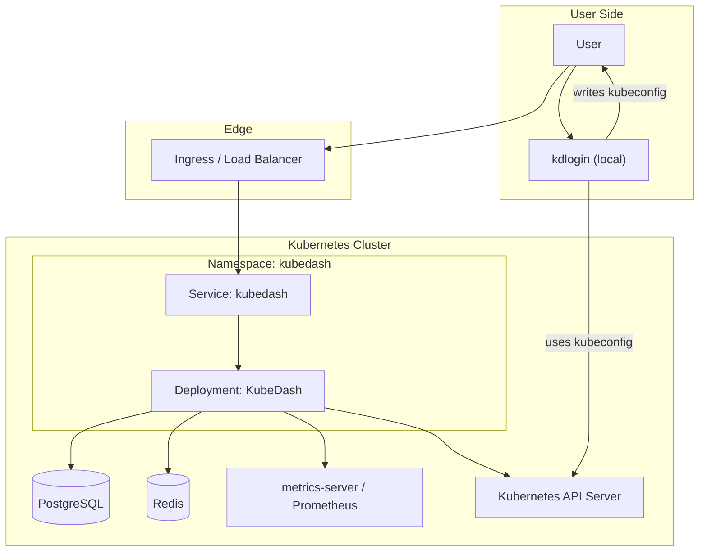

### Scope

This document describes the **application infrastructure** for the KubeDash stack, with a focus on:

- How the **KubeDash** application runs in a Kubernetes cluster.
- How the **kdlogin** helper fits into the overall authentication and kubeconfig story.
- The main runtime dependencies (databases, caches, telemetry) and how they connect.

It intentionally **excludes CI/CD pipelines** and focuses on runtime topology, configuration, and environments.

### High‑Level Topology

At a high level, a typical production deployment looks like this:

- **Kubernetes Cluster**
  - Namespace (e.g. `kubedash`) hosting the KubeDash deployment and service.
  - Optional dependencies:
    - **PostgreSQL** for relational data (users, audit logs, metrics, projects, etc.).
    - **Redis** for caching and some cross‑request state.
    - **metrics‑server** (and/or Prometheus) for cluster metrics.
  - KubeDash talks directly to the **Kubernetes API server** using user or ServiceAccount credentials.
- **Ingress / Load Balancer**
  - Fronts the KubeDash service and terminates TLS.
  - Optionally participates in OIDC/SO authentication flows (redirects, callbacks).
- **kdlogin**
  - Typically runs close to the user (local machine or a small service) and interacts with the user’s kubeconfig file.
  - Receives OIDC or cert‑based credentials (from KubeDash flows) and writes/merges kubeconfig contexts.

### KubeDash Runtime Architecture

KubeDash is a monolithic Flask app packaged into a container image and deployed as a Kubernetes Deployment.

- **Core components**
  - **Flask app with Gunicorn** (via `gunicorn-color` and `gunicorn`).
  - **Blueprints** for HTML UI and REST APIs under `/api/` and `/api/v1/…`.
  - **Kubernetes client** (`kubernetes` Python package) for all interactions with the cluster.
  - **Database** via SQLAlchemy and Flask‑SQLAlchemy, targeting PostgreSQL in production (SQLite for dev).
  - **Redis cache** via Flask‑Caching to speed up expensive calls and template rendering.
  - **OpenTelemetry** instrumentation for Flask, SQLAlchemy, Redis, and outbound HTTP requests, with OTLP exporters.
  - **Prometheus metrics** endpoints (`/metrics`) for scraping by Prometheus.
  - **Security middleware** via Flask‑Talisman (CSP, HSTS, etc.) and Flask‑WTF CSRF protection.

- **Key environment dependencies**
  - **Database connection** (`SQLALCHEMY_DATABASE_URI` or equivalent) pointing to PostgreSQL.
  - **Redis connection** (`REDIS_URL` or similar).
  - **Kubernetes API access**: In‑cluster configuration via ServiceAccount or external kubeconfig when running outside the cluster.
  - **OIDC/SSO configuration**: Issuer URL, client ID/secret, redirect URIs, and optional IdP CA data.
  - **Tracing and metrics**: OTLP endpoint for OpenTelemetry and Prometheus scrape config.

### Deployment Model (Kubernetes)

The canonical deployment is via a **Helm chart** (see general docs and `openspec/CODEBASE_OVERVIEW.md`):

- **Workload**
  - `Deployment` running the KubeDash container(s) (Python + Gunicorn).
  - Optional `HorizontalPodAutoscaler` if high traffic is expected.
  - Probes:
    - Liveness: `/api/health/live`
    - Readiness: `/api/health/ready`
- **Service**
  - `Service` (ClusterIP, NodePort, or LoadBalancer) exposing the KubeDash HTTP port (typically 5000/8000 inside the pod).
- **Ingress**
  - `Ingress` routing external traffic to the Service, terminating TLS and enforcing hostnames.
  - Can be integrated with OIDC/SSO and external auth if desired.
- **Config & Secrets**
  - `ConfigMap` for non‑secret app settings (base URL, features, plugin toggles, logging levels, etc.).
  - `Secret` for sensitive configuration:
    - DB credentials
    - Redis password (if used)
    - OIDC client secrets
    - TLS certs, if not handled at the ingress controller level.
- **Optional supporting components**
  - **PostgreSQL**: either as:
    - In‑cluster Helm subchart (e.g. CloudPirates chart) for smaller setups.
    - External managed database (RDS, Cloud SQL, etc.) referenced via connection string.
  - **Redis**: similar pattern—embedded chart or managed service.
  - **metrics‑server / Prometheus + Grafana** for metrics collection and dashboarding:
    - KubeDash exports metrics to Prometheus and may have a pre‑built Grafana dashboard.

### Authentication, Authorization, and kdlogin

KubeDash supports multiple auth methods and integrates tightly with Kubernetes RBAC:

- **User authentication**
  - **Local users**: Stored in the database; authenticated via username/password.
  - **OIDC/SSO users**: Authenticated against an Identity Provider, with attributes mapped to users and groups.
  - **Kubernetes users**: Certificate‑based authentication using client certificates.

- **Authorization**
  - KubeDash maintains its own dashboard‑level roles (Admin/User).
  - Kubernetes RBAC is enforced by using user‑specific tokens or certs when talking to the Kubernetes API; KubeDash filters namespaces and resources based on permissions.

- **kdlogin’s role**
  - Runs a small Gin HTTP server listening on port 8080 by default.
  - Accepts JSON payloads with:
    - OIDC tokens and metadata (`RequestOIDC`), or
    - Certificate + key data (`RequestCert`).
  - Builds a Kubernetes `clientcmdapi.Config`, merges it with any existing kubeconfig (from `$KUBECONFIG` or `~/.kube/config`), and writes back a unified config.
  - Allows users to easily obtain working `kubectl` contexts that match the credentials managed through KubeDash.

From an infra perspective, **kdlogin** is typically:

- A local binary (installed on user machines) invoked by:
  - A browser redirect from KubeDash carrying necessary parameters, or
  - A kubectl plugin that wraps the kdlogin workflow.
- A short‑lived local web server that:
  - Opens the relevant URL in the browser (`open`, `xdg-open`, etc.).
  - Waits for a callback with credentials.
  - Writes/merges kubeconfig, then shuts down gracefully.

### Observability and Security

- **Logging**
  - Structured logging via `colorlog` for the Python app.
  - Correlation IDs and trace IDs propagated through requests (see `docs/development/logging.md`).

- **Tracing**
  - OpenTelemetry instrumentation configured for:
    - Flask request handling
    - SQLAlchemy DB operations
    - Redis cache operations
    - Outbound HTTP requests
  - Exported via OTLP (HTTP) to a collector or directly to systems like Jaeger/Tempo.

- **Metrics**
  - Prometheus‑compatible `/metrics` endpoint via `prometheus-flask-exporter` and related tooling.
  - Metrics include request latency, DB performance, cache hits/misses, and Kubernetes interaction stats.
  - KubeDash also maintains its own internal metrics in PostgreSQL for cluster dashboards.

- **Security posture**
  - **Network**:
    - Expose only necessary ports (HTTP/TLS) via Service/Ingress.
    - Optionally use NetworkPolicies to restrict egress (e.g. only to Kubernetes API, DB, Redis, telemetry endpoints).
  - **App security**:
    - Flask‑Talisman enforces CSP, HSTS, and other headers.
    - CSRF protection on web forms (selected APIs are exempt where appropriate).
    - Regular security tests under `src/kubedash/tests/security/` and ZAP plans under `security/zaproxy/`.
  - **Secrets management**:
    - All secrets should be injected via Kubernetes `Secret`s and environment variables, not hard‑coded.
    - Rotate OIDC client secrets and database credentials periodically.

### Environments

While exact environment names vary by installation, a typical setup includes:

- **Local / Development**
  - KubeDash running outside Kubernetes or in a local cluster (kind, k3d, minikube).
  - SQLite or a local PostgreSQL instance.
  - Redis optional.
  - kdlogin built and run locally for developers.

- **Staging / Pre‑production**
  - KubeDash deployed into a non‑production namespace/cluster.
  - PostgreSQL and Redis using the same type of backing services as production.
  - OIDC connected to a test tenant or sandbox.

- **Production**
  - KubeDash deployed via Helm chart with high‑availability settings.
  - Managed PostgreSQL and Redis (or equivalent) with backups and monitoring.
  - Integration with production IdPs (OIDC, LDAP via portals, etc.).
  - Prometheus, Grafana, and a tracing backend wired to collect metrics and traces.

### Where to Learn More

- **Architecture and codebase**: `openspec/CODEBASE_OVERVIEW.md`, `docs/development/architecture.md`
- **Security**: `docs/development/security.md`, `security/zaproxy/README.md`, tests under `src/kubedash/tests/security/`
- **APIs and integrations**: `docs/development/api-reference.md`, `docs/integrations/kubectl-plugin.md`
- **Operational runbooks**: See project docs under `docs/development/` (logging, audit logging, testing, etc.), and adapt them to your specific cluster and observability stack.

