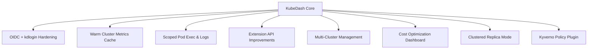

### Overview

**KubeDash** is a Python/Flask‑based Kubernetes dashboard that provides a web UI and REST/Extension APIs to observe, troubleshoot, and manage Kubernetes clusters. It follows a layered architecture (UI → REST API → K8s wrappers → Kubernetes API), supports a rich plugin system (including an AI Chat plugin), and can expose a Kubernetes Extension API for custom resources such as Projects. **`kdlogin`** is a small companion service/CLI written in Go that helps users obtain and merge kubeconfig entries (OIDC or certificate‑based) so they can use `kubectl` against the same clusters and permissions managed through KubeDash.

### Audience

- **New developers**: Understand how the project is structured, how KubeDash and kdlogin fit together, and how to run and extend them locally.
- **Ops/SRE**: Understand how the applications behave in a cluster, what external dependencies they have, and how they interact with Kubernetes and identity providers.
- **AI assistants/agents**: Get a concise mental model of core components, where to hook into APIs, and which docs to read for deep details.

### Repository Structure (high level)

- `src/kubedash/`: Main KubeDash Flask application
  - `kubedash.py`: App factory (`create_app`) and initialization entrypoint
  - `blueprint/`: UI and REST API blueprints (HTML + JSON routes)
  - `lib/`: Core libraries (Kubernetes wrappers, extension API helpers, initializers, components, user/audit/metrics logic, CLI)
  - `plugins/`: Optional plugins (Helm, Flux, Cert‑Manager, Registry, External LoadBalancer, Gateway API, Trivy Operator, IFrame proxy, Application Catalog, **AI Chat**, etc.)
  - `templates/`, `static/`: Jinja2 templates and frontend assets
  - `migrations/`: Alembic DB migrations
  - `tests/`: Unit, integration, and security tests
  - `pyproject.toml`: Python dependencies and tooling (pytest, coverage, black, etc.)
- `src/kdlogin/`: Go‑based kdlogin utility
  - `main.go`: Gin HTTP server + CLI entrypoint for OIDC/cert‑based kubeconfig generation and merging
  - `go.mod`: Go module definition and dependencies
  - `.goreleaser.yaml`: Release packaging configuration
- `docs/`: User, developer, and operator documentation
  - `index.md`: High‑level product intro and doc index
  - `development/api-reference.md`: REST and Extension API reference
- `openspec/`: Spec‑driven development artifacts
  - `CODEBASE_OVERVIEW.md`: In‑depth architecture and codebase analysis
  - `changes/…`: Proposals, designs, specs, and task lists for larger changes (e.g. OIDC kdlogin improvements, metrics warmup)
- `security/`: Security testing assets (e.g. ZAP plans/scripts, DefectDojo upload helpers)
- `Taskfile.yml`, `scripts/`: Local automation and helper scripts

### Conceptual Architecture

```mermaid
graph LR
    subgraph "KubeDash"
        UI[Web UI (Flask + Jinja2)]
        API[REST API /api/v1]
        EXT[Extension API /apis/...]
        PLUGINS[Plugins (Helm, Flux, AI Chat, ...)]
        LIB[lib/ (K8s wrappers, init, components)]
    end

    subgraph "Cluster"
        K8S[Kubernetes API Server]
        DB[(PostgreSQL)]
        REDIS[(Redis Cache)]
    end

    subgraph "Users & Tools"
        BROWSER[Browser]
        KUBECTL[kubectl / CI]
    end

    BROWSER --> UI
    UI --> API
    API --> LIB
    EXT --> LIB
    PLUGINS --> API
    LIB --> K8S
    API --> DB
    API --> REDIS
    KUBECTL --> EXT
```

- **Frontend (KubeDash UI)**: Server‑rendered HTML with Jinja2 templates, Bootstrap/CoreUI styling, and a small amount of JavaScript for interactivity. Primarily talks to the Flask app via standard web routes and some REST endpoints.
- **Backend (KubeDash app)**:
  - Flask application with blueprints for UI and REST APIs (`/api/` and `/api/v1/…`).
  - Library layer in `lib/` that wraps Kubernetes client operations, extension API helpers, caching, metrics, auditing, and initialization logic.
  - Plugin framework that scans `plugins/` and dynamically registers plugin blueprints, APIs, and optional models.
  - Optional AI Chat plugin that exposes `/api/v1/plugins/ai-chat/…` endpoints and integrates with the rest of the stack (see `plugins/ai_chat/` and `docs` for details).
  - Optional Extension API server that registers under `apis/kubedash.devopstales.github.io/v1` as an aggregated API for resources like Projects.
- **Companion tool (`kdlogin`)**:
  - Small Gin‑based web service that receives OIDC or certificate‑based auth data, builds a Kubernetes `clientcmdapi.Config`, merges it with any existing kubeconfig (from `$KUBECONFIG` or `~/.kube/config`), and writes back a usable kubeconfig file.
  - Exposed `GET /info` endpoint returns a health/info payload; `POST /` accepts JSON describing OIDC or certificate credentials and context.
  - Intended to be invoked indirectly by users via browser flows or kubectl plugins, making it easy to get kubeconfigs for SSO or local users managed in KubeDash.

### How KubeDash and kdlogin Fit Together

- **KubeDash**:
  - Manages users (local, OIDC, certificate‑based) and their permissions (via dashboards roles and Kubernetes RBAC).
  - Provides UI screens and APIs for generating kubectl configuration for different auth mechanisms.
  - Exposes an Extension API for KubeDash‑specific resources like Projects.
- **kdlogin**:
  - Acts as a helper microservice that takes OIDC tokens or X.509 cert data generated/managed via KubeDash flows and turns them into valid kubeconfig contexts on the user’s machine.
  - Ensures kubeconfig merging semantics (respect existing config, write new context) and cross‑platform browser integration (`open`, `xdg-open`, etc.).
- **Typical flow**:
  - User logs into KubeDash (local or OIDC).
  - User requests “download kubeconfig” or invokes a kubectl plugin that hits KubeDash/kdlogin.
  - KubeDash provides or triggers retrieval of tokens/certs; kdlogin receives them via POST, builds/merges kubeconfig, and saves it for the user.

### Development Setup (local)

For full details see `docs/development/developer-guide.md` and `docs/development/architecture.md`, but at a high level:

- **Prerequisites**
  - Python 3.11–3.12
  - Poetry (or a compatible Python toolchain) to install dependencies from `pyproject.toml`
  - A Kubernetes cluster (kind, k3d, minikube, or remote) and kubeconfig
  - Optional: PostgreSQL and Redis for a production‑like stack (SQLite/in‑memory are fine for dev)
  - Go toolchain (1.21+) if you want to build/run `kdlogin`

- **KubeDash (backend + UI)**
  - Install dependencies:
    - `cd src/kubedash`
    - `poetry install` (or equivalent using `pyproject.toml`)
  - Run the development server (see developer guide for the canonical command, e.g. using Flask’s dev server or Gunicorn with a dev config).
  - Configure settings using `kubedash.ini`/environment variables (cluster connection, DB, Redis, OIDC, etc.).
  - Access the UI at the configured host/port (default often `http://localhost:8000` in docs).

- **kdlogin**
  - `cd src/kdlogin`
  - `go mod tidy`
  - `go run ./... <callback-url>` to start the server and open a browser URL, or build a binary via `go build` / `.goreleaser.yaml`.
  - Ensure `KUBECONFIG` or `~/.kube/config` is writable so new contexts can be written.

### Testing

- **KubeDash**
  - Python tests live under `src/kubedash/tests/`:
    - `unit/`: unit tests for core modules and helpers
    - `integration/`: end‑to‑end API tests
    - `security/`: tests for auth, CSRF, API security, XSS, and related hardening
  - Common tools: `pytest`, `pytest-cov`, Playwright for UI/E2E tests, Semgrep and Safety for security scanning.
  - Typical test run (see `pyproject.toml` and docs): `pytest` or coverage‑enabled commands.

- **kdlogin**
  - Go tests (if present) follow standard `go test ./...` conventions.
  - Manual validation: run kdlogin, send `POST /` with sample OIDC or cert payloads, and verify kubeconfig changes and `kubectl` behavior.

### Extensibility for AI and Integrations

- **AI Chat plugin**:
  - Lives under `src/kubedash/plugins/ai_chat/` and exposes REST endpoints (documented in `docs/development/api-reference.md` and plugin‑specific docs).
  - Uses additional dependencies (aiohttp, statsd, Prometheus client, OpenTelemetry) declared in `pyproject.toml`.
  - Can be used by AI agents to query cluster state, surface suggestions, or drive remediation flows via the KubeDash APIs.

- **Extension API & REST API**:
  - REST API at `/api/v1/…` for cluster, workloads, network, storage, security, RBAC, users, settings, and plugin endpoints.
  - Extension API at `/apis/kubedash.devopstales.github.io/v1/…` for Projects and other aggregated resources.
  - See `docs/development/api-reference.md` for full endpoint details and example payloads.

### OpenSpec‑Driven Product Changes (PRD View)

KubeDash and kdlogin use **OpenSpec** changes under `openspec/changes/` as the product requirements source of truth. Key active or recent PRDs include:



- **OIDC + kdlogin improvements** (`openspec/changes/oidc-kdlogin-improvements/`):
  - Hardens OIDC on the server (PKCE, strict `state` validation, safer TLS handling).
  - Adds a kdlogin **one‑time‑code** fallback flow when server‑to‑client push fails.
  - Adds kdlogin plugin options (configurable port, optional `exec`‑based kubeconfig users) without breaking existing flows.
- **Warm cluster metrics cache** (`warm-cluster-metrics-cache`):
  - Ensures cluster metrics dashboards stay responsive by pre‑warming and periodically refreshing metrics stored in the DB.
- **Scoped pod exec and log streaming** (`scope-pod-exec-and-log-streaming`):
  - Tightens how pod `exec` and log streaming are scoped, with clearer per‑connection limits and security controls.
- **Extension API improvements** (`extension-api-improvements`):
  - Enhances the Projects Extension API with pagination, field selectors, and more Kubernetes‑style ergonomics.
- **Multi‑cluster management** (`multi-cluster-management`):
  - Introduces a cluster registry, multi‑cluster health monitoring, RBAC across clusters, and UX for switching cluster contexts from KubeDash.
- **Cost optimization dashboard** (`cost-optimization-dashboard`):
  - Adds workload cost attribution, waste identification, and right‑sizing recommendations surfaced in a dedicated cost dashboard and plugin.
- **Clustered replica mode** (`clustered-replica-mode`):
  - Enables robust multi‑replica operation using Redis‑backed sessions, leader election, and leader‑only task execution.
- **Kyverno plugin** (`kyverno-plugin`):
  - Integrates Kyverno policy reports and management into KubeDash with policy dashboards, exceptions, and compliance views.

### Where to Read Next

- **High‑level architecture**: `openspec/CODEBASE_OVERVIEW.md`, `docs/development/architecture.md`
- **Product requirements (OpenSpec)**: see individual change folders under `openspec/changes/` for full proposals, specs, designs, and task lists.
- **For developers**: `docs/development/developer-guide.md`, `docs/development/testing.md`
- **For ops/SRE**: `docs/development/security.md`, `docs/development/logging.md`, `docs/development/audit-logging.md`, plus `INFRASTRUCTURE.md` in this repo
- **For AI agents**: `docs/development/api-reference.md` for API shapes and auth, `docs/integrations/kubectl-plugin.md` for kubectl integration patterns

