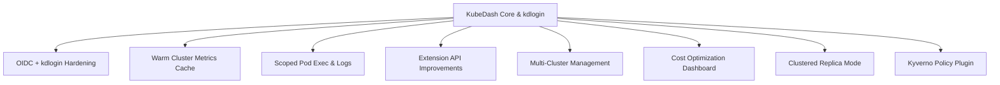

### OpenSpec Changes (PRD Index)

This folder summarizes the main **product requirement documents (PRDs)** for KubeDash and kdlogin, derived from the OpenSpec changes under `openspec/changes/`.

Each PRD here is a **human‑friendly summary** of the corresponding OpenSpec proposal/specs/designs; for full technical detail, always refer back to the OpenSpec files.

### Available PRDs

- **OIDC + kdlogin improvements**
  - OpenSpec: `openspec/changes/oidc-kdlogin-improvements/`
  - PRD: `project/prd/oidc-kdlogin-improvements.md`
- **Warm cluster metrics cache**
  - OpenSpec: `openspec/changes/warm-cluster-metrics-cache/`
  - PRD: `project/prd/warm-cluster-metrics-cache.md`
- **Scoped pod exec and log streaming**
  - OpenSpec: `openspec/changes/scope-pod-exec-and-log-streaming/`
  - PRD: `project/prd/scope-pod-exec-and-log-streaming.md`
- **Extension API improvements**
  - OpenSpec: `openspec/changes/extension-api-improvements/`
  - PRD: `project/prd/extension-api-improvements.md`
- **Multi‑cluster management**
  - OpenSpec: `openspec/changes/multi-cluster-management/`
  - PRD: `project/prd/multi-cluster-management.md`
- **Cost optimization dashboard**
  - OpenSpec: `openspec/changes/cost-optimization-dashboard/`
  - PRD: `project/prd/cost-optimization-dashboard.md`
- **Clustered replica mode**
  - OpenSpec: `openspec/changes/clustered-replica-mode/`
  - PRD: `project/prd/clustered-replica-mode.md`
- **Kyverno plugin**
  - OpenSpec: `openspec/changes/kyverno-plugin/`
  - PRD: `project/prd/kyverno-plugin.md`

